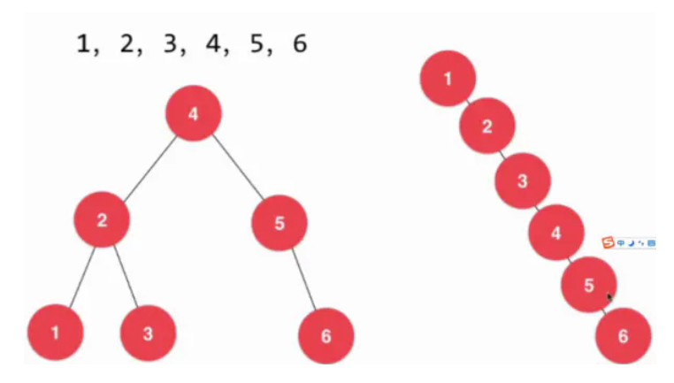

# 查找

## 概念

定义: 根据给定的某个值，在查找表中确定一个其关键字等于给定值的数据元素

- 查找表: 由同一类型的数据元素构成的集合
- 符号表: 一种存储键值对的数据结构，支持插入（put）、查找（get）操作
- 关键字
  - 定义: 是数据元素中某个数据项的值
  - 主关键字: 若关键字可以唯一标识一个记录，则为主关键字
  - 次关键字: 值那些可以表示多个数据元素的关键字
- 静态查找表: 只作查找表的操作
- 动态查找表: 在查找过程中同时插入查找表中不存在的数据元素

## 算法

### 二分查找

- 适合查找有序的数组序列
- 最多查找次数：logN+1

#### 旋转数组

### 二叉树查找

特点:

- 所有节点都比左子树中的节点大
- 所有节点都小于右子树中的节点

不足：可能变成一颗斜树

### 红黑二叉查找树

### 暴力子字符串查找

### KMP算法

### BM

### Sunday
