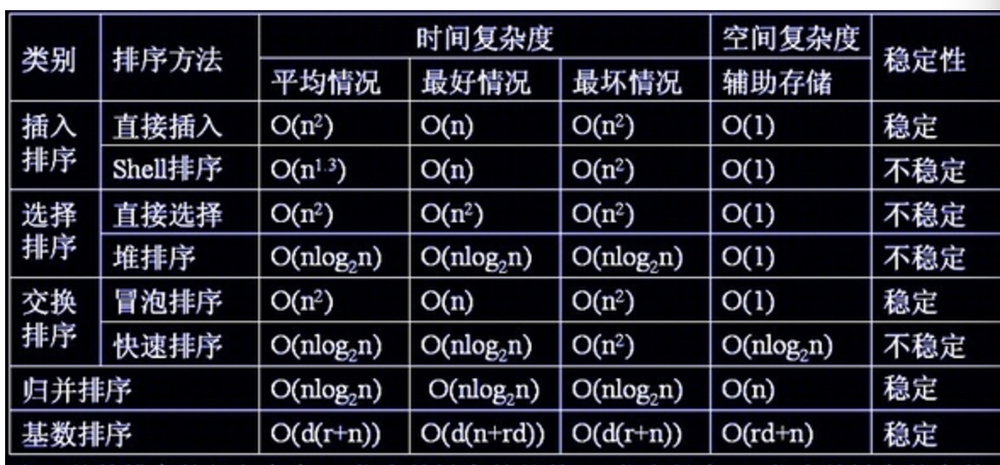

# 排序

## 概念

- 稳定性: 排序前后位置不变
- 内排序: 待排序的所有记录有放置在内存中
- 外排序: 整个排序过程需要在内存之外多次交换顺序才能进行
- 性能影响
  - 时间性能
  - 辅助空间
  - 算法的复杂性
- 原地排序(in-place): 严格上指空间复杂度为O(1)的算法，即空间与问题规模无关，空间更定。
但也可以认为，算法的排序结果是对输入进行操作或者覆盖并返回，也可以认为是“原地”，例如快速排序

## 复杂度

## 算法

### 冒泡排序

两两比较相邻的关键字，反序则交换，直到没有交换位置

### 简单选择排序

记录每轮中最小的下标，然后比较开始的下标交换位置

### 直接插入排序

将左边的看成排序好的，右边看成待排序的，从i=1的位置开始和左边比较，找到一个比他小的位置m时停止，然后插入m+1的位置，其他的元素都往后移动1

### 希尔排序

- 增量
- 希尔增量(逐步折半的增量)
- 先将较无序的数组，通过增量n的方式进行粗排序（插入排序,每次都交换位置），然后增量n=n/减半使用重复，直到n=1排序完成

### 归并排序

1. 从中间划分成两个数组，对每一遍进行归并排序，然后在对两个数组进行排序
2. 排序分别从两个数组的起始位i，j开始，将小的一直放入新数组中直到任一一边取完，如果另一边有剩余，则添加到数组后面即可

### 堆排序

通过二叉堆的方式进行排序，如果要从小到大，则构建一个最大顶的堆，然后交换首尾后，进行下沉操作(比较截止到交换元素 - 1的位置)，这样每轮都会将次大(第二大)的元素放到堆顶，然后放到末尾，直到比较完

优先队列：

- 构建方式最小堆
  - 插入insert： 先将新元素放到堆尾，通过上浮(swim)操作，将其与父节点比较，若小则交换，直到根比较完
  - 删除最下元素： 将最后的元素放到堆顶，然后通过下沉(sink)操作，找出子节点中小的与其比较，若打则交完位置，直到不发生交换 或 2k>n

### 快速排序

基于一个基准值，将数组划分成小于基准值的和大于的两个数组，对基准值左右的两个数组进行快速排序，排序完了也就是结果了，基准值一般取数组的第一个值

排序方式：从两侧{1,len}往中间与基准值比较，小于就与基准值交换位置（要从右边开始），直到左右下标相等

#### 换坑法

  1. 先记录基准值的值（避免多次交换），以第一位为基准值，作为初始坑位
  2. 从right往左边找，遇到小于基准值时，就将值换到基准值的位置，此时right为新坑位
  3. 在从left(基准值位置+1)往右找，遇到大于基准值的，就将值交换到坑位，然后left为新坑位
  4. 重复直到right=left，此时基准值的位置就在left|right，将之间记录的值放进去

#### 指针法

### 三向快速排序

快速排序过程中，如果数据有大量重复元素，比如都相同，则应该停止排序，但快速排序还是会将它分成两个数组进行排序

基准元素进行快速排序，分成小于、大于后分别递归这两部分，等于的就放在中间

对于一次排序扫描需要3个指针：

- 低位指针li：< li对应的元素都小于基准元素
- 高位指针hi：> hi对应的元素都大于基准元素
- 当前遍历元素的指针index
- 并且[li, hi]（闭区间）的元素都是相等的

### 计数排序

适用于整数数组的排序，取max-min的长度计数数组，按下标累积数量然后还原
  
保证稳定性：将计数数组累加(i!)，替代原来的值，这样数组中的每个值都是对应原数据中排序后实际的位置（最大值）。然后从后往前取值放入，每方一个，对应位置

### 桶排序

计数排序只能处理整数，无法处理浮点数的排序

1. 以max-min/length为区间，创建length-1个数组(空桶)
2. 将元素按区间分别放入桶中
3. 各个桶单独排序（快排）
4. 合并桶

### 基数排序（字符串）

把字符串元素按位拆分，每一位进行一次计数排序的算法

分类
    - MSD：从高位往地位排，从第0位进行桶划分，相同的放入同一个小桶中，然后再递归各个小桶，最后将各个小桶按顺序合并（不足的低位则补充0）
    - LSD：从低位往高位排，从最后一位往前进行稳定基数排序，然后循环直到最低位（不足的高位补0）

### 三向字符串排序

基数排序MSD（首字母）为基准元素进行快速排序，分成小于、等于、大于后分别递归这三部分分（首字母位置移动到下一位）
