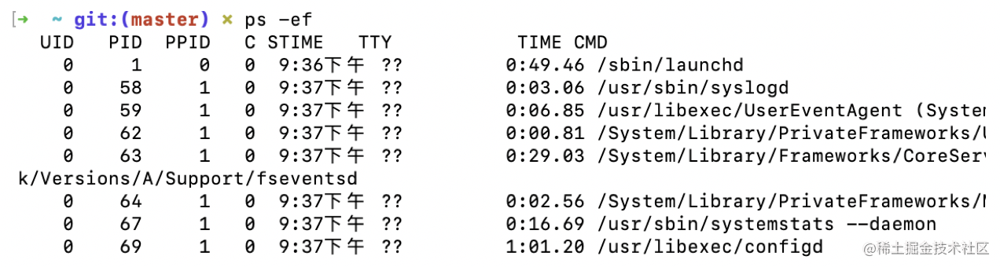
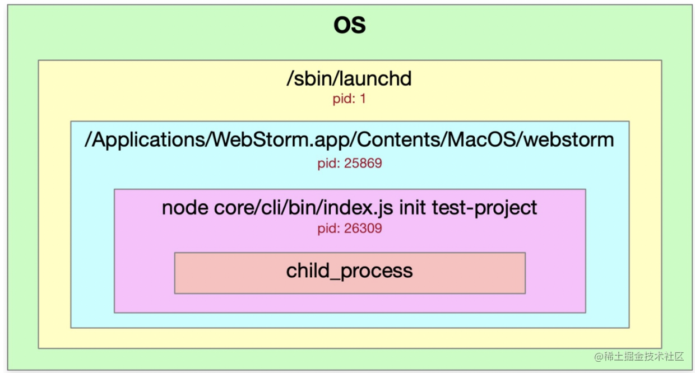
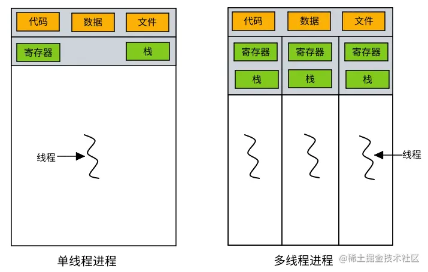
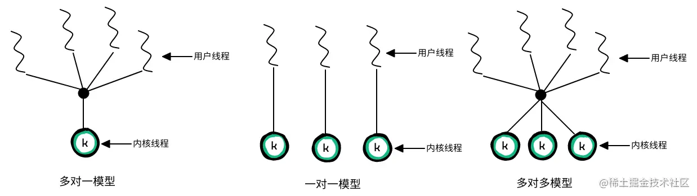
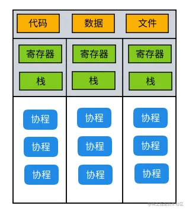
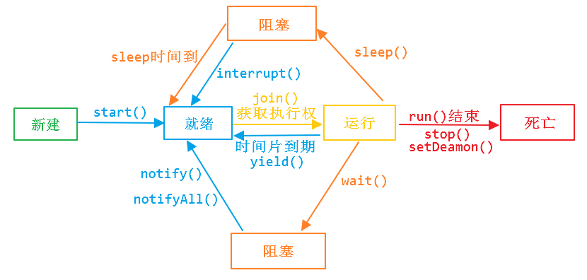

# 计算机基础

## 进程、线程、协程、纤程

操作系统的主要目标是执行用户程序，但也需要顾及内核之外的各种系统任务。

系统由一组进程组成： 操作系统进程执行系统代码，用户进程执行用户代码。

- 挂起
- I/O 模型： 阻塞、非阻塞、同步、异步

### 进程

> 进程（Process）是计算机中的程序关于某数据集合上的一次运行活动，是系统进行资源分配和调度的基本单位，是操作系统结构的基础。

进程的概念主要有两点：

- 进程是一个实体，每一个进程都有自己的地址空间。
- 进程是一个"执行中的程序"，存在嵌套关系。

可看做是正在执行的程序，进程需要一定的资源（如 CPU、时间、内存、文件和 I/O 设备）来完成其任务。 这些资源在创建进程或者执行进程时被分配。

- 进程的组成有：PCB、程序段、数据段
  - PCB（进程控制块，process control block）： 保存进程运行期间相关的数据，是进程存在的唯一标志。
  - 程序段： 能被进程调度程序调度到 CPU 运行的程序的代码段。
  - 数据段： 存储程序运行期间的相关数据，可以是原始数据也可以是相关结果。

创建进程： 需要为进程划分出一块完整的内存空间，有大量的初始化操作，比如要把内存分段（堆栈、正文区等）。

进程在执行时会改变状态，进程的状态有 5 种：


- 创建：进程正在被创建。
- 运行：指令正在被执行。
- 等待：阻塞，进程等待某个事件的发生（如 I/O 完成或收到信号）。
- 就绪：进程等待分配处理器。
- 终止：进程完成执行。

> Tips ：将 CPU 切换到另一个进程需要保存当前进程的状态并恢复另一个进程的状态，这一任务称为上下文切换（context switch） 。

相关命令：

```bash
# 查看所有进程
ps -ef 
```



- UID: 用户id，在mac下root用户的uid是0，其他用户是uid是501，可以通过uid来判别用户的级别。
- PID: 进程的id
- PPID: 某个进程的父进程，表示这个进程是由父进程发起的，即存在嵌套关系。



1. 首先是操作系统进程OS
2. 其次是启动进程，所有的进程都是由sbin/launchd来启动的，这个其实就是一个桌面进程
3. 我们打开了 webstorm/vscode 的编辑器，就相当于开启了一个webstorm/vscode的进程
4. 在编辑器进程中启动了node应用，所以需要有个node进程
5. 在node进程中利用child_process创建nodejs的子进程

### 线程

- 线程是 CPU 使用的基本单元，由线程 ID、程序计数器、寄存器集合和栈组成。
- 进程由一个或多个线程组成： Linux 中创建一个进程自然会创建一个线程，也就是主线程。
- 调度切换： 线程上下文切换比进程上下文切换快。
- 进程创建很耗时间和资源：
  - 创建进程： 需要为进程划分出一块完整的内存空间，有大量的初始化操作，比如要把内存分段（堆栈、正文区等）。
  - 创建线程： 只需要确定 PC 指针和寄存器的值，并且给线程分配一个栈用于执行程序，同一个进程的多个线程间可以复用堆栈。



有两种不同方法来提供线程支持：

- 用户层的用户线程 ：适合于 IO 密集型任务，受内核支持，而无须内核管理。
- 内核层的内核线程 ：计算密集型任务，由操作系统直接支持和管理。

用户线程与内核线程之间对应关系有三种： 多对一模型、一对一模型、多对多模型



- 多对一模型缺点： 任一时刻只有一个线程能访问内核，多个线程不能并行运行在多处理器上。
- 一对一模型缺点： 每创建一个用户线程就需要创建相应的内核线程。限制了系统所支持的线程数量。
- 多对多模型： 没有以上两者的缺点。开发人员可创建任意多的用户线程，并且相应内核线程在多处理器系统上并发执行。

### 协程

> 本质上是轻量级的线程。因为是自主开辟的异步任务，所以很多人也更喜欢叫它们纤程（Fiber），或者绿色线程（GreenThread）。正如一个进程可以拥有多个线程一样，一个线程也可以拥有多个协程。



特点：

- 非阻塞 ：具有挂起和恢复的能力。当前协程进行阻塞操作
- 可看作轻量级线程： 占用更少的堆栈空间，并且需要的堆栈大小可以随着程序的运行需要动态增加或者空间回收。
- 上下文切换发生在用户态： 切换速度比较快，并且开销比较小。

### 纤程

代码易移植性一直是平台间交互考虑的重点，在将引用程序从Unix移植到Windows的过程中，会存在一些类似于线程栈管理的不一致、结构和异常处理等问题，增加移植难度和成本。

为了帮助各公司更快、更正确地将他们的代码移植到Windows，Microsoft 在操作系统中增加了纤程（Fiber）。线程与纤程对比，有如下的特性：

- 线程是在Windows内核中实现的，操作系统会根据系统的调度算法对线程进行调度。
- 纤程是在用户模式下实现的，内核对纤程一无所知。
- 纤程是更轻量级的线程，一个线程可以包含一个或多个纤程
- 内核会对线程进行抢占式调度，线程一次只能执行一个纤程的代码（具体执行哪一个纤程由用户调度算法决定）
- 纤程的调度与线程的调度没有直接关系，操作系统随时可能会夺取纤程所在线程的运行权
- 除非正在运行的纤程显式的切换到另一个纤程，否则其他纤程将无法运行
- Windows有一套API来讲线程转换为纤程或者在同一个线程里面创建多个纤程

### 挂起 和 睡眠

进程除了五种基本状态——创建，就绪，阻塞，运行，终止，还有进程挂起、睡眠状态。

阻塞状态是正在运行的线程没有运行结束，暂时让出CPU，这时其他处于就绪状态的线程就可以获得CPU时间，进入运行状态。

线程运行过程中，可能由于各种原因进入阻塞状态:

线程调用一个在I/O上被阻塞的操作，即该操作在输入输出操作完成之前不会返回到它的调用者；
线程试图得到一个锁，而该锁正被其他线程持有；
线程通过调用sleep方法进入睡眠状态；
线程在等待某个触发条件；
......
以上原因可以划分成三大类：线程阻塞、线程睡眠、线程挂起。

操作系统中阻塞、睡眠、挂起的区别形象解释。首先这些术语都是对于线程来说的，对线程的控制就好比你控制了一个雇工为你干活。

线程阻塞：本来你让雇工扫地，结果扫帚被偷了或被邻居家借去了，你又没让雇工继续干别的活，他就只好睡觉了。雇工一旦发现扫帚回来了，他就会自己去干活的。

线程睡眠：你主动对雇工说：“你睡觉去吧，某时某刻过来报到，然后接着干活”。

挂起线程：你对主动对雇工说：“你睡觉去吧，用着你的时候我主动去叫你，然后接着干活”。

下图是使用时间片轮转法的操作系统进程的状态和它们之间的转换。


#### 线程阻塞

线程在运行过程中必然要获取访问系统资源，暂且不说CPU，线程运行肯定要和磁盘进行交互，继而发生IO操作，IO操作势必要引起等待，在资源未读取完成，线程必然要等待，那么在等待IO完成这个部分就是阻塞状态。所以从这里来看，阻塞是一种被动的方式，由于获取资源获取不到而引起的等待。
线程阻塞细分成两类：

- 等待阻塞：等待IO等硬件资源
- 同步阻塞：等待信号量等内核资源，延伸的还有互斥锁、条件变量等线程同步对象（线程Join操作原理估计也是同步阻塞）。

#### 挂起

定义：当系统资源紧张的时候，操作系统会对在内存中的资源进行更合理的安排，这时就会将将某些优先级不高的进程设为挂起状态，并将其移到内存外面，一段时间内不对其进行任何操作，当条件允许的时候，会被操作系统再次调回内存，重新进入等待被执行的状态即就绪态。

分为：

- 阻塞挂起状态：进程在外存等待某事件出现。
- 就绪挂起状态：进程在外存，但只要进入内存即可运行。

进程挂起的原因：

1. 终端用户的请求，（这里你可以理解为我们在编译器里调试时的状态）当终端用户在自己的程序运行期间发现有可疑问题时，希望暂停使自己的程序静止下来。亦即，使正在执行的进程暂停执行；若此时用户进程正处于就绪状态而未执行，则该进程暂不接受调度，以便用户研究其执行情况或对程序进行修改。我们把这种静止状态成为“挂起状态”。

2. 父进程的请求。有时父进程希望挂起自己的某个子进程，以便考察和修改子进程，或者协调各子进程间的活动。

3. 负荷调节的需要。当实时系统中的工作负荷较重，已可能影响到对实时任务的控制时，可由系统把一些不重要的进程挂起，以保证系统能正常运行。

4. 操作系统的需要。操作系统有时希望挂起某些进程，以便检查运行中的资源使用情况或进行记账。

5. 对换的需要。为了缓和内存紧张的情况，将内存中处于阻塞状态的进程换至外存上。

#### 线程挂起

线程挂起是操作系统调度线程的手段之一，操作系统在调度时暂停当前线程的执行，将其切换至阻塞状态，将CPU资源调度给其他的线程；在需要的时候，操作系统可以恢复某线程的执行权限，将其切换至就绪状态。

因此常见的**线程挂起是一种被动的方式**，场景如下：

分时操作系统当前进程时间片用完时，被动切换至阻塞状态
抢占式操作系统当前进程被高优先级进程抢占后，被动切换至阻塞状态
某些情况下线程挂起是主动触发的，比如调试程序时，线程执行到某个断点，会主动挂起线程（trap陷入）。

#### 线程睡眠

当一个线程获取资源失败（但没有触发线程阻塞）暂时无法继续运行时，可以有两种处理方式：

放弃CPU，自己睡眠，触发调度；
占有CPU，忙等待，使用完自己的时间。
从这里看，**睡眠是一种主动的方式**，且仅仅作为一种处理手段。睡眠不仅仅用于使线程进入阻塞状态，更多的，我们可以在适当的时候设置让线程睡眠一定的时间。

- [怎样理解线程的睡眠，挂起，和阻塞？](https://www.zhihu.com/question/42962803)
