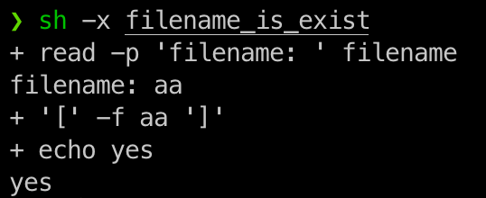

# shell

### 变量、语法等

#### 变量

- 不加引号
- 双引号: 引号内的 $ 保持原有的特性，如模板字符串
- 单引号: 纯粹的字符串
- $(bash) / `bash`: 执行其他指令
- env: 查看环境变量
- set: 查看所有的 自定义变量 和 环境变量
- export: 将 自定义变量 转 环境变量

#### 变量键盘读取、阵列与宣告

```bash
read -pt var # 读取输入，p后面跟着提示，t是时间
declare -aixr # a变量为数组，i为数字，x与export一样，r为只读
```

其他命令

```bash
history 
source filenaem # 将文件读入当前环境中 
```

#### 标准输入输出

- 标准输出: > , >> 追加
- 标准错误错误输出: 2> , 2>>
- /dev/null: 垃圾黑洞
- 标准输入:
- tee: 同时输入到文件 和 输出 到屏幕

#### 正则

示例文件 regular_express.txt

```text
"Open Source" is a good mechanism to develop programs.
apple is my favorite food.
Football game is not use feet only.
this dress doesn't fit me.
However, this dress is about $ 3183 dollars.^M
GNU is free air not free beer.^M
Her hair is very beauty.^M
I can't finish the test.^M
Oh! The soup taste good.^M
motorcycle is cheap than car.
This window is clear.
the symbol '*' is represented as start.
Oh! My god!
The gd software is a library for drafting programs.^M
You are the best is mean you are the no. 1.
The world &lt;Happy&gt; is the same with "glad".
I like dog.
google is the best tools for search keyword.
goooooogle yes!
go! go! Let's go.
# I am VBird
```

##### 特殊符号

- `[:alnum:]`: 0-9, A-Z, a-z
- `[:alpha:]`: A-Z, a-z
- `[:digit:]`: 0-9
- `[:lower:]`: a-z
- `[:upper:]`: A-Z
- `[:space:]`: 任何会产生空白的字符，包括空白键, [Tab], CR 等等

#### - 减号

> 代表标准输入输出

```bash
tar -cvf - /home | tar -xvf -
```

1. 将 home 打包，打包的数据作为 标准输出 （不实际打包）
2. 第二个 “-” 将之前的 输出 作为 标准输入，进行解压
3. 整个命令相当于 `cp /home`

### 常用命令示例

#### 判断

##### test

```bash
test -efdL # 存在判断：e文件名是否存在；f存在且为文件；d存在且为目录；L链接文件；
test -rwx # 权限检测：rwx权限；
test -nt/ot/ef # 文件比较： -nt，是否比较新；
test -eq/ne/ge/lt/ge/le # 整数判断：等于/不等于/大于/小于/大于等于/小于等于

test -e aaa && echo "yes" || echo "no"
```

##### [] 的利用

与 `test` 的使用基本一样，只是更方便在 条件判断式中使用。

```bash
#!/bin/bash
# 判断文件是否存在
read -p "filename: " filename
if [ -f $filename ]
then
 echo "yes"
else
 echo "no"
fi
```

##### if then elseif then else fi

##### case 1) ;; 2) ;; esac

##### 函数 function fname () {}

#### find

```bash
find path -options # path查看路径；-options=name,user,ctime 
find . -iname "aaa.js" # 不区分大小写找出当前目录下  aaa.js 结尾的文件，注意双引号
find . -name "*.js" # 找出当前目录下以 .js 结尾的文件
find . -name "[a-z]*.js" # 找出当前目录下以 小写字母开头.js 结尾的文件

find . -type f          # 将当前目录及其子目录中的所有文件列出
find . -size 100k       # 按大小搜索 -小于，+大于，不加符号=
```

#### cut/grep

cut: 主要的用途在于将“同一行里面的数据进行分解!”，以行为单位处理

##### grep / egrep

grep: 从一行当中搜索想要的部分，取出来

```bash
grep -[AB]num filename # A=after后面num行也列出来，B=before
grep -in 'the' regular_express.txt          # 找出包含 the 的行，并且列出行号n，且不区分大小写i
grep -n 't[ae]st' regular_express.txt       # 找出包含 test | tast 的行
grep -n '[^g]oo' regular_express.txt        # 找出不包含 goo 的行， 但 gooo 符合
grep -in '^the' regular_express.txt         # 找出以 the 开头的行
grep -n 'g..d' regular_express.txt          # 找出包含 g..d 的行 `.`代表任意一个字符，就是正则的 `.`
grep 'test' d*　　          # 显示所有以d开头的文件中包含 test的行
grep 'test' aa bb cc 　　   # 显示在aa，bb，cc文件中包含test的行
grep '[a-z]\{5\}' aa 　　   # 显示所有包含每行字符串至少有5个连续小写字符的字符串的行
grep -v magic /usr/src　　  # 显示/usr/src目录下的文件(不含子目录)包含magic的行
grep -r magic /usr/src　　  # 递归查找

grep -E # === egrep，可以使用更多正则功能
grep -v '^$' regular_express.txt | grep -v '^#' # 去除空白行 和 # 为首的字符
egrep -v '^$|^#' # 等价于上面

```

#### cut

```bash
sed [-nefri] [动作acdips] # n只输出被处理的行；f将动作写在一个文件内，接入文件名；r是正则；i直接修改源文件而不输出
# 动作 a新增；c取代[n1,n2]行；d删除；i插入；p打印；s替换[n1,n2]行中特定字符
sed '2,5d' # 删除2-5行
sed '2a drink tea' # 在第二行后面插入 “drink tea” 成为第三行
sed '2i drink tea' # 在第二行前面插入 “drink tea”
sed 's/要被取代的字串/新的字串/g'
```

#### awk

#### diff

#### cmp

#### patch

### shell 的一些概念

#### script 的执行方式差异

- `./xxx.sh`: 要求脚本具备可执行权限且指名用什么来执行（头部申明）
- `~/xxx.sh`: 和上面一样
- `sh xxx.sh`: 利用 sh 来执行
- `source xxx.sh`: 前面都是在子进程中执行，而 `source` 在父环境中执行命令

#### debug

```bash
sh -nvx # -n不执行仅检查语法；v输出script，输出什么就执行对应的script；x将使用到的script输出到屏幕上 
```


