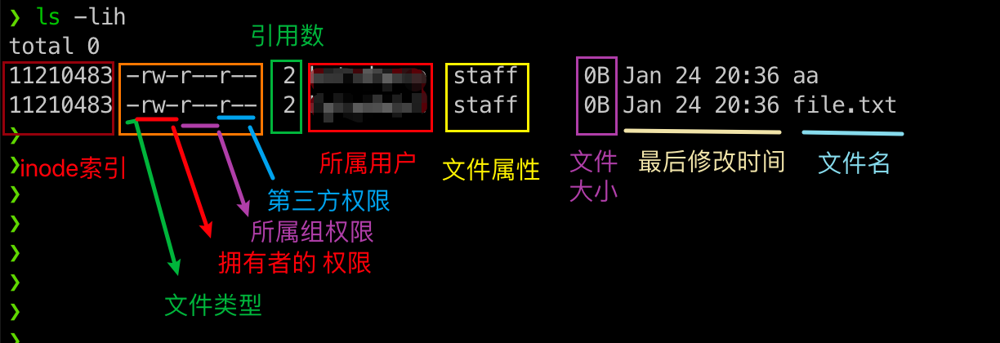
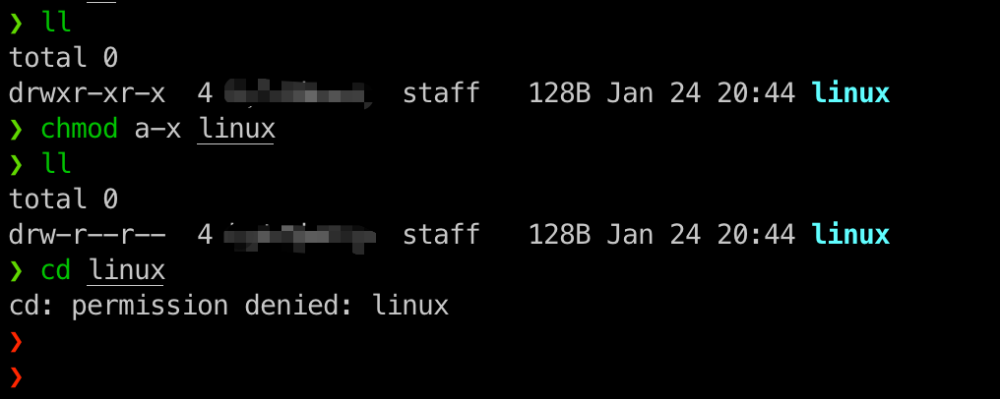
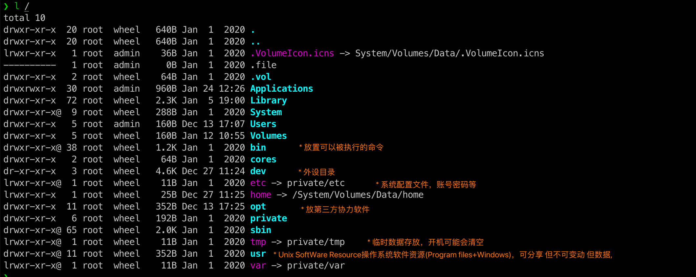

# 基本概念

### 帮助命令

```powershell
man command # 第一行的数字(1)代表内容的类型，ctrl+d=page_down=下页，q退出，方向键移动
```

### 系统命令

```powershell
su - # 切换为 root
shutdown # 关机，可以设定关机时间，以及发送关机通知
reboot # 重启
poweroff # 关机
systemctl # todo
```

### 文件系统

linux 的角色可以分为：

- 拥有者：比如学生A，拥有一台 switch，就能独自看、玩
- 群组：所属的群组，所拥有的权限，比如 学生A 加入 xx社团 成为 社员A，并将 switch 放在社团给所有社员一起玩，这样社员B就可以使用这台 switch 了

- 第三方用户：非上面的情况
- root：不受上面约束，有全部权限，即为“上帝”



- 索引节点Inode：
- 文件类型（橙色框第一个符号）："-"～文件，"d"～目录，"l"～链接

- 权限（橙色框后面9个符号，3个一组）：
- 引用数：

```bash
chgrp newGroup filename # 修改组
chown newOwn filename # 修改 拥有者
chomd [rwx] filename # 修改权限，覆盖之前的 3组 设置
chomd a[+/-]w fielname # a: all, 给全部 加/减 写权限， a还有[ugo]其他选项 
```

对于文件：

- 文件是存放实际数据的所在
- r: 读取文件名对应的数据
- w: 修改/新增数据内容
- x: 执行、删除

对于文件夹：目录是存储文件名的清单

- r: 读取清单的权限，可以用 `ls` 查看
- w:  创建新文件和目录、删除/更名已存在文件（忽略文件权限），移动
- x: 是否可以进入改目录



#### 目录树说明

下面的图片是 mac 的

