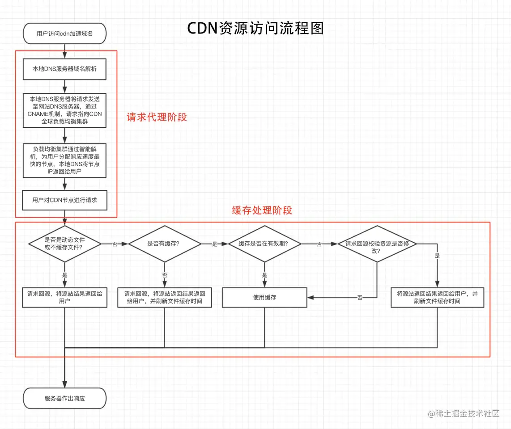

# web相关

## 加载优化

### 浏览器请求过程

> 当浏览器请求一个URL的时候，会经过以下过程：阻挡、域名解析、建立连接、发送请求、等待响应、接收数据。

- 阻挡：不同浏览器对于单个域名的最大并发连接数有一定的限制，如果浏览器同时对某个域名发起多个请求，超多限制就会出现等待，也就是阻挡。

#### cookie-free domain

将静态资源放在不同的域名下，与主站域名不同，这样浏览器就不会把主域名下的Cookie传递给改域名，减少网络开销，提高页面加载速度。
这个域就叫做 cookie-free domain（无cookie域名）

### domain hash

由于浏览器有并发数量限制，可以使用多个域名加大浏览器并发量

#### 为什么浏览器有并发上限

1. 服务端为了保护自己，比如一个客户端过多的请求占用了资源，会有安全机制来防止
2. 一个tcp链接的建立需要创建一个线程，连接结束会销毁，过多的请求会占用双方过多的资源
3. 过多的请求并不能提高加载的速度，而通过keep alive复用链接反而能减少建立的开销，提高加载速度

### CDN

CDN 节点缓存策略一般都会遵循 HTTP 标准协议的缓存标准

#### 流程

