# 网络模型

OSI: Open System Interconnect，开放式系统互联玩

## 分层模型

类比快递

### 物理层 -- 交通工具

1. 传输比特流（数模和模数的转换）
2. 主要通过广播的方式发送数据

### 链路层 -- MAC地址，鉴别快递是否属于本站或把快递装对应目的地的车

网卡的唯一的标识。

mac：MAC 地址是有一定定位功能的，只不过范围非常有限，类似找人，通过地址(ip有位置信息)找，到了公司里，才会通过名字or身份证(mac地址)进一步确认

功能：

- 将来自物理层的数据流封装成帧
- 将来自上层网络的数据帧拆解成数据流
- 同时，通过各种控制协议，将差错的物理信道变为无差错的、能可靠传输数据帧的数据链路

分层：

- 逻辑链路控制子层（LLC）
- 媒体访问控制子层（MAC）

### 网络层 -- 快递的下一站以及配送方式

> 快递的目的地在哪（下一个站点）？送的方式，走那条路？也就是发送快递

通过IP寻址来建立两个节点之间的连接，即寻址，路由

#### 协议

IP协议：地址解析协议ARP：网际控制报协议ICMP * 网际管理协议IGMP

CIDR：无类型域间选路，现在比较常见，用于IP的表示和划分。
将ip地址划分为网络号、主机号，如：`10.100.122.2/24`，前24位表示网络号，后8位表示主机号
子网掩码: 用来表示那些是主机位、那些是网络位
主机号全为0是网络地址（ip与掩码的and结果），全为1是广播地址

#### 概念

私有IP：允许组织内部的 IT 人员自己管理、自己分配，而且可以重复
公有IP：公有 IP 地址由组织统一分配

IP的划分

- A类：网络位8位，主机位24位，网络前导位为0
  1.0.0.0—127.255.255.255
- B类：网络位16位，主机位16位，网络前导位为10
  128.0.0.0—191.255.255.255
- C类：网络位24位，主机位8位，前导位为110
  192.0.0.0—223.255.255.255
- D类：组播地址，前导位为1110
  224.0.0.0—239.255.255.255
- E类：保留地址，前导位为11110
   240.0.0.0—247.255.255.255

### 传输层 -- 收快递、送快递的站点，保证快递正确送达

传输层建立了主机端到端的链接，
传输层的作用是为上层协议提供端到端的可靠和透明的数据传输服务，包括处理差错控制和流量控制等问题。
该层向高层屏蔽了下层数据通信的细节。

#### 协议

##### UDP

面向报文传输的协议

特点：

- 无链接的协议
- 不可靠的数据交付、
- 高效，处理速度快：UDP的首部简单，有点非常小，就8字节
- 可能会丢包
- 不会对数据进行拆分或者其他处理，应用层数据报文越长，UDP的数据报文就越长

###### 应用

DHCP、VXLAN、QUIC

##### TCP

> （Transmission Control Protocol）传输控制协议，面向连接的协议

特点：

- 连接较慢：3次握手，4次挥手
- 慢启动
- 超时重传，包丢失：发送方在等待一段时间之后，发现并没有接收到确认消息，就会重新发送消息，这个就属于超时重传
- 流量控制：见下面

###### 报文

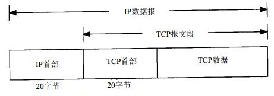

###### 三次握手过程

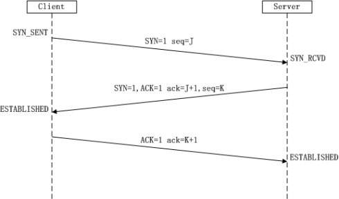

1. 客户端向服务器发出连接请求报文，这时报文首部中的同部位SYN=1
2. TCP服务器收到请求报文后，如果同意连接，则发出确认报文。确认报文中应该 ACK=1，SYN=1
3. TCP客户进程收到确认后，还要向服务器给出确认。确认报文的ACK=1

为什么要三次握手：为了满足在不可靠的信道上传输可靠的数据所要求的

###### 四次挥手过程

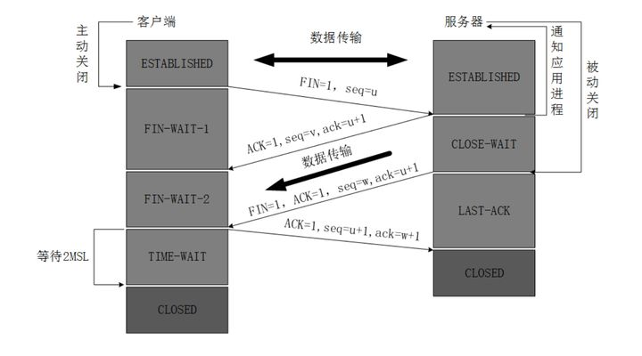

1. 客户端进程发出连接释放报文，并且停止发送数据
2. 服务器收到连接释放报文，发出确认报文
3. 客户端收到服务器的确认请求后，进入等待状态，等待服务器发送链接释放的报文
4. 服务器将最后的数据发送完毕后，就向客户端发送连接释放报文
5. 客户端收到服务器的连接释放报文后，必须发出确认， 同时等待2MSL时间后结束
6. 服务器只要收到了客户端发出的确认，就**立即**结束TCP链接，如果客户端没有确认答复，过一段时间也会自己关闭链接

为什么需要四次握手：确保双方数据发送完成

###### TCP流量控制

如果发送者发送数据过快，接收者来不及接收，那么就会有分组丢失。为了避免分组丢失，控制发送者的发送速度，使得接收者来得及接收，这就是流量控制

目的：防止分组丢失，它是构成TCP可靠性的一方面。

**实现：**
由滑动窗口协议（连续ARQ协议）实现。

- 接收方每次收到数据包，可以在发送确定报文的时候，同时告诉发送方自己的缓存区还剩余多少是空闲的
- 发送方收到之后，便会调整自己的发送速率，也就是调整自己发送窗口的大小，当发送方收到接收窗口的大小为0时，发送方就会停止发送数据，防止出现大量丢包情况的发生。

**拥塞控制**
发送方可能因为IP网络环境限制的拥塞而被遏制，如果发送的包太多，可能容易丢失。

**拥塞避免**
实现：
发送方维持一个叫做**拥塞窗口** cwnd的状态变量。拥塞窗口的大小取决于网络的拥塞程度，并且动态变化

**慢启动**
因为刚刚发送数据的时候，不知道网络环境的情况，因此会探测一下，即由小到大逐渐增大发送窗口。

**超时重传**
发送数据包在一定的时间周期内没有收到相应的ACK，等待一定的时间，超时之后就认为这个数据包丢失，就会重新发送。这个等待时间被称为RTO.  

**快重传**
发送数据[1,2,3]，接收方收到[2,3]后便不会应答ACK,而是复发送需要1的ACK，当发送方收到3次重复的Ack的时候，便会立即重新发送数据1

**快速恢复**
上面的情况说明了
**网络确实发生了拥堵，但是又没有完全拥堵**
所以将**拥塞窗口**的大小降低一半，在计算合适的窗口大小

### 应用层 -- 打包东西，填写寄收方的资料，联系快递公司

用于网络上应用间的通信，包括文件传输协议（FTP），超文本传输协议（HTTP）和电子邮件

这一层按照本新标准又可分为3层，但目前的实现都是未分离的，也就是都在应用层实现。

#### 会话层

对话管理，如建立连接，输出发送，会话结束释放

#### 表示层

为应用层的数据进行格式化，包括编码和加密、解密等，使不同的计算机可以彼此理解

#### 应用层

为计算机用户提供应用接口

#### 协议

HTTP，FTP，POP3、SMTP

#### http协议

超文本传输协议。
http是在一个计算机世界里专门在两点之间传输文字、图片、音频、视频等超文本的约定和规范，包含控制和错误处理方式
HTTP 专门用来在两点之间传输数据，不能用于广播、寻址或路由。
HTTP 是构建互联网的重要基础技术，它没有实体，依赖许多其他的技术来实现（TCP/IP来传输），但同时许多技术也都依赖于它（websocket、DNS）。

**相关概念：**
浏览器 - User Agent, 用户代理角色
web服务器 - 响应方
CDN
HTML

- HyperText Markup Language，超文本标记语言
- 包含HTML、JavaScript、CSS等前端技术，用来描述超文本页面的标准

**安全&幂等**
安全：指请求方法不会“破坏”服务器上的资源，如GET/HEAD
幂等：意思是多次执行相同的操作，结果也都是相同的，即多次“幂”后结果“相等”。

**特点**

- 灵活可扩展
- 可靠传输
- 应用层协议
- 请求-应答模式：一发一收
- 无状态
- 不安全：明文传输，缺少认证和完整性校验

#### 连接管理

##### 长短连接

短链接：请求发起，连接建立，数据返回，连接关闭。

长连接：在特定时间内，数据传输完成后依然保持保持TCP连接，如果在规定时间内（一般是服务端设定的时间），有请求则复用该链接

##### 长短轮询

短轮询：短轮询指的是在循环周期内，不断发起请求，每一次请求都立即返回结果

长轮询：而长轮询及是在请求的过程中，若是服务器端数据并没有更新，那么则将这个连接挂起，直到服务器推送新的数据，再返回，然后再进入循环周期。

#### URI、URL

##### URI - 统一资源标识符

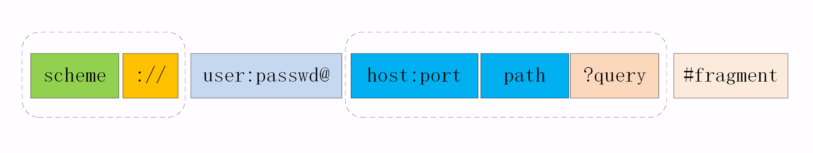

如：<http://nginx.org/en/download.html>

账号密码已经不推荐使用，会明文暴露

##### URL - 统一资源定位符

俗称网址，是URI的子集，但区别不大

#### 报文格式

- 请求
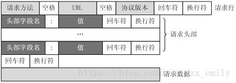

- 响应
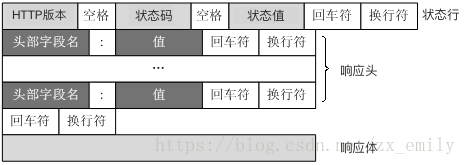

分成3快

1. 起始行：
   - 请求行：`method 空格 URI 空格 httpVersion \r\n`
   - 状态行: `httpVersion 空格 statusCode 空格 reason(OK) \r\n`

2. 头部字段集合：最后一定是一个空行（\r\n）

    ```json
    {
        key: value \r\n`，
        ...,
        \r\n
    }
    ```

    \r\n(空行，表示请求头到这里结束了)

3. 消息正文（可以没有）

##### 请求方法

目前 HTTP/1.1 规定了八种方法，单词都必须是大写的形式

**常用：**

- GET
- POST
- PUT
- DELETE

**不常用：**

- HEAD
- CONNECT
- OPTIONS
- TRACE

##### 请求头字段

- Content-Type（MIME）: 实体数据真实类型
 如Accept: text/html,application/xml,image/webp,image/png
- Accept-Encoding/Content-Encoding：压缩格式
 如：gzip, deflat
- Accept-Language：语言类型
 如：zh-CN, zh, en
- Transfer-Encoding：chunked（分块传输编码， 与Content-Length互斥）
- Accept-Ranges/Content-Range/Range
  - bytes（告诉客户端支持范围传输，例如视频快进）
  - bytes x-y/length，响应，告诉客户端当前的范围和总长
  - 支持传输多个如：Range: bytes=0-9, 20-29
  - 响应状态码必须是 206 Partial Content

和缓存有关的字段

- expires
- cache-control
    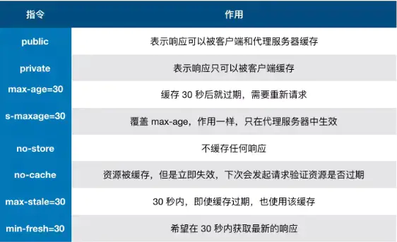

- Last-modified / if-modified-since
- ETag / if-none-match

##### 状态码

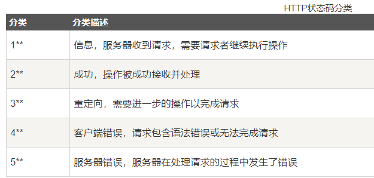

1xx：提示信息，表示目前是协议处理的中间状态，还需要后续的操作
2xx：成功，报文已经收到并被正确处理；
3xx：重定向，资源位置发生变动，需要客户端重新发送请求；

- 301：永久重定向（301 Moved Permanently），搜索引擎的爬虫看到 301，也会更新索引库，不再使用老的 URI
- 302：Found（Moved Temporarily）临时重定向，爬虫看到后，只会简单的跳转而不会记录新的URI
 304：304 Not Modified
4xx：客户端错误，请求报文有误，服务器无法处理；
  - 401 未授权，比如重新登入
- 403 Forbidden，禁止访问，无权限
- 404
5xx：服务器错误，服务器在处理请求时内部发生了错误。
- 500 Internal Server Error，服务器出错
- 502 Bad Gateway，服务器正常、但访问服务器后台资源错误
- 503 Service Unavailable，服务器当前很忙，暂时无法响应服务

#### Cookie

请求头字段 Cookie
响应头字段 Set-Cookie

#### 代理

服务本身不生产内容，而是处于中间位置转发上下游的请求和响应，具有双重身份

##### 分类

- 匿名代理：完全“隐匿”了被代理的机器，外界看到的只是代理服务器；
- 透明代理：顾名思义，它在传输过程中是“透明开放”的，外界既知道代理，也知道客户端；
- 正向代理：靠近客户端，代表客户端向服务器发送请求；
- 反向代理：靠近服务器端，代表服务器响应客户端的请求；

##### 作用

- 负载均衡
- 健康检查：使用“心跳”等机制监控后端服务器，发现有故障就及时“踢出”集群，保证服务高可用；
- 安全防护：保护被代理的后端服务器，限制 IP 地址或流量，抵御网络攻击和过载
- 加密卸载：对外网使用 SSL/TLS 加密通信认证，而在安全的内网不加密，消除加解密成本
- 数据过滤：拦截上下行的数据，任意指定策略修改请求或者响应
- 内容缓存：暂存、复用服务器响应
- 缓存代理
- 缓存控制
  - private：不能放在代理上共享
  - public：哪里都可以缓存

#### 版本发展和特点

关键词：队首堵塞

**TCP队头阻塞**：
队头阻塞（head-of-line blocking）发生在一个TCP分节丢失，导致其后续分节不按序到达接收端的时候。该后续分节将被接收端一直保持直到丢失的第一个分节被发送端重传并到达接收端为止。

##### http1.0

**队首堵塞**：对于同一个tcp连接，所有的http1.0请求放入队列中，只有前一个请求的响应收到了，然后才能发送下一个请求，即一个tcp链接一次只能处理一个http请求。可见，http1.0的队首组塞发生在客户端。

##### http1.1

使用了一种叫Pipelining管道技术的方式，这是相对于keep-alive连接的又一性能优化。让客户端能在一个TCP链接中，并行发送多个http请求，服务器端也可以并行处理多个来自客户端的请求，只有GET请求才能管道化
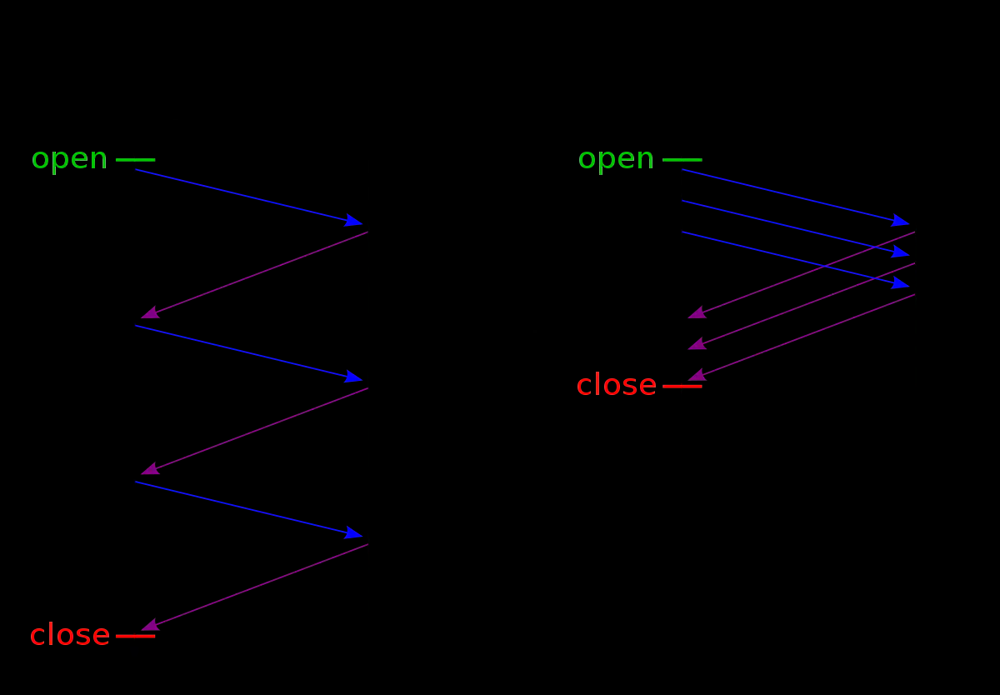

- 对于同一个TCP请求，客户端能一次发送多个，而不必等前一个响应收到，这样就解决了客户端队首堵塞问题。
- 但服务器端必须遵守先收到的先回复，即时后一条已经处理完，也要等前一条响应，客户端也要如此接收响应，不然客户端无法识别那条响应对应那条请求。可见，http1.1的队首阻塞发生在服务器端。（受限于TCP的队头堵塞）

##### http/2

1. 解决什么问题：采用流(steam)的方式，并行发送若干个请求，各个流之间互相独立，互不堵塞，所以可以解决服务端的http队首堵塞

    > 流：流是连接中的一个虚拟信道，可以承载双向的消息；每个流都有一个唯一的整数标识符（1、2…N）；

2. http/1只能（”content-Encoding“指定编码方式）压缩body，而http/2可以压缩头部（HPACK算法）

3. 二进制格式：HTTP/2 采用二进制格式传输数据，而非 HTTP 1.x 的文本格式，二进制协议解析起来更高效。
    - 把原来的“Header+Body”的消息“打散”为数个小片的二进制“帧”（Frame），化化整为零
    - 用“HEADERS”帧存放头数据、“DATA”帧存放实体数据

4. 多路复用：采用流(steam)的方式，服务端可以新建“流”主动向客户端推送消息(资源)，即在一个TCP链接中，通过不同的流，传输不通的数据。
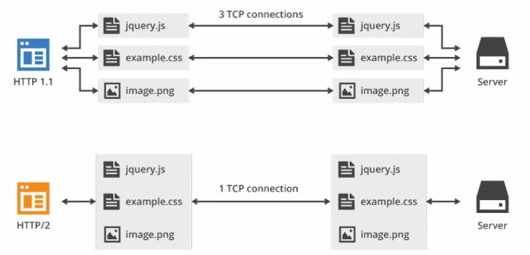

**缺点**
在出现丢包的情况下，整个 TCP 都要开始等待重传，也就导致了后面的所有数据都被阻塞了。但是对于 HTTP/1.1 来说，可以开启多个 TCP 连接，出现这种情况反到只会影响其中一个连接，剩余的 TCP 连接还可以正常传输数据。

##### http3.0

QUIC：基于 UDP，而 UDP 是“无连接”的，根本就不需要“握手”和“挥手”，所以就比 TCP 来得快。此外，QUIC 也实现了可靠传输，保证数据一定能够抵达目的地。

特点：

- 实现了类似 TCP 的流量控制、传输可靠性的功能。
- 实现了快速握手功能。
- 集成了 TLS 加密功能。
- 多路复用，彻底解决 TCP 中队头阻塞的问题。

##### https

###### 安全特性

- 机密性（Secrecy/Confidentiality）：靠混合加密解决，非对称加密实现对称加密秘钥传递，对称加密实现内容加密。
- 完整性（Integrity，也叫一致性）：靠摘要算法解决
- 身份认证（Authentication）： CA机构颁布数字证书认证公钥的正确性
- 不可否认（Non-repudiation/Undeniable）：靠数字签名解决

##### SSL/TSL

- SSL：安全套接层（Secure Sockets Layer）
- TSL：SSLv3版本改名位TSL1.0

**基本形式**
套件组合如下，意思是
握手时使用ECDHE算法进行密钥交换，
用RSA签名和身份认证，
握手后使用AES对称算法，密钥长度256位，分组模式时GCM，
摘要算法SHA384用于消息认证和产生随机数

**套件组合**：

- 密钥交换算法
- 签名算法
- 对称加密算法
  
签名算法 + 对称加密算法 的混合加密：用RSA/ECDHE交换密钥，将对称加密的密钥（称为”会话密钥“）加密后送过去，之后双方用这个协商好的密码对数据进行加密传输

**摘要算法**：如散列函数、哈希函数，可以把任意长度的数据压缩成长度固定，获得独一无二的”摘要“字符串

**签名/验签：**

1. 对一段数据的hash进行加密，得到签名
2. 接收方用对应的公钥进行解密，得到数据和hash，然后再次对进行hash2， 得到的结果 hash2===hash (验签)

##### 单向认证流程

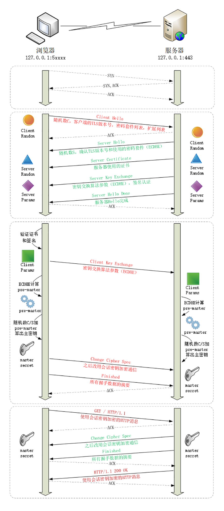

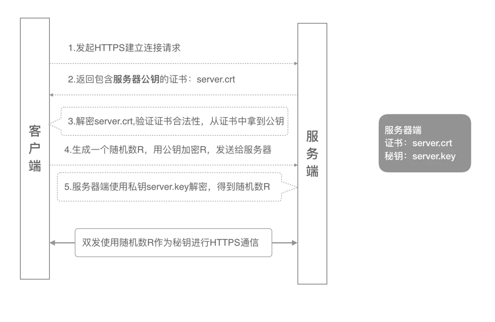

**TSL握手过程**

1. 客户端与服务器建立TCP链接，携带以下信息
    - 支持的TSL协议版本
    - 支持的加密方式
    - 随机数A
    - 支持的压缩方式
2. 服务器答复，包括以下信息
    - 数字证书
    - 随机数B
    - 确认加密方式和密钥
    - 通信的版本协议
    - 如果服务器需要客户的信息，便会要求客户提供客户端证书，比如金融机构
3. 客户端接收到后会验证服务器证书
4. 客户端响应一下信息

- 随机数R，又称pre-master key
- 用客户端的公钥加密随机数R

5. 服务端回应，确认加密方式和密钥

**随机数的作用**
客户端和服务器将3个随机数，通过之前协商的加密方式各自生成用一把”会话密钥“，随机数的作用是保证密钥的随机性，不会每次都重复

原因：只有一个pre-master-key，还可以被猜出，或者重复，但是3个随机数，密钥就不容易被猜出了

###### 双向认证流程

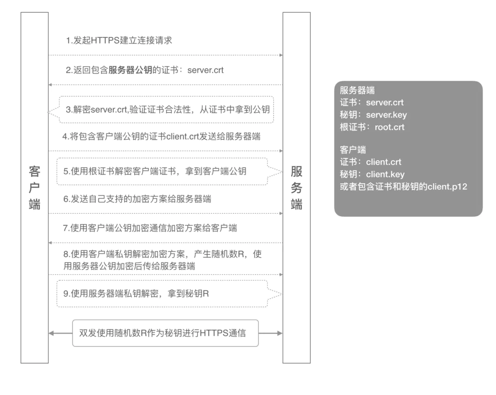

1. 浏览器内置[or安装]数字证书
2. 浏览器与服务器建立TCP链接，提供下面的信息
   - 支持的TSL协议版本
   - 支持的加密方法
   - 压缩方法

3. 服务器发送自己的数字证书(server.crt)给浏览器，包括：签发者，服务器的公钥，签发者用私钥加密的服务器公钥hash的摘要信息【签名】等
4. 浏览器在CA(证书的签发机构)证书中，找到服务器给的数字证书中的签发者的公钥，验证合法行：
   1. 用签发者公钥解密摘要信息，得服务器公钥hash
   2. 在计算服务器的公钥的hash2， 判断hash === hash2【验签】
   3. 浏览器将自己公钥证书(client.crt)发送给服务器
   4. 服务器端使用根证书(root.crt)【验签】，拿到客户端公钥
   5. 协商加密方式：浏览器发送自己支持的加密方案给服务器
   6. 服务器选择一个合适的加密方法，用浏览器的公钥加密，发送给浏览器
   7. 浏览器用私钥解密得到加密方式，生成一个随机数R，使用服务器公钥加密发送到服务器
   8. 服务器用私钥解密，得到密钥R
   9. 双方用这个密钥R进行加密通信

#### 其他概念

- p2p：peer-to-peer
- SSL 证书（SSL Certificates）又叫服务器证书
- CA：证书的签发机构

## 参考

[HTTPS双向认证指南](https://www.jianshu.com/p/2b2d1f511959)
