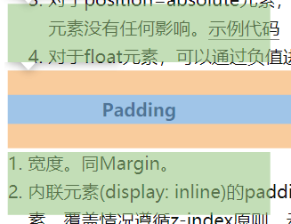
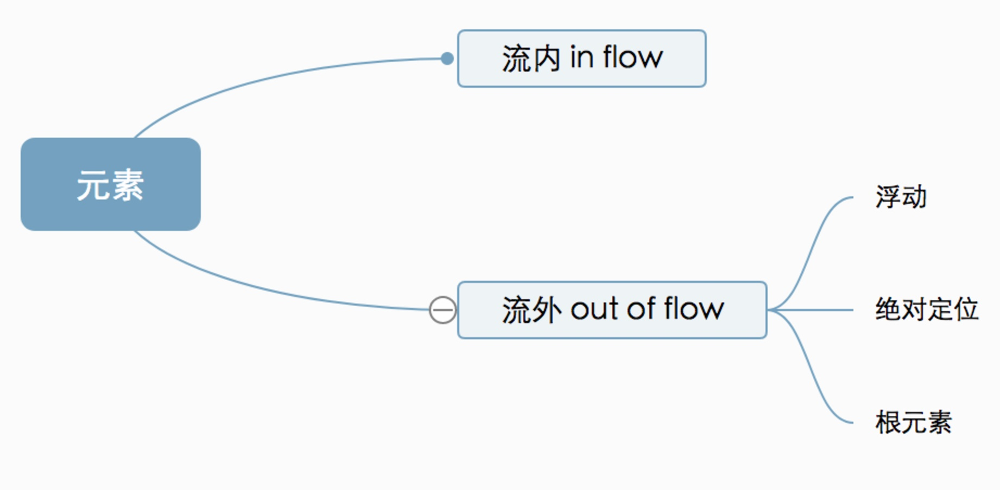
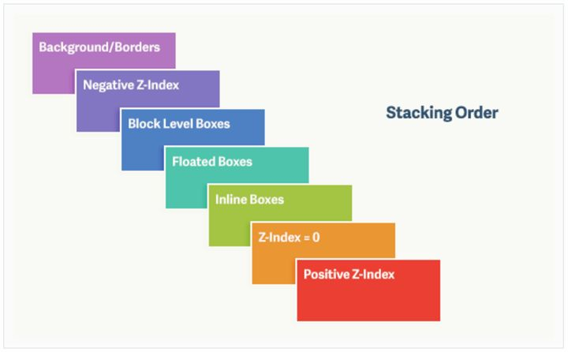

# css可视化模型

## 盒模型

1. 由外到内： margin/border/padding/centent
2. IE盒模型：宽度包含border/padding/centent

### margin

- margin的百分比是根据元素的包含块(containing-block)的width来计算
- 内联元素(display: inline)的margin-top和margin-bottom失效
- margin合并：
  - **块级**元素上下关系会合并
  - **块级**的margin-top在没有元素元素隔离的情况下会合并

### padding

- padding的百分比也是根据包含快的宽度来计算
- 内联元素(display: inline)的padding**生效**，但是top和bottom并不会占据空间，只会覆盖其他元素，覆盖情况遵循z-index原则

    

- 不允许负值

### Border

- 宽度。只有px，不支持百分比。
- 合并。inline元素左右不合并，上下会合并。inline-block&block元素四个方向都不会合并

### content

内容区域

### width/height

见包含块

## 包含块(containing block)

无特殊情况下，containing block（包含块）**就是最近的块元素的content area**（内容区）。

每个盒子会变成他后代盒子的包含块，后代盒子的大小和位置会根据他包含块的矩形边框进行计算。但是不会受到包含块的限制，可能会溢出。

### 确定包含块的方法

- 对于根元素、position=fixed的元素，包含块都是视窗
- 如果元素是relative或者static,则是他最近的块形父元素的内容区(content)
  ——注:规定了父元素必须是block container
- 如果元素是absolute，包含块是最近的非static的父元素的Padding + content区
  ——注:父元素的类型未规定

## 控制框（Controlling Box）

块级元素和块框以及行内元素和行框的相关概念

### 块框

- 块级元素会生成一个块框（Block Box），块框会占据一整行，用来包含子box和生成的内容
- 块框同时也是一个块包含框（Containing Box），**里面要么只包含块框**，**要么只包含行内框**（不能混杂），如果块框内部有块级元素也有行内元素，那么行内元素会被匿名块框包围

### 行内框

- 一个行内元素生成一个行内框
- 行内元素能排在一行，允许左右有其它元素

### display的影响

- block：变成块框
- inline: 变成行框
- inline-block：变成本身变成一个行框，但内部是一个块框（所以会产生BFC）

## 定位模式

### 流内模型分类

1. css2: IFC（Inline Formatting Contexts）与 BFC（Block Formatting Contexts）
2. css3：GFC（GridLayout Formatting Contexts）和FFC（Flex Formatting Context）

### BFC（Block formatting contexts）块格式化上下文

> 具有 BFC 特性的元素可以看作是隔离了的独立容器，容器里面的元素不会在布局上影响到外面的元素，并且 BFC 具有普通容器所没有的一些特性。

1. 什么情况产生BFC(四选一)
    - 浮动
    - 绝对定位
    - 非块盒的块容器（inline-block）
    - overflow不为visible的块盒（对后代元素有效）
2. 特性
    - 内部box在垂直方向，一个接一个的放置
    - BFC内部兄弟盒子之间的margin会合并——可以通过把兄弟之一变成BFC
    - BFC解决合并BFC可以阻止margin合并
    - 能让float元素参与父元素高度的计算

#### 为什么overflow:hidden能清除浮动元素？

如果不把高度计算进去，那么浮动元素就看不到了，所以BFC会计算float元素的高度

### IFC（Inline formatting contexts）内联格式化上下文

> 高度由其包含行内元素中最高的实际高度计算而来

1. 如何产生：
   只有在一个块级元素中仅仅包含内联级别元素时才会生成
2. 特性
    - 从包含块顶部水平方向排列
    - 行内元素会应用IFC规则渲染，譬如text-align可以用来居中等
    - 排列情况和浮动与否会改变行盒的高度
    - 当一个行盒被分割，margin,border,padding都不会再有视觉效果了

### 浮动

> 允许文本和内联元素环绕它，从网页的正常流动中移除，尽管仍然保持部分的流动性

位置：

1. 当一个元素浮动之后，会移除正常的文档流，然后向左或者向右平移，直到碰到容器边框或者另一个浮动元素
2. 跟随上一个浮动元素，如果当前行放不下，就放下一行

清除浮动：

1. `clear: xxx`
2. 父盒子变成BFC

### 绝对定位

> position=absolute设置元素绝对定位，会导致元素变成绝对定位，脱离文档流，并且元素此时是BFC布局，Margin不会进行合并。

## 盒模型百分数

[参考](https://segmentfault.com/a/1190000000590998)

这里父元素指 **包含快**

### 父元素非绝对定位

1. 参照物是【父元素】的width: width、margin-left\right\top\bottom、padding-left/right/top/bottom的。
2. 参照物是【父元素】的height: height

### 父元素绝对定位

1. 定位起点是【定位包含块】的padding-box
2. top/bottom相对于宽度、left/right相对于宽度

### 其他

1. font-size：继承父元素的计算
2. line-height: 根据自身的`font-size`
3. vertical-align: 相对于`line-height`
4. translate: 自身的边界框尺寸`border-box`

## 层叠关系

1. 背景和边框 —— 形成层叠上下文的元素的背景和边框。 层叠上下文中的最低等级。
2. 负z-index值 —— 层叠上下文内有着负z-index值的子元素。
3. 块级盒 —— 文档流中非行内非定位子元素。
4. 浮动盒 —— 非定位浮动元素。
5. 行内盒 —— 文档流中行内级别非定位子元素。
6. z-index: 0 —— 定位元素。 这些元素形成了新的层叠上下文。
7. 正z-index值 —— 定位元素。 层叠上下文中的最高等级。

### 层叠上下文

产生条件

1. `HTML`中的根元素`<html></html>`本身j就具有层叠上下文，称为“根层叠上下文”。
2. `position`为非`static`的元素并设置了`z-index`为具体数值的元素
3. css3的某些新属性

### 层叠等级

1. 普通元素的层叠等级优先由其所在的层叠上下文决定。
2. 层叠等级的比较只有在当前层叠上下文元素中才有意义。不同层叠上下文中比较层叠等级是没有意义的。

## 参考

[CSS原理解析之模型篇](https://zhuanlan.zhihu.com/p/29711976)
