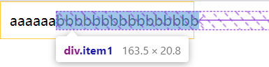

# flex-弄懂flex-item大小的计算

### 宽度计算
对于一个flex容器 和 flex项目之间，会有 **Flex项目尺寸大小之和大于或小于Flex容器**
- 当之和小于flex容器时，就会有多余的空间，称为**剩余空间**
- 当之和小于flex容器时，就会缺少一些空间，称为**不足空间**

#### flex-basic
在计算的时候，首先会计算 `flex项目` 的大小，与`flex-basic`有关，如果设置为了`auto`，且设置了`widthL auto`，那么此时会以内容的长度作为 flex项目的大小。

**规则:**
- flex-basic 的优先级高于 width
- 当Flex容器剩余空间不足时，Flex项目的实际宽度并不会按flex-basis来计算，会根据flex-grow和flex-shrink设置的值给Flex项目分配相应的空间
- `min-width`和`max-width`的优先级高于 `flex-basic`
- 最后在根据 `flex-grow` 和`flex-shrink` 计算分配**剩余空间**或**不足空间**。

tip: 如果希望完成按照`flex-grow` 和`flex-shrink`，忽略flex项目本身的宽度，那么可以直接设置`flex-basic: 0`或`flex-basic: auto; width: 0`

#### flex-grow
如果未设置 `flex-basic`时：

flex都相同，如`flex-grow: 1`，则按照比例均匀分配剩余空间按。

但每个项目各自的内容宽度不一样，则最终的计算结果，并不是等宽的，据观察是原本的宽度，在加上**平均分配剩余宽度**

#### flex-shirnk
与`flex-grow`差不多，当 flex项目 的宽度总和超过 flex容器 时，按比例缩小分配全部空间，`flex-shrink: 1`时则平均分配

但最小值是 flex项目 内容的最小值，不会缩小至等于0。也就是依然会超过容器，哪怕设置`flex-basic: 0`也没用，此时可以加上`overflow: hidden`，截断它，让 flex项目 的宽度满足分配比例而不会溢出

### 参考
[聊聊Flexbox布局中的flex的演算法](https://zhuanlan.zhihu.com/p/50449041)