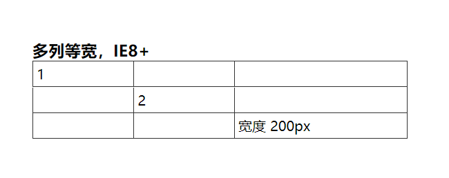
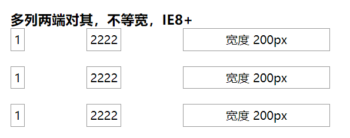

# 多列布局

目前(2202)年了，主流的布局方式基本都能用 flex 实现，甚至 Grid 的兼容性也越来越好了，这里记录下以前为了兼容 IE 而研究过的一些布局

## 多列等宽

自然想到可以用 `<table>` 去实现，但 `<table>`  的结构需要很多元素去包裹，这里可以采取另一种方案

```css
.row {
    display: table;
    table-layout: fixed; // 非常关键的一句， 实现等宽的的计算， 兼容IE8+
    width: 100%
}
.col {
    display: table-cell;
    vertical-align: middle;
}
```



## 多列两端对其，不等宽

```css
.row {
    text-align: justify;
    text-align-last: justify;  /* IE8+ */
}
.col {
    display:inline-block;
    text-align:center;
    border: 1px solid #333;
}
```



其中，可以有兼容性更好的写法：

```css
.row {
    text-align: justify;
    /*text-align-last: justify;  !* IE8+ 去掉 *!*/
}
.row:after {
    content: "";
    display: inline-block;
    position: relative;
    width: 100%;
}
```

原因：justify 只有在存在第二行的情况下，第一行才两端对齐，所以在这里，我们需要制造一个假的第二行，而 :after 伪元素正好再适合不过。

[demo地址](./static/layout/多列布局.html)
