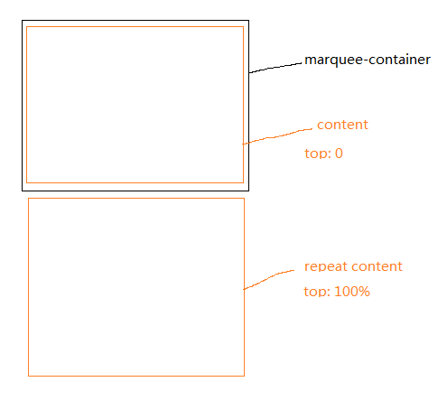
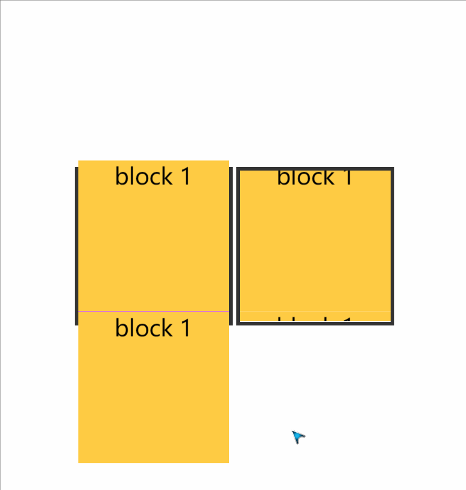
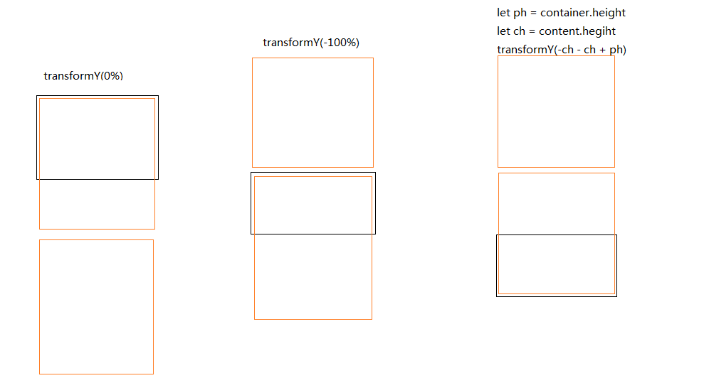

# 跑马灯、轮播等

类似的库：

- <https://github.com/YishaiBerg/vue-dynamic-marquee>
- <https://github.com/EvodiaAut/vue-marquee-text-component>

### 分析

要实现跑马灯，可以直接用 css3 的`animation + tansform`：（不考虑兼容性）
animation 可以通过 [animation-play-state](https://developer.mozilla.org/zh-CN/docs/Web/CSS/animation-play-state) 来暂停

```css
@keyframes marqueeAnim { 
    0% { transform: translateX(0); } 
    100% { transform: translateX(-100%); } 
}


.marquee-content{
    animation: marqueeAnim 5s linear 0s infinite;
}
```

参考： <https://juejin.cn/post/6984808958481399822>

如果想要实现无缝滑动，可以同时生成绘制两个节点，然后同时向上使用上面的`marqueeAnim`就可以了。



> vue 中两个节点可以用 `slot + for` 循环生成。

#### 元素大小与跑马灯容器一样大

> 注意，实际进行动画的，不是上图注中的两个橙色盒子，而是用一个新的容器包裹了，这样实际进行动画的就只有一个元素而已

[demo效果和示例代码](./static/跑马灯/demo1.html)



#### 元素大小比跑马灯容器大

如果block盒子超过容器的高度, 则`transform: translateX(-100%)`会有问题，
实际运动的容器移动的位置要多太多要么太少，如下图，如果要计算出真正的`transform`的距离，则是需要用js计算的，那么怎样能才能将 移动距离的高度传入css？



有几种方案：

1. 用js直接控制 `transform: translateX(offset)`，不用animation，但这样js需要些很多代码，包括暂停启动等
2. 动态创建 `@keyframes` 通过 style 标签插入页面，也比较麻烦，需要维护更新和删除
3. 用 `css-var`，将 `offset` 作为变量写入:

```html
// html 
<div style="--offset: -250px"></div>

// css
@keyframes marqueeAnim { 
    0% { transform: translateX(0); } 
    100% { transform: translateX(var(--offset)); } 
}
```

[demo2效果和示例代码](./static/跑马灯/demo2.html)


