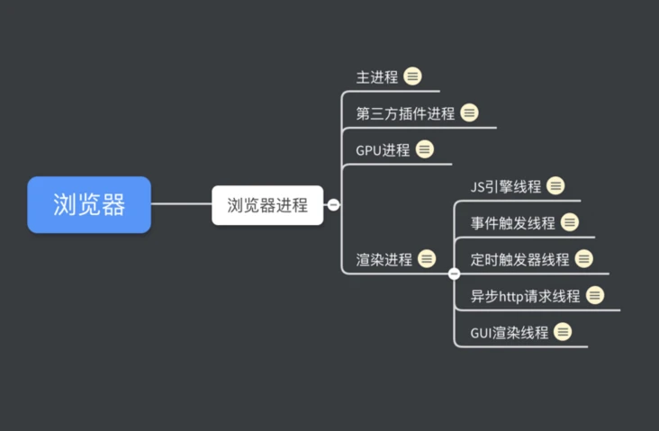
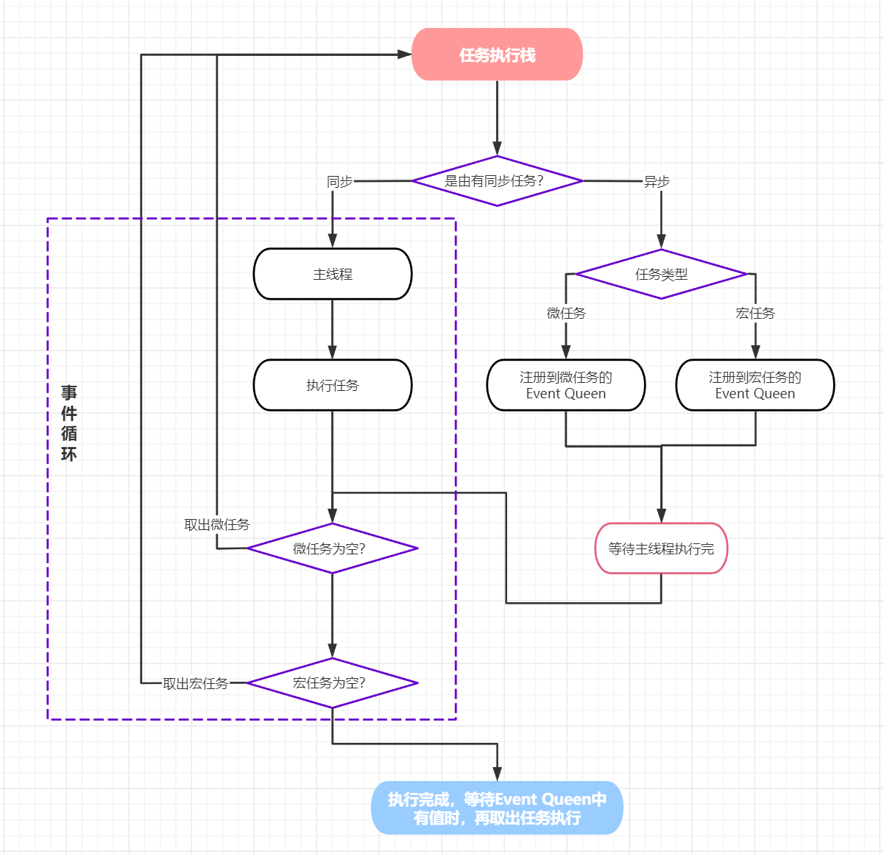
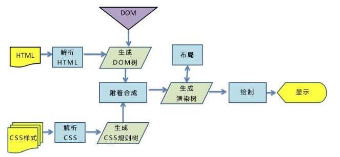
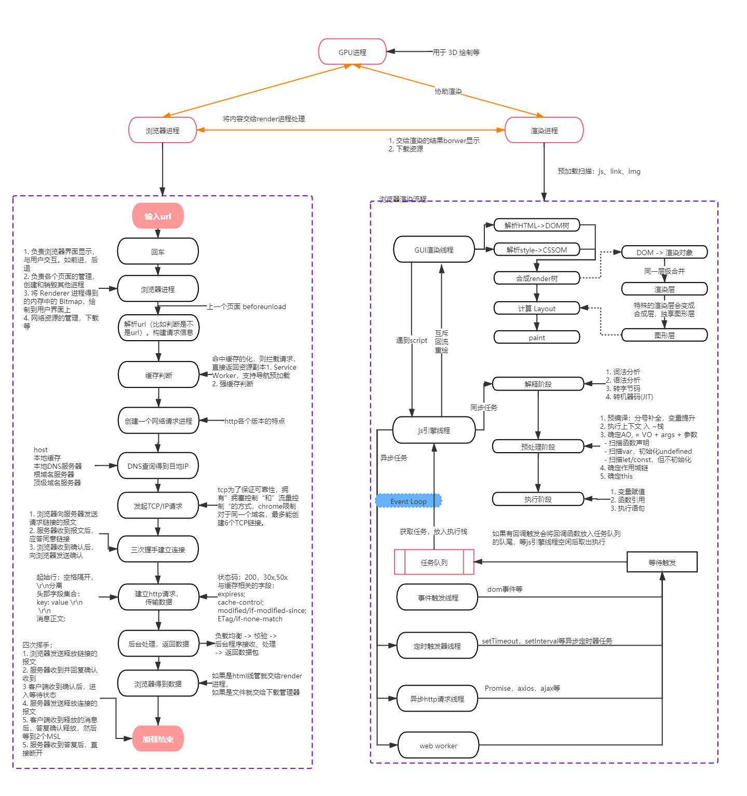

# 浏览器基础知识

## 浏览器



### 浏览器模型

浏览器是多进程的，有一个主控进程，以及每一个tab页面都会新开一个进程

Browser 进程：浏览器的主进程（负责协调、主控），只有一个。

- 负责浏览器界面显示，与用户交互。如前进，后退等负责各个页面的管理，
- 创建和销毁其他进程
- 将 Renderer 进程得到的内存中的 Bitmap，绘制到用户界面上
- 网络资源的管理，下载等

第三方插件进程：每种类型的插件对应一个进程，仅当使用该插件时才创建

GPU 进程：用于 3D 绘制等

###### 内核（渲染进程）

1. GUI线程
    - 负责渲染界面，解析HTML、css等
    - 需要重绘或者回流(重新合成渲染树)时，就会触发
    - 与js引擎时互斥的
2. js引擎
    - 负责解析和执行js脚本
3. 事件触发线程
    - 归属于浏览器而不是js引擎，用来控制事件循环
    - 当JS引擎执行代码块如鼠标点击、AJAX异步请求等，会将对应任务添加到事件线程中
    - 当对应的事件符合触发条件被触发时，该线程会把事件添加到待处理队列的队尾，等待JS引擎的处理
4. 定时器触发器线程
    - 传说中`setTimeout`和`setInterval`所在线程
5. 异步http请求线程
    - 在XMLHttpRequest在连接后是通过浏览器新开一个线程请求
    - 将检测到状态变更时，如果设置有回调函数，异步线程就产生状态变更事件，将这个回调再放入事件队列中。再由JavaScript引擎执行。

#### 进程与线程

进程：一个应用就是一个进程，是CPU分配资源的最小单位，系统会为其分配内存
线程：依附与进程，是CPU任务调度和执行的基本单位，线程见共享进程的资源

#### 特点

1. 进程中的任意一线程执行出错，都会导致整个进程的崩溃。
2. 线程之间共享进程中的数据。
3. 当一个进程关闭之后，操作系统会回收进程所占用的内存
4. 进程之间的内容相互隔离。

打开一个chrome的tab相当于创建了一个进程，其内核是多线程的：

- GUI 渲染线程：解析 HTML，CSS，构建 DOM 树和 RenderObject 树，布局和绘制等
- JavaScript引擎线程：执行js脚本，堵塞GUI渲染
- 定时触发器线程：指定setTiemout等定时器函数，等计数结束后会放入任务队列等js引擎执行
- 事件触发线程：将准备好的事件交给JS引擎线程执行，如ajax回调，定时器
- 异步http请求线程：Promise，axios，ajax等。

#### 浏览器中的Event loop

<https://juejin.cn/post/6844903761949753352>



1. js引擎会定期从`Event Queen`种取出函数到主线程去执行，任务分为：同步任务、异步任务
2. 不同的异步任务会进入不同的`Event Queue`，任务分类:
    - 宏任务 macroTask: `script`的全部代码、`setTimeout`、`setInterval`、`setImmediate`、`I/O`、`requestAnimationFrame`、`UI rendering`
    - 微任务 microTask: `Process.next`、`Promise`、`MutationObserver`
3. 主线执行完了之后，会先先判断是否有 微任务，如果有就取出来放进入主线种执行
4. 然后继续判断直到 微任务队列 的为空。
5. 接着从 宏任务 总取出一个到主线中执行，重复1， 直到全部 微任务、宏任务
   队列执行完成
6. 这个时候会进行 渲染 操作
7. 轮询检查 Event Queue，发现有内容了则重复3

### 1. 客户端储存

cookie、localstorage、sessionstorage、indexDB

### 2. 浏览器渲染原理


[参考](https://mp.weixin.qq.com/s/K0EVNoJPO6y08qc7ngFFRw)

#### 1. 浏览器渲染基本步骤

- 浏览器通过HTTP协议向服务端请求页面数据
- 将请求回来的HTML文件解析成DOM树
- 将请求回来的CSS文件解析成CSSOM树
- 将DOM树和CSSOM树结合在一起，生成渲染树（render tree）
- 计算渲染树的布局，这实际上是回流的过程
- 将布局渲染到屏幕上，这实际上是重绘的过程

注意：

- css的加载**不会阻塞**DOM的解析
- css的加载**会阻塞**DOM的渲染
- JS的加载和执行**会阻塞**DOM的解析
- JS的加载和执行**会阻塞**DOM的渲染
- CSS的加载**阻塞**JS的运行，**不阻塞**JS的加载（浏览器可以预先扫描并下载）

#### GUI渲染线程的工作



##### 构建DOM树

1. 解析过程，遇到 CSS 和 JS 文件，就会下载并解析这些文件
2. 如果遇到的是`<script>`标签，就会停止解析并执行js代码。如果是外联的，也会等待下载并执行。

##### 构建CSSOM树

1. 会堵塞页面渲染，在CSSOM解析完成前，都是白屏

##### 构建渲染树Render Tree

将DOM树和CSS Tree合并为一颗Render树

- 元素如果被设置为 display:none，在 DOM 树中依然会显示，但是在 Render 树中不会显示；
- 元素如果被设置为 visibility:none，那么 DOM 树和 Render 树中都会显示；
- 脱离文档流值得就是脱离 Render Tree。

##### 计算渲染树的布局

1. 布局就是计算元素的大小及位置。
2. 布局完成后会输出对应的“盒模型”，它会精确地捕获每个元素的确切位置和大小，将所有相对值都转换为屏幕上的绝对像素。

##### 将布局渲染到屏幕上

将渲染树中的每个结点转换成屏幕上的实际像素，包括合成层等

###### 回流 和 重绘

- 回流reflow： 当`Render Tree`中部分或全部元素的尺寸、结构、或某些属性发生改变时，**浏览器重新渲染部分或全部文档的过程**

- 重绘replain：当页面中元素样式的改变并不影响它在文档流中的位置时（例如：color、background-color、visibility等），浏览器会将新样式赋予给元素并重新绘制它

### 同源策略和跨域

> 同源策略：protocol（协议）、domain（域名）、port（端口）三者必须一致。
用于隔离潜在恶意文件的重要的安全机制

同源政策主要限制了三个方面：

- 当前域下的 js 脚本不能够访问其他域下的 cookie、localStorage 和 indexDB。
- 当前域下的 js 脚本不能够操作访问操作其他域下的 DOM。
- 当前域下 ajax 无法发送跨域请求。

#### 如何解决跨域

##### 1. 利用`script`标签能跨域的`jsonp`

1. 具有局限性， 仅支持get方法不安全，
2. 可能会遭受XSS攻击

##### 2. CORS（跨域资源共享，Cross-origin resource sharing）

###### 2.1 简单请求

> 简单请求指：HEAD/GET/POST
服务器设置`Access-Control-Allow-Origin： *`，设置允许方通的域名或者`*`

###### 2.2 非简单请求

> 如： delete、PUT等，会在正式请求发送之前进行**预检请求**，一个OPTIONS方法

请求头需要设置

```plain
Access-Control-Allow-Origin: http://api.bob.com  // 允许跨域的源地址
Access-Control-Allow-Methods: GET, POST, PUT // 服务器支持的所有跨域请求的方法
Access-Control-Allow-Headers: X-Custom-Header  // 服务器支持的所有头信息字段
```

##### 3. postMessage 跨域

可用于解决以下方面的问题：

- 页面和其打开的新窗口的数据传递
- 多窗口之间消息传递
- 页面与嵌套的iframe消息传递
  上面三个场景的跨域数据传递

##### 4. proxy代理服务器

1. node + express + http-proxy-middleware

##### 5. WebSocket协议跨域

### 5. 输入一个网址的时候发生了什么

- [语雀·在地址栏输入 url 后](https://www.yuque.com/xiezhongfu/chrome/rxtpam)
- [知乎·从输入URL到页面加载的过程？如何由一道题完善自己的前端知识体系！](https://zhuanlan.zhihu.com/p/34453198)
- [浏览器渲染过程](https://www.clloz.com/programming/front-end/js/2019/04/25/how-browser-work-2/)

**整体流程图**



### 7垃圾回收

1. 引用计数，在IE上，缺点：循环引用无法解决
2. 标记清除法：从root出发，标记其能访问到的所有结点，那么不能访问的就没法标记，将被删除。

在浏览器环境中，GC root由：

- 全局window对象
- 文档DOM对象
- 存放在栈上的变量

#### 可访问性

⽬前 V8 采⽤的可访问性（reachability）算法来判断堆中的对象是否是活动对象，能够访问的成为**活动对象**，无法通过GC root访问的成为非活动对象

#### chrome的内存回收机制

[V8 内存浅析](https://zhuanlan.zhihu.com/p/33816534)

步骤

##### 1. 通过 GC Root 标记空间中活动对象和⾮活动对象

##### 2. 回收⾮活动对象所占据的内存

##### 3. 做内存整理

#### 优化

V8 采⽤了两个垃圾回收器：

- 主垃圾回收器 -MajorGC ：回收老生代
- 副垃圾回收器 -Minor GC (Scavenger)：回收新生代

##### 分代回收

重点：新生代、老生代

###### 新生代

大小通常只有1~8M，采用**Scavenge 算法**，分半回收。
主要用来回收生存周期很短的变量，如函数内部声明的。

###### 老生代

属于老生代，这里只保存原始数据对象，这些对象没有指向其他对象的指针；
对象占用空间大，存活时间比较久的。采用**标记-清除**法回收。

###### 大对象区

这里存放体积超越其他区大小的对象，每个对象有自己的内存，垃圾回收其不会移动大对象区；

###### 代码区（code space）

代码对象，会被分配在这里。唯一拥有执行权限的内存；

###### map 区（map space）

存放 Cell 和 Map，每个区域都是存放相同大小的元素，结构简单。

## 参考

- [浏览器到js](https://segmentfault.com/a/1190000012925872)
- [深入解析你不知道的 EventLoop 和浏览器渲染、帧动画、空闲回调](https://juejin.cn/post/6844904165462769678)
