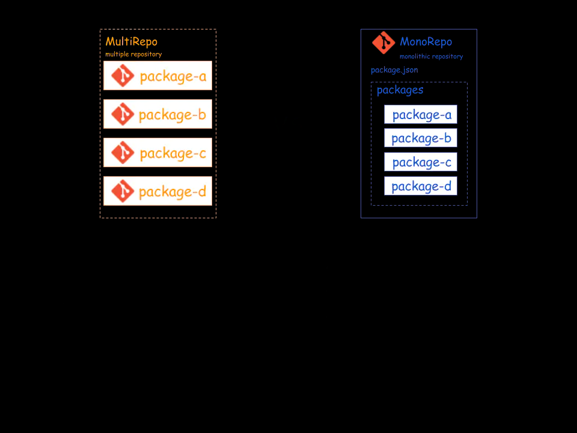
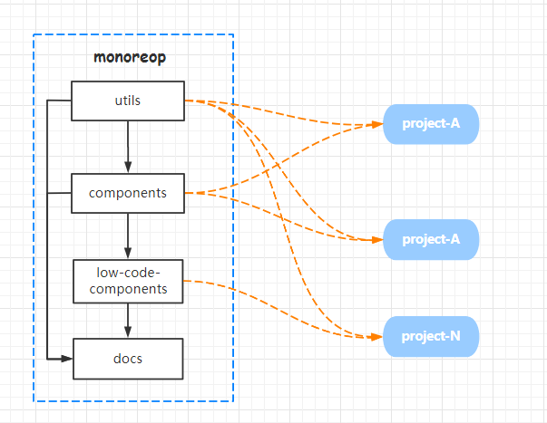
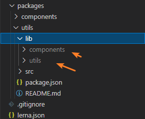
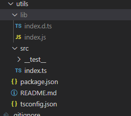
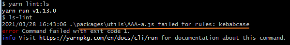
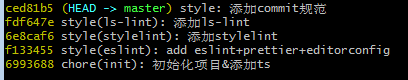
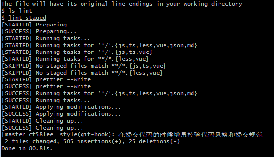
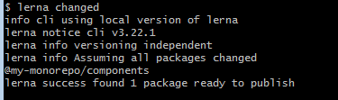
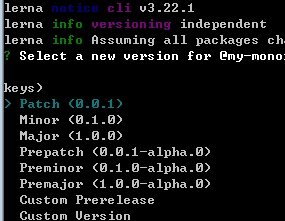

# monorepo项目实践
> 2021.4，项目参考：https://gitee.com/zaiMoe/my-monorepo

本文从0到1搭建一个项目，包含`ts、vue、jest、linter(eslint、stylelint、prettier、ls-lint、husky)、docs(vuepress)、build(rollup)、dev(vite)`以及由于做了勇士而踩过的一些坑（一些新的库安装使用过程的问题）

## 项目管理模式
1. 多仓库Multirepo：每个项目都放在不同的仓库管理，然后通过npm包的方式引入，或者通过git-submodule引入使用。

2. 单个仓库Monorepo：各个项目都放在一个仓库管理，每个项目称为package，不同的package可以单独发包。直接的好处是可以避免重复安装包，减少了磁盘空间的占用，并降低了构建时间，并且内部代码可以彼此相互引用。

两者的优缺点如下：

(图片来源： https://juejin.cn/post/6844903911095025678)

当各个package之间有关联，依赖关系时，明显采用monorepo的方式管理更加合适。结合我们实际项目需求（utils、components、low-code-components、docs等等各个库之间的依赖关系，其他的业务项目的使用情况）以及......，决定采用monorepo来搭建我们的组建仓库。



## yarn workspace 和 lerna
两个都是`monorepo`项目的管理工具和解决方案，他们会在在相互引用的包之间创建符号链接进行管理，以及依赖、发布和版本控制的管理。

### lerna
`lerna`是一个`babel`自己维护自己的monorepo项目所开源出来的一个工具。它**优化了使用`git`和`npm`管理多包存储库的工作流**，所以我们一般用`lerna`进行**版本控制**和**npm包的发布**管理。

#### lerna常用命令
##### 安装所有依赖项并链接任何交叉依赖项
`lerna bootstrap`

##### 给所有项目安装统一的依赖，如
command: `lerna add depend`
```
lerna add vue
```

##### 给指定的项目安装对应的依
command: `lerna add depend --scope=pkg`
```
// 给所有的pkgB安装wepack
lerna add webpack --scope=pkgB

// 将本地的pakA安装到pkgB
lerna add pkgA --scope=pkgB`
```

##### 运行所有模块相同的命令，如：
command：lerna run command
```
// 所有package执行build命令
lerna run build

// 按照拓扑排序规则执行命令，即依赖的顺序 
lerna run --stream --sort build

// 单独运行一个模块
lerna --scope pkgA run build
```

##### 创建一个package，如：
command: `lerna create pkgName [loc]`
```
// 创建一个名为pkgC的项目，默认安装到lerna.json中packages字段下的第一个目录位置
lerna create pkgC

// 将docs安装到sites目录下
lerna create docs sites
```

##### 版本发布
```
// 检查自上次发布以来哪些软件包已经更新
lerna changed

// 生成changelog，并提交到远程，同时创建对应的tag
lerna version --conventional-commits

// 发布
lerna publish
```

##### 其他
```
// 清除项目中所有 node_modules
lerna clean

// 查看lerna和系统的信息
lerna info 
```

### yarn workspace
`yarn workspace`能更好的管理`monorepo`多个项目中的依赖，可以为所有的packages安装统一的目录，也可以为单独的package安装单独的依赖，所有packages共享一个`yarn.lock`文件。同时可以通过`yarn`一键安装or更新多有的依赖。同时，`yarn`还会分析依赖关系，将所有相同的依赖安装到根目录的`node_modules`下，避免重复安装，避免磁盘空间的浪费。

**所以我们使用`yarn workspace`来管理依赖**。

**说明**：
- 根目录称为workspace-root
- 各个(子)项目之间，没有node_modules，但如果依赖的版本不一致的话，例如project-1依赖了不同版本的project-2，则会单独安装
- 工作区名称指packjson.json中的name


#### 常用命令

##### 给工作区中所有的包都安装相同的依赖
command: `yarn add xxx -D -W`
> 不同于lerna，这个是安装在root的package.json里

##### 给指定的工作区安装依赖
**（1）安装外部依赖**
command：`yarn workspace <workspace_name> <command>`
```
// 往 pkg1 添加 rollup  开发依赖
yarn workspace pkg1 add rollup -E

// 从 pkg1 移除 rollup 依赖
yarn workspace pkg1 remove rollup 
```

**（2）安装内部依赖**
command：`yarn workspace <workspace_name> <command> <workspace_name>`
```
// 将pkg2添加到pkg1的package中,若不加版本号则是从远程添加
yarn workspace pkg1 add pkg2@version -E

// 将pkg2从pkg1的package中移除
yarn workspace pkg1 remove pkg2@version
```

##### 其他
```
// 显示当前各 workspace 之间的依赖关系树。
yarn workspaces info [--json]

// 执行各个项目中的命令
yarn workspaces run command
```


## 项目搭建
### 初始化
1. 开启`yarn workspace`(yarn1.x版本默认是关闭的)
```
yarn config set workspaces-experimental true
```

2. 在项目中安装lerna：
```
// 当前发布的4.x有坑，且文档不全，还是先用3.x的版本吧，勇士请随意上
yarn add lerna@3.22.1

// npx lerna init // 初始化lerna项目
```

3. 此时的目录结构
```
│  lerna.json
│  package.json
│  yarn.lock            
└─packages
```

4. 修改`lerna.json`
```
{
  "packages":  [
    "packages/*"
  ],
  "version":  "independent", // 默认是1.0.0
  "npmClient":  "yarn", // 采用yarn来管理依赖，而不是npm
  "useWorkspaces":  true, // 使用yarn workspace
}
```
`version`-lerna的两种模式：

- Fixed（固定模式）：默认。所有package 共用一个版本号，任何`package`的 `major change`均会导致所有包都会进行`major version`的更新。
- Independent（独立模式）：每个包都有自己独立的版本号。lerna会配合git，检查文件变动，只发布有改动的package。

5. 修改`package.json`
```
    {
      "name": "my-monorepo", // 项目名称
      "version": "1.0.0",
      "license": "MIT",
      "private": true, // 防止误发布
      "workspaces": [ // 添加工作区间
        "packages/*"
      ],
      "devDependencies": {
        "lerna": "^3.22.1"
      }
}
```

6. 创建两个项目
   创建项目可以手动在`packages`目录下创建，也可以通过`lerna`，这里我们用`lerna`来创建:
```
    npx lerna create @my-monorepo/utils
    npx lerna create @my-monorepo/components
```
同样，给`package.json`添加`private： true`防止误发布

创建完并且调整后的目录结构：
```
    |-- lerna.json
    |-- package.json
    |-- packages
    |   |-- components
    |   |   |-- README.md
    |   |   |-- package.json
    |   |   `-- src
    |   |       |-- __test__
    |   |       |   `-- index.spec.ts
    |   |       `-- index.ts
    |   `-- utils
    |       |-- README.md
    |       |-- package.json
    |       `-- src
    |           |-- __test__
    |           |   `-- index.spec.ts
    |           `-- index.ts
    `-- yarn.lock
```
基于`lerna`和`yarn workspace`项目的初始化完毕

### 添加ts
```
yarn add typescript -W
npx tsc --init // 生成tsconfig.json文件
```
这个时候，各个`package`都是在共享这份配置文件，假如我们要单独打包`utils`工具库的代码：
```
// package.json
"scripts":  {    
    "build":  "lerna  run  --stream  --sort  build"
  }

// utils/package.json
"scripts":  {
    "build":  "tsc  --outDir  ./lib"
  }
```
执行`yarn build`结果却是打包了所有的`package`



这个时候可以给每个`package`增加`tsconfig.json`作为单独的目录，继承外层的配置，这样`tsc`就会以这层作为根路径打包了
```
// utils/tsconfig.json
{
  "extends":  "../../tsconfig.json",
  "include":  [
    "src"
  ]
}
```
再次打包：



### 添加linter工具
#### eslint + prettier + .editorconfig
eslint结合prettier进行统一的风格代码格式，网上介绍很多，不做说明
##### 安装依赖
```
  yarn add -D -W prettier
 
 // eslint 套餐...
yarn add -D -W
eslint 
eslint-config-prettier
eslint-plugin-prettier
@typescript-eslint/eslint-plugin 
@typescript-eslint/parser
```

说明：
- `eslint-config-prettier`： 截止目前大部分都是介绍这个的，8.x版本开始已经不用这个了，而是换成了下面了这个，如果实在搞不定，可以安装低版本的按照其他文章配置即可
- `eslint-plugin-prettier`：3.3.x版本使用这个，但是还需要依赖上面的一个文件，[见官方推荐配置](https://github.com/prettier/eslint-plugin-prettier#recommended-configuration)
- 后面2个按照其他文档进行配置即可，无坑

##### 设置
1. （略）添加配置文档`eslintrc`、`eslintignore`、`prettierrc`、`prettierignore`、`editorconfig`

`prettierrc + editorconfig`保障在不同ide上的显示效果的一致性

2. 添加命令
```
// package.json
"lint":  "lerna  run  lint",
"lint:fix":  "lerna  run  lint:fix",
"prettier":  "prettier  --write  **/*.{js,jsx,tsx,ts,less,vue,md,json}",

// 其他packages按需添加
"lint:ts":  "tsc  --noEmit",
"lint:es":  "eslint  ./src  --ext  .vue,.js,.jsx,.ts,.tsx",
"lint":  "yarn  lint:ts  &&  yarn  lint:es",
"lint:fix":  "yarn  lint:es  --fix"
```
执行`yarn lint`报错，然后执行`yarn lint:fix`修复，在执行`yarn prettier`统一格式所有的文件

> 注意：eslint为了提高编译速度，[是不会检查ts的类型错误的](https://github.com/typescript-eslint/typescript-eslint/issues/352)，所以采用tsc取检查，见上面的`lint:ts`

> tip：如果是webstrom党，也可以像vscode一样保存自动修复，[参考](https://www.jianshu.com/p/926a0e17a42d)

#### stylelint+prettier
##### 安装依赖
```
yarn add -D -W 
stylelint 
stylelint-config-prettier 
stylelint-config-rational-order 
stylelint-order
stylelint-config-standard
stylelint-declaration-block-no-ignored-properties 
```
说明：
- `style-config-rational-order+stylelint-order`：统一css属性的书写顺序，[见
  浏览器渲染原理](https://imweb.io/topic/56841c864c44bcc56092e3fa)
- `stylelint-config-prettier`：结合`prettier`的规则格式化`css`
- `stylelint-declaration-block-no-ignored-properties`：防止冲突导致的属性无效，见[官方文档](https://github.com/kristerkari/stylelint-declaration-block-no-ignored-properties#readme)
- 其他略

##### 设置
1. （略）添加配置文档：`.stylelintrc.json`、`.stylelintignore`
2. 添加命令
```
// 其他package下的package.json按需修改
"lint:style": "stylelint ./src/**/*.{vue,less}",
"lint": "yarn lint:ts && yarn lint:es && yarn lint:style",
"lint:fix": "yarn lint:es --fix && yarn lint:style --fix",
```
添加一个样式文件测试下，pass

> tip: webstrom中也可以像eslint一样保存修复，[参考](https://blog.csdn.net/MAIMIHO/article/details/110226225)

#### ls-lint -- 统一文件命名风格
##### 安装依赖
```
yarn add -D -W @ls-lint/ls-lint
```

##### 配置
1. 添加配置文件`.ls-lint.yml`，详细配置见[官方网](https://ls-lint.org/1.x/configuration/the-basics.html#creating-configuration)

2. 添加命令
```
// 根目录package.json
"lint:ls": "ls-lint",
"lint":  "yarn  lint:ls  &&  lerna  run  lint"
```
执行命令`yarn lint:ls`测试下




#### markdownlint -- 统一markdown书写风格
todo

#### 规范commit信息
有很多文章讲的很好，这里就不详细说明了，没坑，找一篇合适的照着配置就行，这里推荐:

[commit规范+commitlint+CHANGELOG自动生成一条龙服务](https://juejin.cn/post/6934292467160514567)

配置的时候可以跳过生成`CHANGELOG.md`和校验的部分，在后面章节会讲

##### 添加依赖
```
  yarn add -D -W 
 commitizen
 cz-customizable
```

##### 配置
1. 添加配置文件: `.cz-config.js`
2. 添加命令
```
// 根路径package.json

// script:
"commit":  "git  cz  -a",

// 自定义适配器
"config":  {
    "commitizen":  {
      "path":  "node_modules/cz-customizable"
    }
}
```

然后运行`yarn commit`进行代码提交



当然，如果不想用`yarn commit | git cz`代替原来原来的`git commit`，那么可以通过git-hook修改：
```
"prepare-commit-msg": "exec < /dev/tty && git cz --hook || true" // 配个下面的husky可以修改钩子
```

#### 提交校验
上面介绍了那么多校验规则，但在团队中，不可能实时记得在提交代码的时候，将全部校验都过一遍，那么我们可以有其他方式来自动校验，如：
1. CI-CD：在提交到远程仓库的个人分支的时候，跑一边校验命令，错误的时候发送通知给对应的提交人（这个可以另起一篇说明，跳过）
2. 利用`git-hook`，在不同的动作执行不同的命名，比如上面的提到的，利用`prepare-commit-msg`设置`git cz`默认替换`git commit`，下面介绍下这种方案（当然，每次提交代码的时候都要等较长时间的校验hhh）

##### 安装依赖
```
yarn add -D -W 
husky 
@commitlint/cli 
commitlint-config-cz
```

说明: 看官方介绍吧...

> 注意，当前的husky为5.x的版本，与绝大多数文章的配置方法都不同，如果不想折腾请安装@4.x的版本

##### 设置
1. 添加配置文档：`.commitlintrc`
2. 设置钩子
```
// package.json添加并执行
"prepare": "yarn husky install"
```
接着执行`yarn husky install`会在根目录增加一个`.husky`文件，在这里文件里面添加钩子。

###### 校验commit信息
执行命令`yarn husky add .husky/commit-msg 'npx commitlint --edit "$1"'`，会在`.husky`下增加`commit-msg`文件，这个就是对应的钩子

###### 提交前校验代码
执行命令`yarn husky add .husky/pre-commit 'yarn lint'，会在`.husky`下增加`pre-commit文件，在`commit`之前便会执行`yarn lint`校验所有的代码

更多的钩子请参考 [官方文档](https://typicode.github.io/husky/#/) ，几乎没什么坑


#### 优化 -- 增量校验
上面步骤中，`pre-commit`会在commit的时候执行`yarn lint`校验所有文件，导致提交时间过长，所以可以考虑下是否可以只校验改动的部分呢？答案是有的，采用`lint-staged`这个库就能实现

##### 安装依赖
```
  yarn add -D -W lint-staged
```

##### 设置
```
// package.json
// script
"lint:staged":  "lint-staged"

// 增加
"lint-staged":  {
    "**/*.{js,ts,less,vue,json,md}":  ["prettier  --write"],
    "**/*.{js,ts,vue}":  ["eslint  --fix"],
    "**/*.{less,vue}":  ["stylelint  --fix"]
  }
```

接着打开`.husky/pre-commit`，修改为：
```
#!/bin/sh
.  "$(dirname  "$0")/_/husky.sh"

yarn  lint:ls
yarn  lint:staged
```

接着提交代码便会看到校验了：




#### 统一换行符
https://juejin.cn/post/6844904062987550733

1. 当前项目没有`git status` 为空
2. 新增 `.gitattributes`文件
3. 加入配置，提交

### 发布
`lerna`本身自动了发布包的功能和相关的命令，常用带有

#### lerna changed
查看可以发布的包



#### lerna version
标识自上一个版本以来发生了变化的包，然后提供可以升级的`bump`版本给用户选择，然后将相关的变动(package.json版本号更新)提交，然后打上`tag`推送到远程仓库，并且会自动生成`CHANGELOG.md`记录各个版本的变动



这一过程可以加上`--conventional-commits`来自动化，跳过选择阶段。
同时，为了符合我们之前`commitlint`的校验，需要设置下：
```
// package.json
"script": {  
    "version":  "lerna  version  --conventional-commits"
}

// lerna.json
  "command":  {
    "version":  {
      "ignoreChanges":  ["*.md",  "**/*.test.ts",  "**/*.spec.ts"],
      "message":  "chore(release):  publish"
    }
  }
```

执行`npm run version`，然后远程仓库便会出现一条`chore(release): publish`的记录。

#### lerna publish form-git
`这一步才是真正的发布，from-git`会识别`lerna version`标记的包，并将它们发布到`npm`上面。

`lerna publish`默认会会执行`lerna version`，我们可以在`lerna.json`中对发布的进行一些配置
```
 "command":  {
    "publish": {
      "allowBranch": ["master", "main"], // 限制 lerna version 只能在主分支执行
      "conventionalCommits": true,
      "exact": true, // 关联包锁定
      "ignoreChanges": ["ignored-file", "*.md"],
      "message": "chore(release): publish %s",
      "registry": "https://registry.npmjs.org" // 发布的地址，如私服地址
    }
  }
```

然后执行`lerna publish from-git`，则会成功发布，如果发现发布错误，执行`npm unpublish`即可撤回

#### 发布其他版本
```
lerna version --conventional-commits -y preminor --preid bi  // 将 1.0.0 -> 1.1.0-bi.0
lerna version --conventional-commits -y --preid bi  // 将 1.1.0-bi.0 -> 1.1.0-bi.1
```
1. 先以第一个发布一个新版本，
2. 然后在去掉 preminor，之后发布就会只修改后面的版本号（fix/feat相同）

## 文档
理想的文档是既能写文档，同时也能用于开发，查了一下当前有的文档库

1. marked + highlight.js：将markdown转成页面，需要自己搭建页面项目，自定义样式等，灵活度较高，但需要折腾
2. docsify：无需构建，在页面将md转成html，不需要每次打包生成html，能实时更新，本身支持解析vue，同样需要折腾
3. gatsby：基于react开发的，如@antv/gatsby-theme-antv主题等
4. Gridsome：基于vue开发，gatsby的替代品，但目前还在开发阶段，可能有坑
5. VuePress：将md转成md，天然支持vue，中文文档
6. vitePress: 还不能用
7. Storybook：ui 组件开发管理的工具，并且每个组件都有一个独立开发调试环境

由于是基于`vue`的开发，比较成熟的只有`vuepress`、`storybook`了。

### 文档的搭建目标
1. demo和示例代码写一套，最好能直接引入`.vue`文件，即有demo又有示例代码
2. 能使用`packages`下的组件

对于`vuepress`和`storybook`都支持，当时简单搜索了一下，在`vuepress`中发现了插件
[Demo Container](https://docs.chenjianhui.site/vuepress-plugin-demo-container/zh/started.html#%E5%AE%89%E8%A3%85)

满足了需求，加上为了降低上手成本，选择了`vuepress`。

### 改造
在使用`Demo Container`的时候，发现不支持**直接引用vue文件作为示例以及代码展示**，作者已经不维护了，于是fork了一份自己搞。


### 本地开发环境
vuepress作为本地开发环境比较慢，不能忍受，所以直接上了vite搭建了一个本地开发环境，简单易上手！

## 构建
[rollup从入门到打包一个按需加载的组件库](https://juejin.cn/post/6934698510436859912)
[你的Tree-Shaking并没什么卵用](https://zhuanlan.zhihu.com/p/32831172)
[VUE UI组件库按需引入的探索](https://juejin.cn/post/6844904004372152327)
[聊聊 Webpack4 的 Tree Shaking](https://zhuanlan.zhihu.com/p/260724544)
[Webpack 4 Tree Shaking 终极优化指南](https://juejin.cn/post/6844903998634328072)
[Webpack5 新特性业务落地实战](https://zhuanlan.zhihu.com/p/348612482)

## jest单元测试
`@types/jest`,`eslint-plugin-jest`,`jest`,`ts-jest`
'jest/globals': true

[jest](https://fe.rualc.com/note/jest.html#zi-liao)
https://www.yuque.com/sunluyong/node/gq5qaa
https://fe.rualc.com/note/jest.html#zi-liao
[参考](https://kingyinliang.github.io/standard/TEST.html#%E5%8D%95%E5%85%83%E6%B5%8B%E8%AF%95)
[参考2](https://juejin.cn/post/6844903700855521293)
[参考3](https://zhuanlan.zhihu.com/p/25962640)
```jest.comfig.js
preset: 'ts-jest',
root: ['>rootDir>/packages']
testEnvironment: 'jsdom',
moduleFileExtensions: [ts,tsx,js,json]

// coverage
collectCoverage: true
coveragePathIgnorePatterns： [node_module, es, lib, dist]
```
## 参考
### 参考文档
- [All in one：项目级 monorepo 策略最佳实践](https://segmentfault.com/a/1190000039157365)
- [基于 Lerna 管理 packages 的 Monorepo 项目最佳实践](https://juejin.cn/post/6844903911095025678#heading-0)
- [官方：Workspaces](https://classic.yarnpkg.com/en/docs/workspaces/)
- [Yarn Workspace 使用指南](https://www.jianshu.com/p/990afa30b6fe)
- [lerna指令总览](http://www.febeacon.com/lerna-docs-zh-cn/routes/commands/)
- [浏览器渲染原理](https://imweb.io/topic/56841c864c44bcc56092e3fa) 和 [alloyteam-css属性声明顺序](http://alloyteam.github.io/CodeGuide/#css-declaration-order)
- [规范Git提交说明](https://juejin.cn/post/6844903831893966856)
- [commit规范+commitlint+CHANGELOG自动生成一条龙服务](https://juejin.cn/post/6934292467160514567)

### 相关issue
- [eslint不能对typescript进行类型校验](https://github.com/typescript-eslint/typescript-eslint/issues/352)

### 问题
1. 项目组件库用的vue是2.5.7，而vuepress用的是2.6.12，会导致[vue-template-compiler](https://vue-loader.vuejs.org/zh/guide/#%E6%89%8B%E5%8A%A8%E8%AE%BE%E7%BD%AE)的版本对应不上，解决方式： 将2.5.7的相关依赖装全局，这样文档包的依赖就会自己安装在目录下，不会影响外部