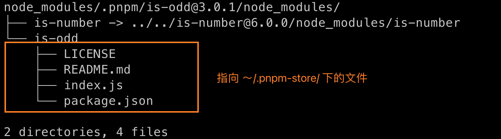

# pnpm 浅析

pnpm 因为其极快的安装速度，更加节省磁盘空间，同时还解决了 npm 和 yarn 的一些问题，而备受关注。
至于有多快可以看一下看一下官方网给的 [Benchmark](https://github.com/pnpm/pnpm)

### 常用命令
```shell
pnpm prune    # 删除一些不被全局项目所引用但包，以减小全局 store 但存储空间
pnpm add pkg  # 添加一个包
pnpm remove/uninstall/rm pkg  # 删除
pnpm i/install 		# 安装全部依赖
pnpm run cmd 		# 运行 script 命令
pnpm update/up 		# 更新
pnpm up -i 		# 选择更新

pnpm exec name	  # 执行项目范围的 shell
pnpm dlx name	  # 等于 npx
```

### pnpm 原理
#### 前置知识
1. 硬连接：对源文件的指针的复制，只能链接文件，删除其中一个文件，不影响其他文件
2. 软连接 / 符号链接：是一个链接文件，指向源文件对地址，源文件地址变化则软连接失效，可以链接文件夹
   
具体概念可以阅读：[前端应该掌握的软链接与硬链接知识链接](https://mp.weixin.qq.com/s/ICnWDxLp3sKmvuURt2smYA)
#### 解决什么问题
1. Dependency Hell
2. Phantom dependency
3. doppelgangers dependency

以上的问题都是当前 yarn 和 npm 存在的，详细可以阅读：[node_modules 困境](https://zhuanlan.zhihu.com/p/137535779)

#### pnpm 的安装解析
我们以安装 [is-odd](https://github.com/i-voted-for-trump/is-odd/blob/master/package.json) 
这个库为例子，从仓库的 `package.json` 来看，它有一个依赖 `is-number`，执行 `pnpm add is-odd` 后查看 `node_modules` ，
`node_modules` 下只有 `is-odd` 这个包，这样就能避免 `Phantom dependency`


再来看完整的目录，可以看出， `.pnpm` 目录除了 `node_modules` 目录外，其他的文件是 `<okg_name>@version` 形式的目录，
这样可以隔离不同版本，同时还是全部提升到 `.pnpm` 目录下，提高复用，解决 `Dependency Hell` 和 `doppelgangers dependency`


回到 `is-odd` 这个依赖，它通过软连接指向 `.pnpm/is-odd@3.0.1/node_modules/is-odd` ，
特别将 `id-odd` 和它的依赖放在 `node_modules` 下，能保证 `is-odd` 
索引到正确版本的依赖，同时软连接的方式又复用了外面的包


那上上张图中蓝色框的作用呢？ 主要是为了解决一些书写不规范的包问题，比如 pkgc 同时依赖了 is-odd 和 is-number，但其 dependencies 只安装了 is-odd（在 yarn 和 npm 下是能正常引用但），那么 pkgc 还能通过 .pnpm/node_modules 加载到 is-umber，也就是兼容了一些写法不规范的第三方包。

#### pnpm 为什么快？
从上一小章节的分析，能看出来 `pnpm` 是怎么解决 `yarn` 和 `npm` 遗留下来的问题，
但为什么说它更快，更省磁盘空间呢？ 没错，就是用到了 硬连接！ 
`pnpm` 在安装的时候，会全部都下载到 `~/.pnpm-store` 下，window 会放在项目所在盘的根目录的 
`.pnpm-store` 中。

> 硬连接不能跨分区，所以跨区时，pnpm 将复制包而不是硬链接它们
> 


打开 `~/.pnpm-store` 会发现是一堆看不懂的东西


这是一种 `CSA`（Content-addressable storage）的存储方式，他和上面文件其实是一样的，只是通过硬连接的方式，
起的文件名不同而已，我们可以通过命令直接查看文件内容


所以在安装依赖的时候，如果已经缓存在了 `~/.pnpm-store` 下，就通过硬连接去加载， 避免再次安装的时间消耗。
当然，采用硬连接的方式也有一些缺点，比如：如果因为这样那样的原因要修改 `node_modules` 中的文件，要注意会影响所有工程

### 参考
- [pnpm vs 其他](https://juejin.cn/post/7053340250210795557)
- [前端应该掌握的软链接与硬链接知识链接](https://mp.weixin.qq.com/s/ICnWDxLp3sKmvuURt2smYA)
- [pnpm原理](https://juejin.cn/post/6916101419703468045)
- [node_modules 困境](https://zhuanlan.zhihu.com/p/137535779)
- [CAS-wiki](https://en.wikipedia.org/wiki/Content-addressable_storage)