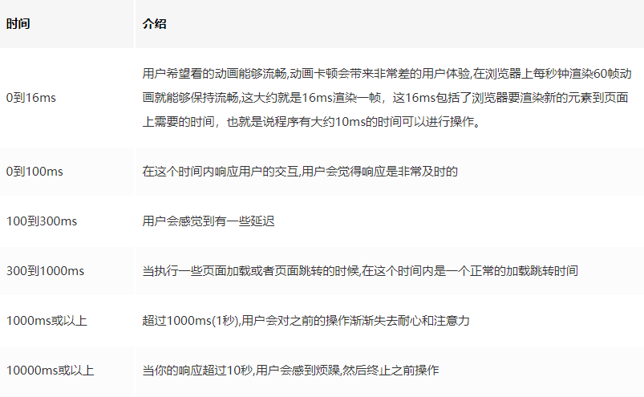
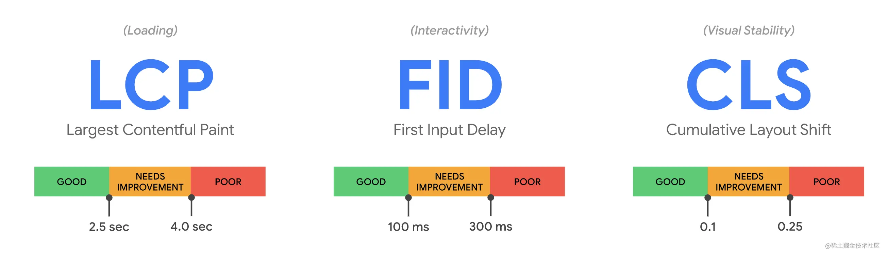
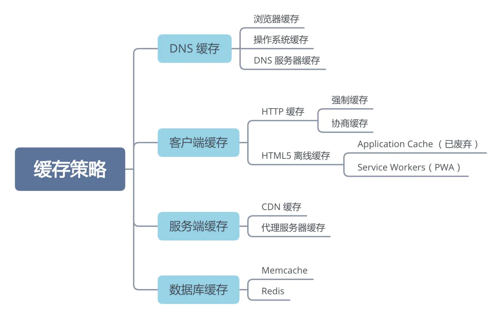
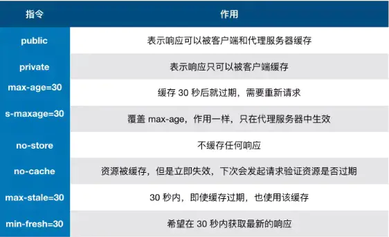
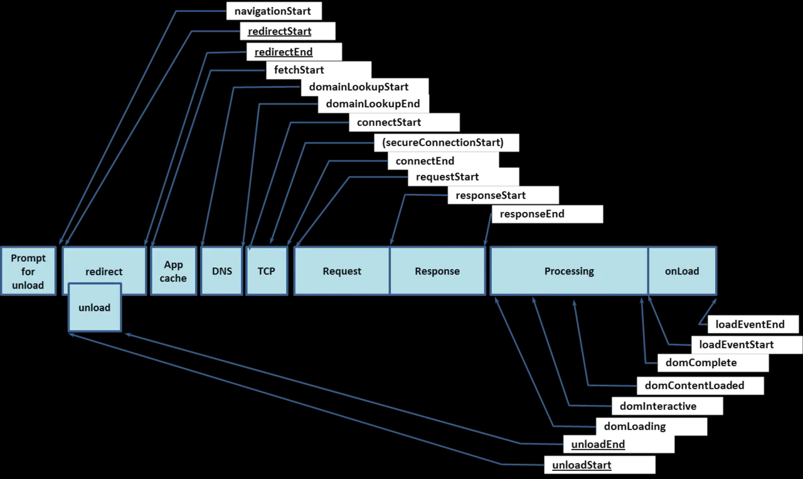

# 来一打前端优化

## 关键指标

- TTFB（Time to First Byte）：浏览器从请求页面开始到接收第一字节的时间，这个时间段内包括 DNS 查找、TCP 连接和 SSL 连接。

告诉用户： 正在工作  --发生了吗？

- FP（First Paint）：首次绘制时间。它代表浏览器第一次向屏幕传输像素的时间，也就是页面在屏幕上首次发生视觉变化的时间。

> 注意：FP不包含默认背景绘制，但包含非默认的背景绘制。

- FCP（First Contentful Paint）：首次绘制任何文本，图像，非空白canvas或SVG的时间点。

> FP和FCP可能是相同的时间，也可能FP先于FCP

用户关心的部分渲染  -- 它有用吗？

- FMP（First Meaningful Paint Time）：首次有意义的渲染时间，也就是用户关心的一块区域渲染区域，但是**比较难以计算，不太准确**
- LCP（Largest Contentful Paint）: 可视区域“内容”最大的可见元素开始出现在页面上的时间点。当前推荐用LCP代替FMP作为指标

它能使用了吗？

- TTI/FIT （First Interactive Time，Time to Interactive）：表示网页第一次 完全达到可交互状态 的时间点

> 需要 50 毫秒以上才能完成的任务称为 长任务

- FCI（First CPU Idle） 是对TTI的一种补充，TTI可以告诉我们页面什么时候完全达到可用，第一次CPU空闲，主线程空闲就代表可以接收用户的响应了。
- CIT（Consistently Interactive Time）：持续可交互时间
- FID（First Input Delay）：从用户第一次与页面交互（例如单击链接、点击按钮等）到浏览器实际能够响应该交互的时间。
  第一次输入延迟通常发生在第一次内容绘制（FCP）和可持续交互时间（TTI）之间，因为页面已经呈现了一些内容，但还不能可靠地交互。如果主线程被占用，则说明FID值比较大。所以对于 FID 这个指标，我们需要关注的是整体的 FID 值分布，而不是单一值。

视觉相关

- SI（Speed Index）：页面可视区域中内容的填充速度的指标， 在加载过程中视觉上的变化速度，其值越小代表感官性能越好，有特殊算法
- Perceptual Speed Index：与上面一样，但在算法上的计算结果更贴近用户的真实感受

> ”博客文章“这样的页面更侧重FMP（用户希望尽快看到有价值的内容），而类似后“台管理系统或在线PPT”这种产品则更侧重TTI（用户希望尽快与产品进行交互）。

### 指标优化目标



### 获取这些指标

有些可以通过已有的接口计算，或者使用工具[web-vitals](https://github.com/GoogleChrome/web-vitals)

#### 1. FP/FCP

通过`window.performance.getEntriesByType('mark')`可以获取FP和FCP

#### 2. FMP

```
 
<script> 
performance.clearMarks("img displayed"); 
performance.mark("img displayed"); 
</script>
```

[捕获FMP的原理](https://github.com/berwin/Blog/issues/42)

#### 3. 计算FPS -- 衡量动画性能

利用`requestAnimationFrame`记录每次动画的时间差

### 工具

- 集成测试工具可以在预先规定了设备和网络配置的可复制环境中收集实验数据。例如：Lighthouse、WebPageTest
- 真实用户监测（RUM） 工具可以持续评估用户交互，收集实际数据。例如，SpeedCurve、New Relic，两者也都提供集成测试工具。
- web-vitals：可以收集'CLS' | 'FCP' | 'FID' | 'LCP' | 'TTFB'，兼容性比较低


```
import { getCLS, getFID, getLCP } from 'web-vitals'

function sendToAnalytics(metric) {
  const body = JSON.stringify(metric);
  navigator.sendBeacon('/analytics', body)) // sendBeacon 可以在关闭浏览器后继续发送
}

getCLS(sendToAnalytics);
getFID(sendToAnalytics);
getLCP(sendToAnalytics);
```

### 核心性能指标与 Performance API



- LCP: 加载性能。最大内容绘制应在 2.5s 内完成。
- FID: 交互性能。可开始互动的时间，从用户交互到响应的时间
- CLS: 页面稳定性。累积布局偏移(比如正在使用一个页面时，突然跳出一个按钮或广告，导致点击到非目标按钮或功能)，需手动计算，CLS 应保持在 0.1 以下。

## 优化方案

### 缓存策略



#### 浏览器(http)缓存

> 浏览器会将用户请求过的静态资源缓存在本地磁盘中，当再次访问的时候，直接从本地加载，而不用再去服务端请求。

##### 方式

浏览器缓存分为`强缓存`和`协商缓存`

##### 强缓存

> 强缓存可以通过服务端设置两种 HTTP Header 实现：Expires 和 Cache-Control

- Expires：http1.0的字段，设置过期的时间，缺点是会出现客户端和服务端时间不一致问题

- Cache-Control：http1.1的字段。常用的字段有



##### 启发式缓存

如果一个资源的响应头没有缓存是否过期的相关字段`expires/cache-control`，则可以根据`Date`和`Last-midified`的差值，取10%作为缓存周期

之后才会进入协商缓存

##### 协商缓存

> 当强缓存过期后，浏览器会带上缓存标识向服务器发起请求，由服务器根据缓存标识解决是返回新资源还是让浏览器继续使用缓存

- 当返回304和Not Modified，标识协商缓存生效
- 返回200则标识协商缓存失效，浏览器更新缓存

相关字段：Last-Modified 和 ETag

###### Last-Modified/if-modified-since

> http1.0字段

1. 服务器返回资源的资源带有`last-modified`字段，标识最后修改时间
2. 客户端再次请求该资源时，会将`last-modified`的值放入`if-modified-sinec`中，带给服务器，服务器会通过这个比较，如果变化了则返回304，否则返回200和资源文件

缺点：只要服务端打开过这个文件，last-modified还是会被修改，导致缓存失效

###### ETag/if-none-match

1. 服务器返回当前资源的唯一标识`Etag`，只要资源发生变化就会重新生成
2. 客户端再次请求该资源时，会将`ETag`放入`if-None-Match`中带到服务器，服务器通过比较与资源的`Etag`是否一样，来判断返回304还是200

缺点：计算ETag需要时间，占用服务器性能

###### 相关字段说明

**Cache-Control相关资源**
一些字段

- no-cache：（req/res）不适用强缓存，每次都应该取服务器验证
- no-store:(req/res)不缓存
- max-age: 最大缓存时间

**If-None-Match**
如果时get请求，只有服务器上有资源的ETag相同，才会返回304

如果时post、get请求，的Etag没有匹配上，则返回412

**Vary**
用来区分不同的客户端，可取值`User-Agent`和`Accept-Encoding`，服务器可以根据这里两个字段来区分客户端支持什么缓存方式来返回内容，如是否支持gzip

**Date**
标识这个请求的发送、响应时间

##### Push Cache

> http/2，服务器可以在一轮http请求中主动将某些资源推送到客户端，并且这些资源都可以缓存

缺点：如果浏览器已经缓存了资源，则会造成浪费

##### 基于Service Worker的PWA

利用浏览器service-worker另启一个线程，这个线程负责去监听所有https请求（注意是https）,当发现某些资源是需要缓存下来的他会把资源拉取到浏览器本地，访问的时候拦截请求，不走网络请求，直接读取本地资源。这样资源相当于都是用户本地的资源,响应速度肯定飞快，还有就是资源都在用户浏览器里面，就算断了网,资源也都是能正常访问。

##### 上面4种的顺序

0. memory
1. Service Worker
2. 强缓存 disk
3. 协商缓存
4. Push Cache

##### 缓存机制

1. 强缓存要优于协商缓存
2. ETag优先与Last-Midified

##### chrome的不同行为

1. https不合法的地址，不能使用浏览器缓存
2. 对于已经打开的页面，如果使用F5刷新页面，会直接从`memory cache`中获取资源，而不是304或者`disk cache`
3. `memory`只有js、base64的图片，而不是css

## 具体方式

- 加载优化：如何更快地把资源从服务器中拉到浏览器，如 http 与资源体积的各种优化，都是旨在加载性能的提升。
- 渲染优化：如何更快的把资源在浏览器上进行渲染。如减少重排重绘，rIC 等都是旨在渲染性能的提升。

### 加载优化

##### 图片优化

1. 压缩图片
2. 雪碧图、字体图标
3. base64
4. 图片懒加载
5. 渐进式图片
6. 图片预加载`preload`/`prerender`
7. 使用WebP

##### 预加载

- dns-prefetch: 在浏览器后台进行一次DNS查询（ie9可支持）
- Prefetch：对资源进行预加载
- preload：在不执行资源的情况下对资源进行加载
- prerender：能让浏览器在后台进程进行渲染出特定页面

首屏数据预加载

##### 骨架屏

##### 网络加载优化

大致原则：

- 减少不必要的请求
- 减少包体大小
- 降低应用资源时的消耗
- 利用缓存

**传输优化**


##### CDN

1. 浏览器对同一个域的TCP链接有限制，chrome是6个，所以可以采用CDN的方式分域来提高并行下载数。

2. CDN能减少服务器的压力，同时可加快同一个地理区域内重复静态资源文件的响应下载速度，缩短资源请求时间。
3. 传输距离更近

###### CDN缓存

##### http/2

`http2` 的诸多特性决定了它更快的传输速度。

- 多路复用，在浏览器可并行发送 N 条请求。
- 首部压缩，更小的负载体积。
- 请求优先级，更快的关键请求

##### 利用缓存

见上面

##### 体积、数量

1. 服务端开启gzip
2. 资源并行下载
3. 压缩
4. 减少代码：代码分片（路由懒加载）、Tree Shaking、browserlist/babel，及时更新 browserlist，将会产生更小的垫片体积（如何分析见下面webpack部分）

##### SSR

### webpack优化

#### 提高编译速度

1. 设置loader的作用范围，比如忽略`node_modules`或者设置`babelrcRoots`(7.x)

##### 开发环境优化

1. 设置`cache`进行增量打包，包括`eslint/stylelint`都能开启缓存
2. 使用热更新

#### 生产环境优化

1. 提取公共代码，减少重复代码造成文件过大（如超过4次使用就提取）
2. 使用`externals`，去掉第三方打包，改用CDN
3. 或者用`DLLPlugin`，指定模块打包为`vendor`，然后用`DllReferencePlugin`链接进来
4. 压缩js、css、img、svg
5. 少用gif，因为会周期性的重绘

#### js优化

1. 放在后面最后加载
2. 用defer属性，会在`DOMContentLoaded`之前完成，不仅不堵塞页面渲染，还能按顺序执行
3. async，不堵塞页面渲染，但不会按顺序执行，在`onload`之前执行，而且加载完了就执行
4. 动态插入的脚本默认是`async`
5. 动态插入的内联脚本，**会同步执行**，堵塞后面的js和dom解析

##### 编码部分

1. 定时器是否由销毁
2. dom事件在页面切换是否注销
3. 第三方库是否销毁
4. 是否存在多余请求，比如某些操作之后，并不需要更新表格数据
5. 对于大量的计算（排序）、搜索可以使用`Web Workers`
6. 用`requestAnimationFrame`代替setTimeout执行动画（IE10）

减少回流、重绘

1. 少用js改变进行动画，动画的部分提升成合成层
2. 合理使用 Canvas 和 requestAnimationFrame

### css优化

1. 动态插入的css文件不会影响dom解析与`DOMContentLoaded`事件，但会堵塞`onload`事件
2. 动态插入内联css，会堵塞dom渲染
3. SVG 代替图片，体积更小且不失真

### 后台

#### 负载均衡

#### nodejs处理并发

### 参考

- [使用 Lighthouse 分析前端性能](https://zhuanlan.zhihu.com/p/376925215)
