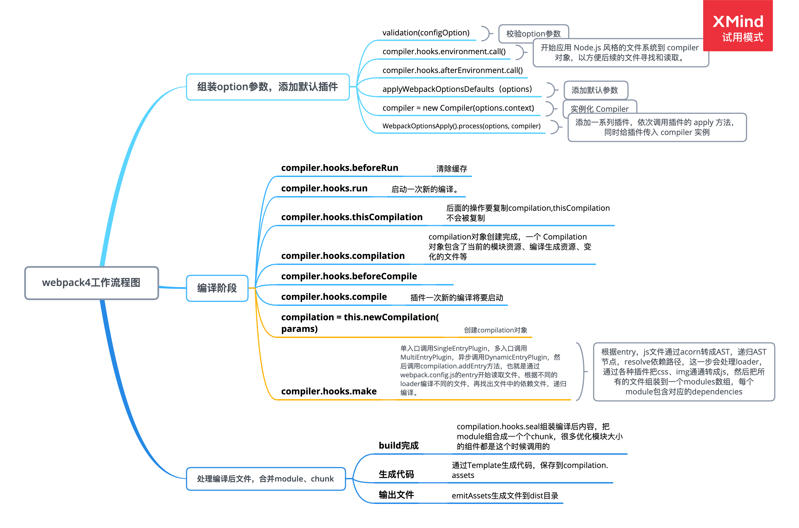
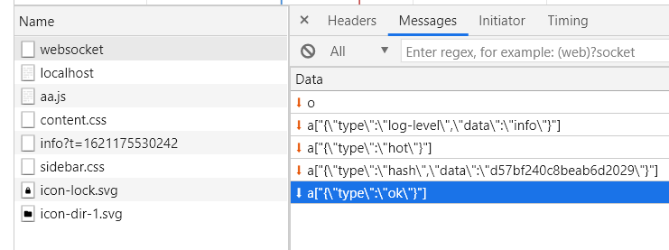
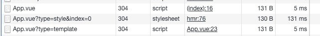

# webpack、rollup、vite的比较

## webpack

核心： transform（转换） + bundler（资源合并）

### 构建流程

1. 初始化阶段：
    1. **初始化参数**：从配置文件、 配置对象、Shell 参数中读取，与默认配置结合得出最终的参数
    2. **创建编译器对象**：用上一步得到的参数创建 Compiler（编译管理器） 对象
    3. **初始化编译环境**：包括注入内置插件、注册各种模块工厂、初始化 RuleSet 集合、加载配置的插件等
    4. **确定入口**：根据配置中的 entry 找出所有的入口文件，调用 compilition.addEntry 将入口文件转换为 dependence 对象
    5. **开始编译**：执行 compiler 对象的 `run/watch` 方法

2. 构建阶段：
    1. **编译模块(make)**：创建`Compilation`对象回调`compilation`相关钩子，根据 entry 对应的 dependence 创建 module 对象，调用 loader 将模块转译为标准 JS 内容，最后将编译好的文件内容通过 JS 解释器将内容转换为 AST 对象，从中找出该模块依赖的模块，再 递归 本步骤直到所有入口依赖的文件都经过了本步骤的处理。通过`compilation`我可以可以读取到`module`的`resource`（资源路径）、`loaders`（使用的loader）等信息
    2. **完成模块编译**：上一步递归处理所有能触达到的模块后，得到了每个模块被翻译后的内容以及它们之间的 依赖关系图
3. 生成阶段：
    1. **输出资源(seal)**：根据入口和模块之间的依赖关系，组装成一个个包含多个模块的 Chunk，再把每个 Chunk 转换成一个单独的文件加入到输出列表，这步是可以修改输出内容的最后机会
    2. **写入文件系统(emitAssets)**：在确定好输出内容后，根据配置确定输出的路径和文件名，把文件内容写入到文件系统



[图片来源](https://github.com/6fedcom/fe-blog/tree/master/webpack/webpack)

### webpack的打包原理

四个核心概念：

- 入口(entry)：指示 webpack 应该使用哪个模块，来作为构建其内部依赖图的开始
- 输出(output)：在哪里输出它所创建的 bundles
- loader：让 webpack 能够去处理那些非 JavaScript 文件
- 插件(plugins)：用于执行范围更广的任务

#### module、chunk、bundle

- module：我们写的源码，无论是commonjs还是amdjs，都可以理解为一个个的module，包含依赖关系，export等信息
- chunk：当我们写的module源文件传到webpack进行打包时，webpack会根据文件引用关系生成chunk文件，webpack 会对这些chunk文件进行一些操作
- bundle：webpack处理好chunk文件后，最后会输出bundle文件，这个bundle文件包含了经过加载和编译的最终源文件，所以它可以直接在浏览器中运行。

#### hash、chunkhash、contenthash --文件的指纹

hash：是跟整个项目的构建相关，只要项目里有文件更改，整个项目构建的hash值都会更改，并且全部文件都共用相同的hash值。
chunkhash：跟入口文件的构建有关，根据入口文件构建对应的chunk，生成每个chunk对应的hash；入口文件更改，对应chunk的hash值会更改。
contenthash：跟文件内容本身相关，根据文件内容创建出唯一hash，也就是说文件内容更改，hash就更改，主要用在css抽取css文件时。

### loader的作用

#### loader的特性

- 支持链式调用
- loader可以是同步任务也可以是异步任务
- 可以通过`options`对象配置
- loader能产生额外的任意文件

#### babel的原理
<https://mp.weixin.qq.com/s/B8XRsMg2uJrQTD5IFWOdlw>

本质是将代码A转成代码B，以便能在不同的浏览器上运行

### plugin

- webpack在启动的时候，会获取插件实例
- 然后通过插入实例，调用实例上的`apply`方法`xx.apply(complier)`
- `apply`中则可以通过`complier`对象，监听各种钩子

#### compiler 与 compilation

- compiler：在webpack启动的时候创建，包含所有配置信息，整个编译过程只会有一个，插件可以通过它获取到 webpack config 信息，如entry、output、loaders等配置。
- compilation: 代表了一次资源版本构建（负责创建bundles），包含了当前的模块资源、编译生成资源、变化的文件等，每当检测到一个文件变化，就会创建一个新的 compilation，比如热更新的时候会重新创建，从而生成一组新的编译资源。

### webpack 性能优化

项目的优化,webpack相关
<https://juejin.cn/post/6887863430510968839>

#### 瓶颈分析

`speed-measure-webpack-plugin`

用这个插件可以分析除各个阶段如`loader/plugin`的耗时，然后对症下药。

#### 方案

##### 1. 缓存

- `babel-loader` 的 `cacheDirectory`
- 一些其他loader也有缓存，或者使用`cache-loader`
- `dll` 动态链接库
- `HardSourceWebpackPlugin`
- external：第三方库用CDN

##### 2. 多线程

- `happypack`

##### 3. 减少打包体积

- `exclude/include`
- 开发环境时可以注释掉某些入口

#### cacheDirectory

一些loader或者plugin都会有`cache`的功能，会将编译结果缓存到文件系统中，避免每次都重新构建整个项目

#### DLL 文件为动态链接库

1. 把一些第三方库抽离，单独打包，用`DllPlugin`插件生成`manifest.json`文件
2. 当前开发项目中配置`DllReferencePlugin`，引入上面的`manifest.json`文件

配置比较繁琐

#### hard-source-webpack-plugin

从`vue-cli`和`create-react-app`中可以知道并没有实用`dll`，是因为：Webpack 4 的打包性能足够好的，dll继续维护的必要了。并且有了更好的替代方案：`hard-source-webpack-plugin`

已在webpack5中内置

### webpack其他问题

#### 文件监听原理

轮训去判断文件的最后编辑时间是否发生变化。当某个文件发生了变化，并不会立刻告诉监听者，而是先缓存起来，等待一定时间段后一起重新构建。

#### 热更新
<https://zhuanlan.zhihu.com/p/30669007>

1. webpack-dev-middleware会调用webpack的watch去观察文件是否变化，当发生变化的时候，就重新编译保存到内存中
2. 通过websokcet与浏览器进行消息推送，当complie.done钩子触发时，webpack-dev-server会将打包后的新模块的`hash`值发送到服务器
3. webpack-dev-server/client，在打包时给entry加入websokcet相关的代码
4. 收到`type： ok`的操作后，会根据配置来决定刷新页面还是热更新

   

5. 请求（都是通过jsonp ）`hot-update.json`获取更新的文件列表，然后请求`hot-update.js`获取到更新的新模块代码
6. 对模块进行热更新：先删除`installedModules`中缓存的id，然后将新的模块添加到 modules 中
7. 最后进行热更新`module.hot.check(true)`，如果更新失败就刷新浏览器

所以需要在业务代码中加入：

```typescript
if(module.hot) {
    module.hot.accept('./hello.js', function() {
        // ...
    })
}
```

## tree-shaking

Tree-shaking的本质是消除无用的js代码，编译器可以判断出某些代码根本不影响输出，然后消除这些代码，这个称之为DCE（dead code elimination）。

### 原理

#### DCE 消除大法

Dead Code 一般具有以下几个特征

- 代码不会被执行，不可到达
- 代码执行的结果不会被用到
- 代码只会影响死变量（只写不读）

传统编译型的语言中，都是由编译器将Dead Code从AST（抽象语法树）中删除

#### tree-shaking

**特点**

- 只能作为模块顶层的语句出现
- import 的模块名只能是字符串常量
- import binding 是 immutable的

ES6模块依赖关系是确定的，和运行时的状态无关，可以进行可靠的静态分析，这就是tree-shaking的基础。

### webpack的tree-shaking

#### webpack使用

1. 在`package.json`中设置`sideEffects`，这样它可以跳过一整颗树的检查
2. 在webpack.config.js中加入`{optimization： {usedExports: true}}`，它依赖与`terser`去检测语句是否有副作用

#### webpack的特点

1. webpack 拆分代码、按需加载  webpack2已经逐渐支持tree-shake
2. 静态资源导入（如 js、css、图片、字体等），拥有如此强大的功能，所以 webpack 在进行资源打包的时候，就会产生很多冗余的代码。

#### 失效原因

函数的参数若是引用类型，对于它属性的操作，都是有可能会产生副作用的。因为首先它是引用类型，对它属性的任何修改其实都是改变了函数外部的数据。

1. webpack通过`uglifyjs-webpack-plugin`来去掉无用代码，但uglify**没有完善的程序流分析**，无法分析一个变量是否指向外部，所以很多可能产生副作用的代码都保守不删除(赋值操作也能产生副作用)

2. 经过 babel 编译全部模块被封装成 IIFE，IIFE 存在副作用无法被 tree-shaking 掉（类的原型创出方法_createClass有副作用，采用`Object.defineProperty`处理原型以符合**不可遍历**的规定，需要配置 `{ module: false }`和 `sideEffects: false`

- rollup 和 webpack 的 shaking 程度不同，以一个 Class 为例子，rollup 有程序流分析的功能，可以更好的判断代码是否真正会产生副作用，但可能会误删
- webpack本身不能编译成esm，所以库最好用rollup打包

## rollup

[为什么说rollup比webpack更适合打包库](https://segmentfault.com/a/1190000038708512)

特点：

1. 它支持导出ES模块的包，可以有目标代码再次打包构建以提供tree-shaking
2. 它支持程序流分析，能更加正确的判断项目本身的代码是否有副作用。
3. 打包后的体积比webpack更小
4. 所有资源放同一个地方，一次性加载，利用 tree-shake特性来  剔除未使用的代码，减少冗余
5. 可以一次输出多种格式:IIFE, AMD, CJS, UMD, ESM

## vite

> vite 是一个由原生ESM驱动的非打包开发服务器，其作用类似webpack + webpack-dev-server

webpack会进行构建，然后启动开发服务器，请求服务器时直接返回打包结果。

而vite是直接启动开发服务器（会对依赖进行与构建，如将cjm转esm，并将多依赖转换成单个的包），请求哪个模块再对该模块进行实时编译。跳过模块依赖分析，编译的打包过程，所以速度很快

### vite为什么更快

1. 跳过打包阶段，通过请求直接隐射本地的代码文件，做到真正的按需加载，不会因为项目越大启动越慢
2. 对于非js、css等浏览器能直接解析的模块，通过esbuild来做转换，而esbuild本身速度极快。
3. 会区分依赖和源码：依赖通过预构建后一般不会在重复构建、源码需要转换、经常被编辑

### 如何解析vue


三次请求，没有query的时候，也就是请求vue文件的时候，会处理后返回下面的代码和组件的配置对象`__script`

```typescript
import { updateStyle } from "/vite/hmr"
updateStyle("c44b8200-0", "/App.vue?type=style&index=0")
__script.__scopeId = "data-v-c44b8200"
import { render as __render } from "/App.vue?type=template"
__script.render = __render
__script.__hmrId = "/App.vue"
__script.__file = "/Users/muou/work/playground/vite-app/App.vue"
export default __script
```

然后在拿到`style`和`render`函数，通过`updateStyle`插入style样式，然后加入vue组件
