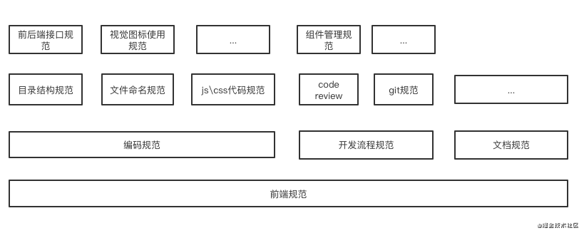

# 前端工程化

> 所谓工程化即系统化、模块化、规范化的一个过程。

本质都是：

1. 提高生产效率
2. 降低生产成本，包括代码维护，开发上手，部署测试等

前端工程化可归纳为：

1. 扩展js、css、html本身语言的能力
2. 解决重复工作
3. 模块化、模板化
4. 解决功能复用和变更问题
5. 解决开发和产品的环境差异
6. 解决发布流程

例如：

1. 提高开发效率：预编译语言、模块热加载等
2. lint 工具等可以保证代码的功能和质量

### 前端工程化

一般来说，前端工程化包含模块化、组件化、规范化、自动化四个方面

#### 1. 工程化的基本思想 --- 模块化

模块化的系统，当需求改动时，开发者可以更快速地将问题定位到相应模块中，模块逻辑清晰不耦合。因此模块化具备更强的可维护性。
简单来说，模块化就是将一个大文件拆分成相互依赖的小文件，再进行统一的拼装和加载。因此，**模块化是在文件层面上，对代码或资源的拆分**。

特点：

- 作用域封装
- 重用性
- 解除耦合

当前已有的模块化方案：AMD、CMD、CommonJs、ES Module

### 2. 组件化

组件化是在设计层面上，对用户界面的拆分，页面是大型业务组件，可以拆分为多个中型业务组件，然后可以再拆分成多个复合组件，复合组件再拆成多个基础组件，直到拆成Dom元素为止。

### 3. 规范化

一般来说，前端规范化大体上可以分类为编码规范、开发流程规范和文档规范等，每个大类中又有一些子类，如编码规范中包含有目录规范、文件命名规范、js/css代码规范等。

### 4. 自动化

前端工程自动化基本包含以下几方面内容:

- 图标合并
- 持续集成
- 自动化构建
- 自动化部署
- 自动化测试
