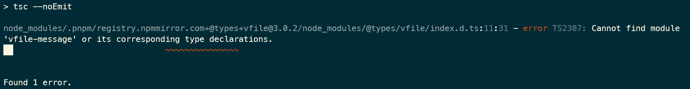
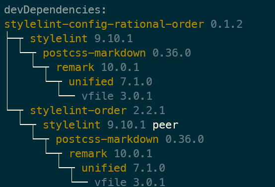

# stylelint

### 问题记录

#### 问题 项目进行 ts 检测时报错

> Cannot find module 'vfile-message' or its corresponding type declarations.

分析：`vfile@3.0.2` 这个包有问题

##### 时间

2022/01/29 21:55:28

##### 解决

1. 找到我们安装的依赖，谁依赖了 `vfile`， 运行 `pnpm list --depth 5 vfile`

    

2. 从上图发现是 `stylelint-config-rational-order` 的这个包依赖了，尝试移除这个包，发现不报错了。
3. 到 github 上发现最后一次更新在 19 年，所以决定不用这个包了，参考 `stylelint-order` 的建议，改用了 [stylelint-config-property-sort-order-smacss](https://github.com/cahamilton/stylelint-config-property-sort-order-smacss) 替代
