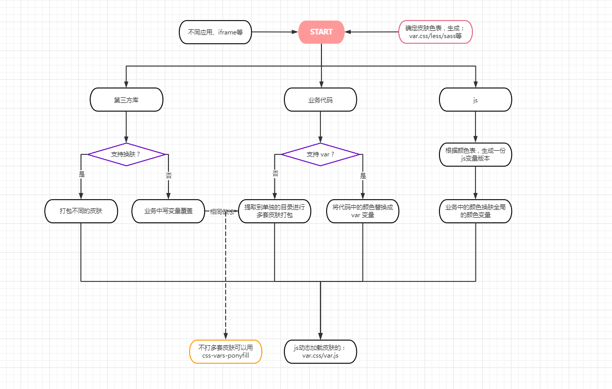

# 前端换肤

### 1. 简单夜间皮肤

```css
html { transition: color 300ms, background-color 300ms; }

// 1. 反转黑白 2. 减弱其他非黑白的颜色
html[theme='dark-mode'] { filter: invert(1) hue-rotate(180deg); } 

// 图片不反转
html[theme='dark-mode'] img{ filter: invert(1) hue-rotate(180deg); }
```

### 2. 多套皮肤的覆盖

打包多套皮肤

```text
theme-green.css
theme-red.css
theme-yellow.css
```

方法有很多，例如

- 皮肤单独构建，然后在项目中引入（公司的项目方案）
- [webpack 换肤功能多主题/配色样式打包解决方案](https://juejin.cn/post/6844903596992135182)

然后线上动态加载

### 3. element-ui的方式

[原理](https://github.com/ElemeFE/element/issues/3054)
[参考](https://juejin.cn/post/6844903801934069768#heading-2)

element提供的生成样式的地址
<https://element.eleme.cn/#/zh-CN/theme/preview>

### 4. antd 的实现(less在线编译)

[antd基于less的换肤方案](https://ant.design/docs/react/customize-theme-cn#%E5%9C%A8-webpack-%E4%B8%AD%E5%AE%9A%E5%88%B6%E4%B8%BB%E9%A2%98)

主要就是基于 `less.modifyVars`处理，如果要支持动态换肤，需要直接引入theme.less,theme.var.less。然后通过  less.js 直接编译输出

### 5. 基于css变量的方式

```css
:root: {
    --color1: #fc4;
}

.a { color: var(--color1) }
```

不兼容ie，可以用

[postcss-custom-properties](https://github.com/postcss/postcss-custom-properties)

```css
/* 编译前 */
:root {--color: red;}

h1 {color: var(--color);}

/* 编译后 */
:root {--color: red;}

h1 {
  color: red;
  color: var(--color);
}
```

或者用`css-vars-ponyfill` 处理

优点：
可以针对单个表单设置作用域，比如vue3.2加入的新功能
[CSS也能像组件状态一样响应式更新？](https://zhuanlan.zhihu.com/p/398826335)

### 参考

[前端换肤的N种方案，请收下](https://juejin.cn/post/6844904122643120141)
[聊一聊前端换肤](https://mp.weixin.qq.com/s/XMNHG0ftv6XqiYQLtPNgYw)

### 实际业务的换肤方案

在业务中除了考虑css的换肤外，还需要考虑js中的颜色，通常包括

- 多个第三方组件库或业务组件库
- 业务代码，包括写在js中的颜色，如图表
- iframe 的模块
- 微前端中不同的应用

方案起始都是根据配置去加载不同的皮肤文件



在实际开发过程，对于应用(仓库)较多的情况，可以写一个cli工具进行一键替换，根据上面确定的颜色变量表，与以前旧的颜色表进行替换，用`var(--color, #fff)`

##### cli工具

颜色的解析可以用postcss做ast转换去解析，会比较准确，时间问题也可以用简单用正则去匹配，但可能会漏掉一些情况(全看正则写的如何)：

```text
/:[\w\s]*(#\w*)(\s*!import)?(\s*;)?/g // 匹配 #xxx 的类型
/:[\w\s]*(rgba?\(.*\))(\s*!import)?(\s*;)?/g // 匹配 rgba 的类型
```

而对于 [颜色](https://developer.mozilla.org/zh-CN/docs/Web/CSS/color_value) ,有

- 关键字：red、blue
- 16进制：#fc4、#ffcc44、#FC4
- rgb：rgb(255,255,255,)、rgba(255,255,255,0.5)、#ffcc44ff
- HSL圆柱坐标: 比较少见，但不代表没人写...

所以我们需要一个颜色转换库: [color-string](https://github.com/Qix-/color-string)

将提取出来的颜色转换成统一的色值，比如 `#RRGGBBAA` 的格式

##### 实际问题

1. 内部有多套皮肤
业务中有的用不同的皮肤，对于同一个颜色，如连接色，不同皮肤颜色不一样，需要人眼识别出来并修改成统一的
