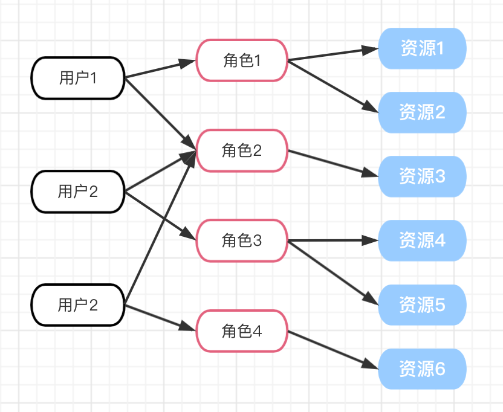

# 前端的权限设计

在做开发时，遇到过一些权限相关的开发，也开发过权限相关的模块，趁着最近的做开发，进行一次总结

## 术语描述

- 用户：操作的账号，为权限的载体
- 资源：将页面（路由）、页面内容、数据等可以进行权限控制的都称为资源，实际还包括后台接口、服务等。
- 角色：权限的载体，通常是指具有某些共同特征的一组人，比如财务、运维、研发等角色；角色和权限（资源）绑定，通过不同的角色关联不同的权限

## 常见的权限模型

- ACL（Access Control List）：访问控制列表，直接将权限与用户绑定，当用户数量很多的时候，操作一次权限就需要对每个用户都进行授权，工作量很大。
- RBAC（Role-Based Access List）: 基于角色的权限控制，通过 `用户 -> 角色 -> 权限` 的方式，增加了一层角色来间接的赋予用户权限，从而让用户与权限解耦。
- ABAC（Attribute-Based Access Control）: 基于属性的访问控制，通过定义一系列属性（用户属性、环境属性、资源属性），通过动态计算来确定用户是否有权限访问。对于资源的管控力度更细，比如运营(角色)在北京(环境)能查询北京订单(资源)。这种在前端并不常见，有兴趣自行了解。

## 前端的权限控制

前端对权限控制粒度的不同，可以分为：

- 页面权限：包括登录权限、路由、菜单这类，本质上就是在路由层面进行控制
- 页面内容权限：比如没有编辑权限，则隐藏掉相关的UI组件，通常和后台接口挂钩

### 角色固定/较少的方案


这种应该是目前比较常见的一种，角色以及对应的权限由后台维护，前端通常会维护一份路由与角色的 map 配置，例如：

```typescript
const routeConfigs = [
    {
        path: '/path1',
        meta: {
            title: 'path1',
            roles: ['role1', 'role2', 'role3'] // 该条路由那些角色可以访问
        }
    },
     {
        path: '/path2',
        meta: {
            title: 'path2',
            roles: ['role1', 'role2']
        }
    },
    {
        path: '/path3',
        meta: {
            title: 'path3',
            roles: ['role3']
        }
    }
]
```

在页面登录之后，获取到当前用户的角色，然后根据该角色，过滤出有权限的路由和菜单，进行页面初始化。

#### 页面权限

虽然上面在页面上不存在入口让用户点击进入，但如果用户记住某条路由（比如保存到书签），直接用过url进入，那么还是会打开的。所以还需要在路由层面做权限判断，如果没有权限，则跳转403页面。

vue 和 react 的路由拦截都有各自的实现，这里不列出来，只给出主要逻辑伪代码

```typescript
const {enableView} = usePermisesion();

if (!enableView) {
    // 定向到 403 页面
} else {
    // 正常逻辑
}
```

这里的 `usePermisesion` 通过 `routeConfigs` 和 用户角色 来判断是当前路由是否权限进入，用户角色 建议通过全局状态、context之类的注入。

当然这里简化了操作，实际上应该先进行 404 的判断，否则随便输入的 url 都会跳转到 403

#### 内容权限控制

内容权限是比较难处理的，不像页面权限可以通过全局的拦截器进行统一的拦截，需要通过侵入业务代码中。

一些实现方案是将权限需要的角色写到业务中，如：

```jsx
<PermissionControl permisstion={["role1", "role2"]}>
  <Button />
</PermissionControl>

// or
<Button v-permission=["role1", "role2"] />
```

不建议采用这种，一旦要增加一个角色，或者删除一个角色，需要到处找代码。因此统一通过 `usePermisesion` 来获取当前页面的其他权限。只需扩展下 `routeConfigs`：

```typescript
const routeConfigs = [
    {
        path: '/path1',
        meta: {
            title: 'path1',
            permission: { // 对应的操作权限需要的角色
                view: ['role1', 'role2', 'role3'],
                edit: ['role1', 'role2']
            }
        }
    },
     {
        path: '/path2',
        meta: {
            title: 'path2',
            permission: {
                view: ['role1', 'role2'],
                edit: ['role2']
            }
        }
    },
    {
        path: '/path3',
        meta: {
            title: 'path3',
            permission: {
                view: ['role3'],
                edit: ['role3']
            }
        }
    }
]
```

然后封装通用的 权限组件 或者 vue指令，来获取当前页面需要对权限

```tsx
const PermissionControl = ({permissionkey, children}) => {
    const {enableEdit} = usePermisesion();

    if (!enableEdit) {
        return null
    }

    return children
}

// 使用

<PermissionControl><Button /></PermissionControl>
// or
<Button v-permission />
```

##### 特殊权限控制

上面的 `edit` 权限还是针对整个页面级别，如果希望只是页面某个按钮需要更加特殊的权限，比如 【文档发布】 按钮，需要更高的管理权限，依然可以通过上面的 `routeConfigs` 来处理：

```typescript
const routeConfigs = [
    {
        path: '/path1',
        meta: {
            title: 'path1',
            permission: { // 对应的操作权限需要的角色
                view: ['role1', 'role2', 'role3'],
                edit: ['role1', 'role2'],
                xxxButton: ['administrator']
            }
        }
    }
]

const PermissionControl = ({permissionkey, children}) => {
    const {enableEdit} = usePermisesion(permissionkey); // 可以传入 key 来获取指定特定对资源权限

    if (!enableEdit) {
        return null
    }

    return children
}

// 使用

<PermissionControl permissionkey="administrator"><Button /></PermissionControl>
// or
<Button v-permission="administrator" />
```

#### 小结

到这里为止基本上就能够覆盖权限验证在前端需要的几个场景，这种方式适合于小型系统，角色有限的情况。通过 `routeConfigs` 来维护权限与页面资源的映射，也比较清晰简单。但也有明显的不足：

- 对于大型项目，权限管理往往是复杂的，比如一个系统有几十个不同类别的应用，用户量都比较大，不能简单的抽象成几个简单的角色来控制。

为了能够更加方便的管理权限，往往会采用角色动态创建的方案，通过自定义不同类型的角色，以支持更加细粒度的权限管理。

### 角色动态创建的方案

这种方案其实提供一个新页面，用于动态创建新的权限，关键在于如何将角色与资源（页面、api）很好的关联起来。路由的结构一般是一棵树，可以设计一个树来让管理进行权限设置，例如


```typescript
// 菜单结构
const treeData = [
  {
    title: "nav1",
    key: "8320208943",
    children: [
      {
        title: "menu1",
        key: "5334596991",
        children: [
          {
            title: "page1",
            key: "4129071236",
            permission: {
                view: true,
                edit: false
            }
          }
        ]
      }
    ]
  },
  {
    title: "nav2",
    key: "9126990335",
    children: [
      {
        title: "page2",
        key: "9177135649"，
        permission: {
            view: true,
            edit: true,
            xxxButton: false // 其他页面内容的权限控制
        }
      }
    ]
  }
];
```

#### 如何将页面和后台接口关联起来

上面菜单结构树 `treeData` 每层都加了一个唯一的 `key`，这个不仅因为组件需要，而是有其他作用：

1. 可以称呼为 `resourceKey`，用于将 **页面和后台接口** 关联起来。
2. 不能用路由中的 `path` 之类的，将来可能变动的数据作为这个 `key`，因为对于前台，这个key需要映射到具体的页面，对于后台需要映射具体的接口等资源。这样无论前端页面结构怎么调整，后台接口都不需要修改 接口-页面 等映射。
3. 对于后台而言，其实并不需要 `nav`、`menu` 这两层，后台需要的是扁平的一层，但是前端的页面结构需要，所以需要将这个 `treeData` 存储在数据库，在页面初始化的时候获取，然后通过 `key` 与 `routeConfigs` 关联。

最终 `routeConfigs` 大概是:

```typescript
const routeConfigs = [
    {
        path: '/path1',
        meta: {
            title: 'nav1',
            resourceKey: '8320208943',
        },
        children: [
            {
                path: '/path1/menu1',
                meta: {
                    title: 'menu1',
                    resourceKey: '5334596991',
                },
                children: [
                    {
                        path: '/path1/menu1/page1',
                        meta: {
                            title: 'page1',
                            resourceKey: '4129071236',
                        },
                        children: [
                            {
                                path: '/path1/menu1/page1/details', // 子页面
                            }
                        ]
                    }
                ]
            }
        ]
    },
     {
        path: '/nav2',
        meta: {
            title: 'nav2',
            resourceKey: '9126990335',
        },
        children: [
            {
                path: '/path2/page2',
                meta: {
                    title: 'page2',
                    resourceKey: '9177135649'
                },
            }
        ]
    },
]
```

在页面获取到 `treeData` 后，就可以进行页面菜单，权限操作的初始化。

这里还需要注意，存在一些路由不通过 `treeData` 进行权限控制，这类路由必须作为某个有权限的页面的子路由，以继承该父路由的权限。或者添加 **路由白名单** 忽略权限判断。

之后代码中的权限判断，基本上可以复用 `usePermisesion` 部分，只是权限数据不同了而已，不在复述

#### 为什么要关联后台接口？

上面部分通过 `treeData` 和 `routeConfigs` 来关联前端路由、页面权限，同时也简单提到了要与后台接口关联。实际上在做权限设计时前后端肯定是完成一套，否则就会有漏洞。

例如上面中的 `page1` 是没有 `edit` 权限的，但直接绕过前端，从控制台直接发送请求，后台也要拦截掉这个请求，所以后台的接口也需要与页面关联起来，也就是通过这个不变的 `key` 来关互相关联。

这里还有一个特殊的场景：

- 页面A绑定了接口a、b   --- {edit: false}
- 页面B绑定了接口b、c   --- {edit: true}

1. 在 B 页面调用 接口b，结果是
2. 在A页面调用 接口c，结果是

这是当一个接口被多个页面复用的时候，至于这里结论是什么，就需要看业务的具体需求，是取 并集 还是 交集。不过还是建议尽量避免这种 case。
另外，key 与 接口、页面的映射可以前后端各自维护配置，也可以开发一个页面进行配置，这样更加清晰！

#### 小结

通过动态创建角色，勾选不同的权限来控制不同资源权限，达到更细粒度多权限控制，同时可以做到一个用户拥有多个角色（最终权限取并集），组合成新的权限，可以更加灵活的进行设置。



[图片来源](https://tsejx.github.io/blog/architect-design-based-on-rbac/)

## 参考

- [前后端分离架构设计（权限模型）](https://zhuanlan.zhihu.com/p/107054677)
- [基于 RBAC 权限模型的架构设计](https://tsejx.github.io/blog/architect-design-based-on-rbac/)
