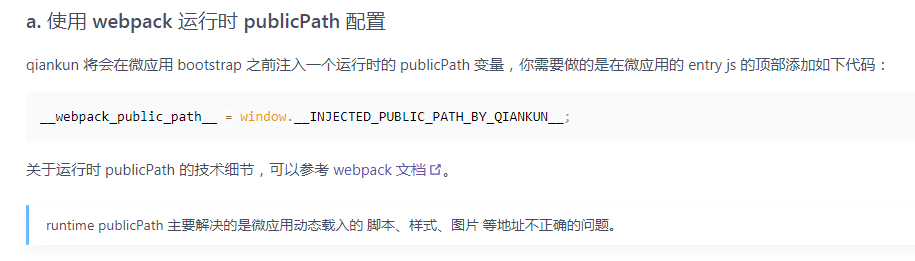

# 项目被嵌入方案
问题：在项目被嵌入其他框架时，一般都需要修改前缀以支持后台做代理转发，处理将新的路径在打包中写死外，还有其他的方案进行尝试。

难点：
1. html中的资源路径，如app.css/js，(相对于html)
2. 动态加载的 css/js (webpack) (相对于html)
3. 2中加载的 img、font等媒体资源 (相对于js/css)
4. 通过非`src`、`href`加载的代码 (相对于html，2/3会受影响)

### 1. webpack打包处理
#### 打包处理
一般情况下，可以直接将 `publicPath` 设置为相对路径，比如 `/dist/` 改为 `./dist/`，这样打包出来的路径就都是相对路径了。但对于 `.css` 中的图片，也会被处理成相对路径，打包后有如下路径
```
dist/
    js/
    css/
        app.css
            background: url('./imgs/logo.png')
    imgs/
    index.html
```

那么图片就会加载失败(`dist/css/img/logo.png`)，因此需要修改下图片的打包路径，图片一般都是通过 `url-loader` 处理，因此可以设置为：
```
 {
	test: /\.(png|jpg|gif)$/,
	use: [
	  {
		loader: 'url-loader',
		options: {
		  publicPath: '../'
		}
	  }
	]
  }
```
这样打完包后图片的路径就会设置为`background: url('../imgs/logo.png')`，加载位置就正确了。

对于 API 的部分，则写代码的时候则不要带 `/` 开头即可（可以写个eslint插件检查，或者在axios拦截器中处理）

以上方案一般就能处理好相对路径的问题，但对于非独立部分的页面，例如微前端，会遇到其他的问题

#### 微前端(qiankun 1.0)
项目部署方式：
```
common_assets/
portal/
app1/
app2/
```
为了支持微前端加载，又支持独立访问，因此设置成了以上的结构：
- 访问微前端页面： /index.html、/web/portal/index.html
- 访问独立页面：/web/app1/index.html、/web/app2/index.html

假设采用上面打包后的页面的代码资源
设置 `webpack` 静态资源路径`publicPath: 'web/app1/'`
```
// 通过 html-plugin 动态插入的公共资源路径
<link href="common_assets/module/xxx.css" />
<script src="common_assets/module/xxx.js"></script>

<link href="app1/static/app.css" />
<script src="app1/static/app.js"></script>
```

问题：
##### qiankun加载问题
qiankun加载的关系，需要在`registerMicroApps`的配置`entry`设置加载路径，比如上面会设置成
```
{
    entry: '/web/app1/index.html',
}
```

然后qiankun在抓取 html 文件解析资源的时候， [代码](https://github.com/kuitos/import-html-entry/blob/master/src/index.js#L265)
```
someFN().then(html => {
    // 这里会根据 entry 作为子应用的前缀，assetPublicPath = /web/app1/
    const assetPublicPath = getPublicPath(url); 
    
    // 这里在加载资源的时候
    // 1. 如果路径是绝对路径，则就按照用绝对路径加载
    // 2. 如果是相对路径，则会加上 assetPublicPath 作为前缀
    const { template, scripts, entry, styles } = processTpl(getTemplate(html), assetPublicPath);
    // ...
})
```

所以上面的加载就会变成，显然是不对的
```
/web/app1/common_assets/module/xxx.css
/web/app1/common_assets/module/xxx.js
/web/app1/app1/static/app.css
/web/app1/app1/static/app.js
```
> 提示，这里如果想将/app/改成相对路径， 将`entry`配置为`web/app1/index.html`的相对路径写法是不行的，qiankun不会按照相对路径取解析，不过由于是运行时的代码，所以可以在生成配置的时候添加当前页面的前缀

**这里起始就遇到了难以解决的问题了**

如果打包的时候，静态资源路径去掉静态路径（如： `publicPath: './'`），按照qiankun的加载逻辑，`app.css和app.js`的请求路径是正确(`common_assets`依然是不行的)，但是会造成`js`中的路径解析错误,假如嵌入后访问时url是`https://domain/subapp/product/index.html`
```
// 这两个资源正确了
/subapp/product/web/app1/static/app.css
/subapp/product/web/app1/static/app.js

// 但其中的资源请求会变成，缺少了/web/app1/，因为里面的资源不受qinakun管控，都相对于indexhtml页面去加载
/subapp/product/static/app_module1.js
/subapp/product/static/app_module1.css
```

对于新的问题，qiankun提供了[解决方案](https://qiankun.umijs.org/zh/faq#a-%E4%BD%BF%E7%94%A8-webpack-%E8%BF%90%E8%A1%8C%E6%97%B6-publicpath-%E9%85%8D%E7%BD%AE)：



可以通过 webpack提供的动态路径方案 `__webpack_public_path`来动态设置前缀，但是这样又会有新的问题，qiankun是通过`fetch`抓取 js、css 的，然后`eval` 执行代码，也就是都在`/subapp/product/web/`下执行，虽然这个方案能解决 js、css加载路径的问题，但如果其中又加载了图片、字体等资源，路径依旧解析不正确，按照这个方案处理后
```
// 这些资源正确了
/subapp/product/web/app1/static/app.css
/subapp/product/web/app1/static/app.js
/subapp/product/web/app1/static/app_module1.js
/subapp/product/web/app1/static/app_module1.css

// 假如css中有张图片 ../imgs/logo.png，加载的路径则会变成
/subapp/imgs/logo.png
```

这里有其他的相关问题：
- [qiankun中import-html-entry对于html页面url的处理](https://github.com/umijs/qiankun/issues/915)
- [微应用打包之后-css-中的字体文件和图片加载-404](https://qiankun.umijs.org/zh/faq#%E5%BE%AE%E5%BA%94%E7%94%A8%E6%89%93%E5%8C%85%E4%B9%8B%E5%90%8E-css-%E4%B8%AD%E7%9A%84%E5%AD%97%E4%BD%93%E6%96%87%E4%BB%B6%E5%92%8C%E5%9B%BE%E7%89%87%E5%8A%A0%E8%BD%BD-404)

对于这个问题，最好的解决就是将静态资源的图片上 CDN，但是对于特殊环境下，无法这么干，比如上面用到的 `common_assets`，因为也是通过 `htmlPlugin` 动态注入的，上面的方案全部都走不通，于是乎只能改 `qiankun` 的源码做一下适配了：
```
// app中的资源依旧保持完整的相对路径，保证 图片 等资源在 基座 中能正常访问到

/app1
publicPath: 'web/app1/'

/app2
publicPath: 'web/app2/'

// https://github.com/kuitos/import-html-entry/blob/master/src/process-tpl.js#L32
// 在这里对资源路径进行特殊处理
function getEntirePath(path, baseURI) {
    if (common_assets) {
        // 特殊处理下，不要带上 baseURI
    } else {
        // 处理因为 htmlPlugin 注入的路径，baseURI 和 publicPath 重复部分
    }
    return new URL(path, baseURI).toString();
}
```

这么处理下来，就能让 qiankun 支持相对路径的写法，能嵌入任意的 iframe 了。

但是，这样会导致无法单独访问子应用！
```
/web/app1/index.html

// 静态资源路径都多了前缀
/web/app1/web/app1/app1.js
/web/app1/web/app1/app1.css
/web/app1/web/app1/imgs/logo.png
```
注意上面路径中间重复的部分 `/web/app1`

### 不改源码的处理
###### 回顾下原来的部署方式
```
common_assets/
portal/
app1/
app2/
```

###### 修改部署目录结构
```
portal/
    static/
    index.html
    common_assets/
    app1/
        static/
        index.html
```

基座 entry
```
entry: 'subapp/product/portal/app1/index.html'
```

app1 的 webpack.config 设置 
```
publicPath = './'
common_assets_path = '../common_assets/'

// 对于动态加载的js、css，加入
__webpack_public_path__ = window.__POWERED_BY_QIANKUN__ ？ 'app1/' : '' 
// 或赋值 window.__INJECTED_PUBLIC_PATH_BY_QIANKUN__ || ''
```

这样打包后html中的资源为
```
../common_assets/xxx.js
./static/js/app.js
./static/css/app1.css
```

访问 `https://domain/subapp/product/index.html#app1/mod1` 子应用的加载为
```
// 这部分是qiankun处理好的路径
/subapp/product/portal/common_assets/xxx.js
/subapp/product/portal/app1/static/js/app.js
/subapp/product/portal/app1/static/css/app1.css

// 加载其他的js，则由 __webpack_public_path__ 添加前缀 app1
/subapp/product/ + app1/static/js/mod1.js
/subapp/product/ + app1/static/css/mod1.css
```

上面的方式，就能够同时支持独立访问和基于微前端的访问：
```
https://domain/subapp/product/index.html#app1/mod1 // 微前端访问
https://domain/subapp/product/app1/index.html#app1/mod1 // 基座访问
```

但是，会发现图片的访问都不正常了：
- 微前端下：`https://domain/subapp/product/static/imgs/app1.png`
- 独立访问：`https://domain/subapp/product/app1/static/css/static/imgs/app1.png`

对于这个问题还没有好的解决方案。

1. 优先支持微前端的访问，则app1的 loader 设置
```
// url-loader
{
    options: {
        publicPath: 'app1/'
    }
}
```

此时访问路径会变成：
- 微前端（正常）：`https://domain/subapp/product/app1/static/imgs/app1.png`
- 独立访问：`https://domain/subapp/product/app1/static/css/app1/static/imgs/app1.png`

独立访问考虑让 nginx  将 app1/static/css/app1/static -> app1/static

2. 优先支持独立访问，则app1的 loader 设置
```
// url-loader
{
    options: {
        publicPath: '../../'
    }
}
```
此时访问路径会变成：
- 微前端：`https://domain/static/imgs/app1.png`
- 独立访问（正常）：`https://domain/subapp/product/app1/static/imgs/app1.png`

微前端可以考虑在 qiankun 中 fetch styles 后，将其中的 url('xxx') 的代码进行处理，都加上 enrty 前缀，当然 qiankun 并没有这份接口，只能改源码了 hhh

### 其他 
1. 跳转路径、下载等连接，也要改成相对路径
2. iframe的路径也要单独处理下
