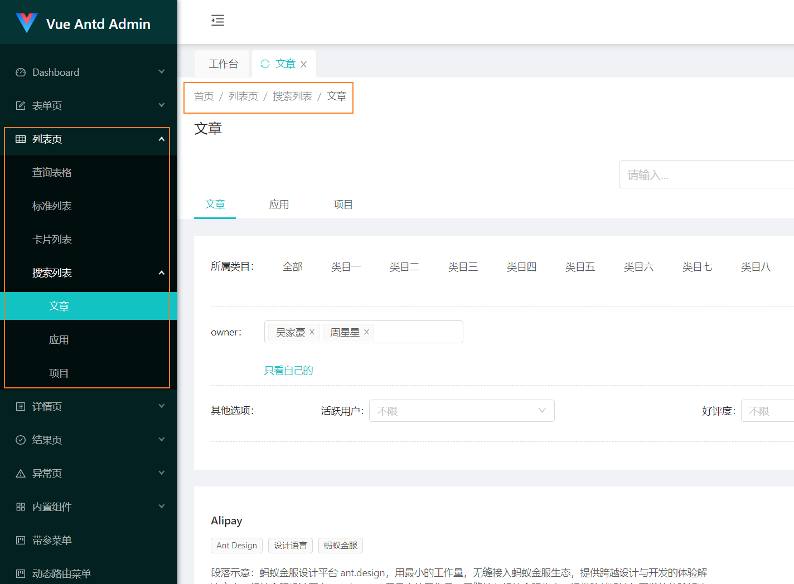

# 中后台系统路由表的最佳实践

> 整理下在一个项目中，一个路由表的最佳实践



> <https://iczer.gitee.io/vue-antd-admin/#/dashboard/workplace>

一个中后台系统的 UI 如上图类似，会分为

```text
一级菜单1
    页面 1-1
一级菜单2
    二级菜单2-1
        页面 2-1-1
        页面 2-1-2
    页面 2-2
    // 可以嵌套更多级的菜单11
    
```

通常情况下，会分开设计两个结构来分别维护，比如针对菜单和面包屑

```tsx
const menusConfig = [
    {
        title: "一级菜单1",
        children: [
            {
                title: "页面 1-1",
                path: "/menu1/page1-1"
            }
        ]
    },
    {
        title: "一级菜单2",
        children: [
            {
                title: "二级菜单2-1",
                children: [
                    {
                        title: "页面 2-1-1",
                        path: "/menu2/page2-1-1"
                    },
                    {
                        title: "页面 2-1-2",
                        path: "/menu2/page2-1-2"
                    }
                ]
            },
            {
                title: "页面 2-2",
                path: "/menu2/page2-2"
            }
        ]
    }
]
```

另外单独维护一个路由表 `routeConfig`

```tsx
const routeConfig = [
    {
        path: "/menu1/page1-1"
        component: "xx",
        children: [/* detail 等子路由，不显示在菜单中 */]
    },
    {
        path: "/menu2/page2-1-1",
        component: "xx",
    },
    {
        path: "/menu2/page2-1-2",
        component: "xx",
    },
    {
        path: "/menu2/page2-2"
        component: "xx",
    }
]
```

仔细观察发现这种路由表与菜单的结构是非常相似的，所以可以尝试维护一个新的数据结构，来减少项目开发中配置的成本（不用维护两份）。

## 菜单与路由表结合

两者结合比较简单，方式也很多，例如像下面这样简单合并，有其他配配置也方便扩展，如 `icon` 等

```tsx

interface MenuItem {
    title: string;
    path?: string;
    component?: any;
    hidden?: boolean; // 不希望显示在菜单树中
    children: MenuItem[];
}

const config: MenuItem[] = [
    {
        title: "一级菜单1",
        children: [
            {
                title: "页面 1-1",
                path: "/menu1/page1-1",
                component: "xx",
                children: [
                    title: "页面 1-1 detail",
                    path: "/menu1/page1-1/detail",
                    component: "xx",
                    hidden: true
                ]
            }
        ]
    },
    {
        title: "一级菜单2",
        children: [
            {
                title: "二级菜单2-1",
                children: [
                    {
                        title: "页面 2-1-1",
                        path: "/menu2/page2-1-1",
                        component: "xx",
                    },
                    {
                        title: "页面 2-1-2",
                        path: "/menu2/page2-1-2",
                        component: "xx",
                    }
                ]
            },
            {
                title: "页面 2-2",
                path: "/menu2/page2-2",
                component: "xx",
            }
        ]
    }
]

```

然后由上面的树分别生成对应的 `menusConfig` 和 `routeConfig`

## 针对使用场景的改进

1. 作为子页面，子路由的场景，比如 edit、detail 等页面，使用场景
    - 一些下钻页面或者抽屉
    - 特点父路由页面不会销毁，可以在返回上一个路由时保持之前页面的状态
    - 同时知道子路由，可以预加载一些子路由页面
2. 作为子路由，但不是子页面，比如跳转到一些特定到独立页面
    - 与上面的场景不同，在路由结构种是一个子路由的位置，但实际上路由可能指向其他页面，只是为了维持一个面包屑的结构，例如在微前端中，嵌套其他子应用，但面包屑要包装路径的映射正常
3. 不作为子页面、子路由而存在的独立页面，但不显示在菜单中（父路由页面会销毁）
    - 这种就类似第 2 种，但可能是一个独立模块，不需要面包屑和菜单，只能通过特定情况打开，例如首次进入的引导页。
4. 支持重定向，例如旧页面下架，重定向到新页面

针对上面的情况，我们可以在路由表种增加：

- flat： 表示生成路由的时候，这个提升到根路由下，而不是嵌套结构
- full：当前路由是否全屏显示，即隐藏掉左侧菜单（和顶部菜单）
- open： 一个跳转链接
- redirect: 重定向

```tsx

interface MenuItem {
    title: string;
    path?: string;
    redirect?: string;
    component?: any;
    open?: string;
    meta: {
        hidden?: boolean; // 不希望显示在菜单树中
        flat?: boolean;
        full?: boolean;
    }
    children: MenuItem[];
}

const config: MenuItem[] = [
    {
        title: "一级菜单1",
        children: [
            {
                title: "页面 1-1",
                path: "/menu1/page1-1",
                component: "xx",
                children: [
                    title: "页面 1-1 detail",
                    path: "/menu1/page1-1/detail",
                    component: "xx",
                    meta: {
                        hidden: true
                    }
                    
                ]
            }
        ]
    },
    {
        title: "一级菜单2",
        children: [
            {
                title: "二级菜单2-1",
                children: [
                    {
                        title: "页面 2-1-1",
                        path: "/menu2/page2-1-1",
                        component: "xx",
                    },
                    {
                        title: "页面 2-1-2",
                        path: "/other-path/xxx",
                        component: "xx",
                        meta: {
                            flat: true // 遍历生成路由表时，直接放在根路由下
                        }
                    }
                ]
            },
            {
                title: "页面 2-2",
                path: "/menu2/page2-2",
                component: "xx",
            }
        ]
    },
    {
        title: '首页',
        path: "/home",
        component: "home",
        meta: {
            full: true
        }
    },
    {
        title: '跳转 aaa', // 显示在菜单中，点击跳转
        open: '/aaa'
    },
    {
        title: '旧页面下架',
        path: '/old-path',
        redirect: 'new-path' 
    }
]

```

## 菜单、面包屑与权限

根据上面的路由表，可以生成出 `menusConfig` 和 `routeConfig`，其结构则与最开始介绍的差不多，但会多一些在上面介绍到的配置。

于是可以通过 `menusConfig` 去生成对应的菜单，这个比较简单。而对于面包屑和权限，通常需要根据当前路由，快速找到其父路由信息，比如一些子路由，其权限是继承其父路由的。通常的方案有：

1. 从根路由开始遍历，找到相似的路由，但因为有前面介绍的场景 `作为子路由，但不是子页面，比如跳转到一些特定到独立页面`，每次都必须全部遍历，不能根据前缀快速筛选，速度会比较慢。
2. 使用 `hash` 表来快速查找，可以在第一次遍历生成 `menusConfig` 和 `routeConfig` 时，以 path 为 key，记录当前路由信息，以及 `parentPath`:

    ```typescript
    interface RouteHash {
        [k: string]: MenuItem & {parentPath?: stirng};
    }
    ```

3. 还有更高级的玩法： [前缀树在前端路由系统中的应用](https://mp.weixin.qq.com/s/rfG0456RTCSR7K1uylsu0g)
