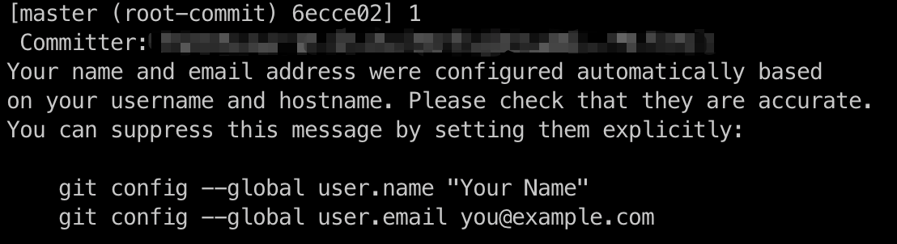

# git 设置多账号

最近换了公司，在 git 多账号上遇到了些问题。前东家内外网是两套环境，所以不存在一个环境需要设置多个账户 git 的问题。新公司采用 vpn 的方式连接内网，所以内外网都是在一个环境下就能访问。

通常来说，在公司上班，公司会给你分配邮箱，并且对 git 的提交是有一定规范的，比如一定要用自己的名字，这样容易知道谁提交的代码。而自己也有自己的私人账号，甚至不同平台的账号，如 gitee、github 如：

```sh
// company - gitlab
name=xiaoming
email=xiaoming@gmail.com

// personal - github
name=DoctorX
email=DoctorX@qq.com
```

通常情况下会设置一个全局名称作为提交的账号：

```sh
# 设置全局账号
git config --global user.name "xiaoming"
git config --global user.email "xiaoming@gmail.com"

# 查看配置
git config --global user.name # xiaoming
git config --global user.email # xiaoming@gmail.com
```

这样的每次commit就会默认使用全局设置的名称进行提交。

#### 问题

提交代码的时候默认的 commit 的用户名全部都是 `xiaoming`，期望当然是对于项目进行区分提交：

- 公司内部的平台使用 `xiaoming`
- github的个人项目使用 `DoctorX`

#### 解决方式

在连接 git 服务器的时候，通常会设置 ssh 密钥进行安全认证，但默认情况下都是生成密钥会覆盖掉之前设置的（文件名相同），所以我们要针对不同的用户，设置不用的密钥文件

1. 生成一个公司用的SSH-Key

```sh
ssh-keygen -t rsa -C 'xxxxx@company.com' -f ~/.ssh/gitlab_id_rsa
```

2. 生成一个github用的SSH-Key

```sh
ssh-keygen -t rsa -C 'xxxxx@qq.com' -f ~/.ssh/github_id_rsa
```

3. 在 `~/.ssh` 目录下新建一个config文件，添加如下内容

```sh
# gitlab
Host gitlab.com
HostName gitlab.com
User xiaoming
PreferredAuthentications publickey
IdentityFile ~/.ssh/gitlab_id_rsa

# github
Host github.com
HostName github.com
User DoctorX
PreferredAuthentications publickey
IdentityFile ~/.ssh/github_id_rsa
```

这样在访问远程服务器的时候，就会根据不同的地址使用不用的密钥进行认证。

上面设置完成后，打开 `~/.ssh` 会有：

```
config
github_id_rsa
github_id_rsa.pub
gitlab_id_rsa
gitlab_id_rsa.pub
```

接下里将 .pub 文件中的公钥分别设置到 gitlab 和 githuh 上。

**测试是否设置成功**：

```sh
ssh -T git@gitlab.com
ssh -T git@github.com
```

**最后清空全局设置的用户名和邮箱**

```sh
git config --global --unset user.name 
git config --global --unset user.email
```

#### 项目设置

由于在上面清空了 git 名称的全局设置，此时在项目中进行 commit 操作，则会以你电脑的账户名提交，并提示



马赛克的部分就是我pc的账户名

这时候我们需要为每个项目单独的配置local级别的账户信息，在对应的项目中执行下面命令

```
git config --local user.name "xxxx"
git config --local user.email "xxxx"
```

然后重新修改下提交人信息

```
git commit --amend --reset-author
```

可以 `git config --local --list` 查看配置信息

当然，每个项目都要敲这么两句也麻烦，所以写个全局脚本来干这事

```sh
#!/bin/bash

type=$1
dir=$(pwd)

case ${type} in
  gitlab)
    git config --local user.name user1
    git config --local user.email xxx
    echo "select [${type}] and set in [${dir}]"
    ;;
  gitee)
    git config --local user.name user2
    git config --local user.email xxx
    echo "select [${type}] and set in [${dir}]"
    ;;
  github)
    git config --local user.name user3
    git config --local user.email xxx
    echo "select [${type}] and set in [${dir}]"
    ;;
  *)
    echo "${type} is invalid!"
    exit 1
    ;;
esac
```

然后添加到到 环境变量 或者 全局 `alias` , 运行一下就行！
