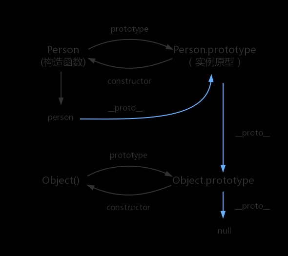
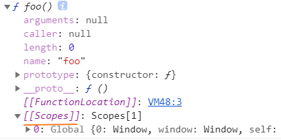
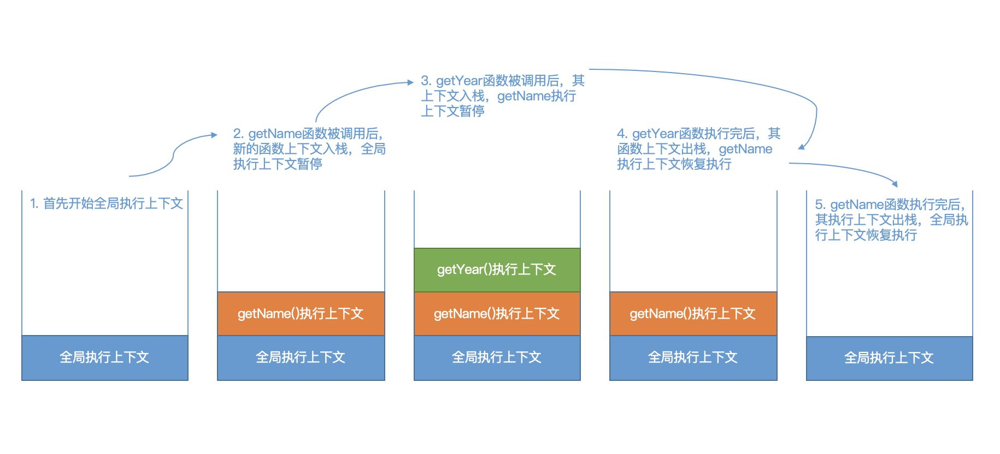
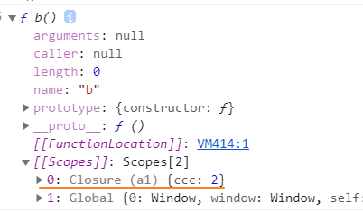

# 八股文

### 1. 基本数据类型

#### 数据类型

##### 基本类型

1. number: 64位双精度浮点数
2. string
3. null
4. undefined
5. boolean
6. symbol
7. BigInt

##### 对象类型

1. function
2. Object
3. 内置对象：Array、Date、Regex、Mat、Map、Set

#### 大数相加

1. 逐位相加，十位进位
<https://leetcode-cn.com/problems/add-two-numbers/solution/liang-shu-xiang-jia-by-zaimoe-uzhq/>
2. 用`BigInt`
`BigInt(12345641975345679) + BigInt(12345641975345679)`

#### 相乘

1. 用`BigInt`
`BigInt(999999)*BigInt(111111)*BigInt(111111)`
2. 逐位每轮相乘...

#### NaN的判断

`typeof a === "number" && a !== a`
`isNaN(a)`

#### 类型判断

##### `typeof`

1. 原始类型除了`null`其他都能
2. 对象类型，只有`function`能判断，其他的包括`null`都为`object`

原理：获取机器码中的标识来判断
js底层在存储变量的时候，会在变量的机器码低位`1-3`位存储类型信息：

- 000：对象
- 010：浮点数
- 100： 字符串
- 110：布尔值
- 1： 正数
- null: 所有位都是0 -> 所以被判断为对象，历史遗留的BUG
- undefined：2^30整数

##### instanceof

测试构造函数的prototype属性是否出现在对象的原型链中的任何位置

```js
[] instanceof Array // true
[] instanceof Object // true
Array instanceof Object // true
```

原理：就是判断对象的原型上是否包含构造函数的原型

```js
function new_instance_of(leftVaule, rightVaule) { 
    let rightProto = rightVaule.prototype; // 取右表达式的 prototype 值
    leftVaule = leftVaule.__proto__; // 取左表达式的__proto__值
    while (true) {
     if (leftVaule === null) {
            return false; 
        }
        if (leftVaule === rightProto) {
            return true; 
        } 
        leftVaule = leftVaule.__proto__ 
    }
}
```

##### Object.prototype.toString.call

```js
Object.prototype.toString.call([]) // "[object Array]"
Object.prototype.toString.call({}) // "[object Object]"
```

对象上有一个`[Symbol.toStringTag]`的内置属性，标志其类型，期望值是一个字符串,比如

```js
JSON[Symbol.toStringTag];         // => "JSON"
Math[Symbol.toStringTag];         // => "Math"
```

然后对象原型上的`toString`会返回自生`[object Symbol.toStringTag]`的结构

##### isXXX

1. isArray
2. isNaN

### 2. 原型，原型链

- 原型：js对象都有的属性，一个对象在创建的时候，都会关联另一个对象，这个对象就是原型，`function`的原型对象是`Function.prototype`。
- `prototype`：函数除了有`__proto__`外，还有的属性--**原型属性**(prototype)，包含所有实例**共享**的属性和方法，以及`constructor`属性，指向构造函数本身。
- `__proto__`: 隐式原型，指向构造函数的原型对象，这样确保了实例能访问构造函数中的方法和属性，非标准属性，es5中使用`getPrototypeOf`，获取原型上的方法和属性。`__proto__`相当于要给属性访问器`getter`，返回`getPrototypeOf`的结果。

```js
function fn () {}
var a = new fn()
a.__proto__ === fn.prototype // true
a.__proto__.constructor === fn // true
a.constructor === fn // true 从__proto__上取
```

- 原型链：就像链表一样，如果当前找不到就会验证`__proto__`所指的对象上，直到到后链表尾`null`未知，比如下图蓝色的部分就是**原型链**，通过`__protp__`链接起来



### 3. 作用域、执行上下文栈

#### 作用域

- 作用域：指程序源代码中定义变量的区域，规定了代码运行的时候如何找变量，和访问权限。js采用的是**静态作用域**
- 静态作用域：又叫词法作用域。函数的作用域在函数定义的时候就确定了。
- 动态作用域：函数执行的时候才确定，比如`bash`

demo1

```js
var value = 1;

function foo() { console.log(value) }

function bar() {
    var value = 2;
    foo(); // 静态作用域，所以value是上面1而不是此处的2
 }

bar(); // 1
```

foo的作用域在foo定义的时候已确定



demo2

```js
// 下面都输出 local scope
var scope = "global scope";
function checkscope(){
    var scope = "local scope";
    function f(){
        return scope;
    }
    return f();
}
checkscope();

var scope = "global scope";
function checkscope(){
    var scope = "local scope";
    function f(){
        return scope;
    }
    return f;
}
checkscope()();
```

#### 执行上下文栈

1. js在执行的时候是一段一段代码的执行的，这里的段指的就是执行上下文
2. 当执行到一个函数的时候，会进入准备工作，也就是**执行上下文**，这个工作包含了：预编译阶段的"变量提示，函数提升"等，执行阶段
3. 当一个函数运行的时候，就会创建一个执行上下文，然后将这个执行上下文压入栈。当函数执行完的时候则出栈。

#### 执行上下文

- 变量对象：执行上下文的数据作用域，包括变量声明、函数声明
- 全局上下文：在浏览器端就是window
- 函数上下文：用活动对象`OA`表示变量对象，活动对象只有在进入函数上下文的时候才会被创建,用`arguments`初始化，`AO = VO + function parameters + arguments`

**执行上下文组成代码：**

```js
const ExecutionContextObj = {
    VO: window, // 变量对象
    ScopeChain: {}, // 作用域链
    this: window
};
```

**执行上下文生命周期:**
两个阶段：

1. 创建阶段
    - 生成变量对象
        - 创建arguments
        - 扫描函数声明：
            - 由名称和对应值和对应的值组成一个变量对象的属性
            - 同名则覆盖
        - 扫描变量声明：
            - 由名称和对应值（初始化为undefined）组成一个变量对象的属性被创建
            - let/const值创建变量名，但不会初始化值，所以不能提前使用
    - 建立作用域链
    - 确定this的指向
2. 执行阶段
    - 变量赋值（const变量没有赋值）
    - 函数的引用
    - 执行其他代码

未进入执行阶段之前，变量对象(VO)中的属性都不能访问！但是进入执行阶段之后，变量对象(VO)转变为了活动对象(AO)，里面的属性都能被访问了，然后开始进行执行阶段的操作。执行完之后，执行上下文就会出栈，等待回收

[let/const参考](https://fangyinghang.com/let-in-js/)

**demo：**

```js
function getName() {
    const year = getYear();

    const name = 'Lynn';
    console.log(`${name} ${year} years old this year`);
}

function getYear() {
    return 18;
}

getName(); 
```



##### 作用域链

```js
function a1 () {
    let ccc = 2; 
    function b () {console.log(ccc)}; 
    console.dir(b)
}
a1();
```



> [[Scope]]：就是所指的作用域，其存储了执行期上下文对象的集合，
这个集合呈链式链接，我们把这种链式链接叫做作用域链。
查找变量：在哪个函数里面查找变量，就从哪个函数作用域链的顶端依次向下查找。

###### 过程模拟

1. 函数`a1`被创建，其作用域确定

    ```js
    a1.[[Scope]] = [
        globalCentext.VO
    ]
    ```

2. 执行`a1()`
3. 在执行前，先创建`a1`的执行上下文`a1Context`，并压入执行上下文栈

    ```js
    ECStack = [
        a1Context
        globalCentext
    ]
    ```

4. 创建执行上下文

    ```js
    a1Context = {
        AO: {
            arguments: {length: 0},
            b: function b () {console.log(ccc)}, // 先扫描函数声明 
            ccc, // 变量声明，因为let，此时还未初始化
        }
        Scope: a1.[[Scope]]
    }
    ```

5. 将活动对象压入作用域链的顶端

    ```js
    a1Context = {
        AO: {
            arguments: {length: 0},
            b: function b () {console.log(ccc)}, // 先扫描函数声明 
            ccc, // 变量声明，因为let，此时还未初始化
        }
        Scope: [AO, ...[[Scope]]]
    }
    ```

6. 执行，执行完毕后，从上下文栈中弹出

    ```js
    ECStack = [
        globalCentext
    ]
    ```

##### this

<https://github.com/mqyqingfeng/Blog/issues/7>

### 4. 闭包

> MDN的定义：闭包是指那些能够访问自由变量的函数。
自由变量可以理解为：不在函数内的局部变量或参数的变量。

结合上面的执行上下文，起始可以认为是闭包创建的函数依然保留了其创建时的作用域在闭包函数的`[[scope]]`中。所以：

- 即使创建它的上下文已经销毁，它仍然存在（比如，内部函数从父函数中返回）
- 在代码中引用了自由变量

### 5. new

new的行为：

1. 创建一个空对象obj
2. 将构造函数f的原型对象链接到obj的隐式原型__proto__上
3. 将this指向obj，并执行构造函数
4. 如果返回值是对象，则返回这个对象，否则返回obj

```js
// 模拟Object.create
function _create(proto) {
    let obj = {};
    if (proto) {obj.__proto__ = proto}
    return obj;
}

// 模拟new
function _new(fn, ...args) {
    // 创建一个空对象并链接原型
    let obj = Object.create(fn.prototype);
    let res = fn.apply(obj, args);

    return typeof res === 'object' ? res : obj;
}
```

### 6. call、apply，bind

apply的实现稍微多写点，包含es6、eval和其他的实现方法，后面的`call`和`bind`都用es6实现

#### apply

```js
// apply
Function.prototype._apply = function (obj) {
    let fn = this; // 函数本体
    let thisObj = obj || window; // obj可能为null
    let thisKey = '__thisKey'; // Symbol('key'), 创建一个唯一的属性

    thisObj[thisKey] = fn;

    // 获取参数 用for循环 或 [...arguments]代替
    let args = arguments[1] ? Array.prototype.slice.call(arguments[1], 0) : [];
    let res;

    // 执行函数
    // 1. es6
    // res = thisObj[thisKey](...args);
    // 2. 用eval，参数部分需要转换成
    /*
    res = eval('thisObj[thisKey](' +
        args.map((item, index) => `args[${index}]`).join(',')
        + ')')
    */
    // 3. 用new Function
    // res = new Function(fnExpression(args.length))(thisObj, thisKey, args)

    delete thisObj[thisKey];
    return res;
}

/**
 * 拼接参数
 * @param {number} argsLength - 参数的长度
 * @returns {string} - 'obj[key](argList[0],argList[1],argList[2])'
 */
function fnExpression(argsLength = 0) {
    let expression = 'var obj = arguments[0];var key = arguments[1]; return obj[key]('

    // 获取所有参数
    let argsList = [];
    for (let i = 0; i < argsLength; i++) {
        argsList.push(`arguments[2][${i}]`);
    }

    expression += argsList.join(',');

    expression += ')';
    return expression;
}
```

#### call

```js
// 模拟call
Function.prototype._call = function (obj) {
    let fn = this;
    let thisObj = obj || window;
    let thisKey = Symbol('key');

    thisObj[thisKey] = fn;
    let args = [...arguments].slice(1);
    let res = thisObj[thisKey](...args);

    delete thisObj[thisKey];
    return res;
}
```

#### bind

> bind() 方法会创建一个新函数。当这个新函数被调用时，bind() 的第一个参数将作为它运行时的 this，之后的一序列参数将会在传递的实参前传入作为它的参数

1. 第一个参数会改变函数的this指向
2. bind的后续参数，会放入函数调用时的前面
3. new的时候，this应该是原函数而不是bind

```js
// 模拟bind
Function.prototype._bind = function (obj) {
    let fn = this;
    let bindArgs = [...arguments].slice(1);

    let bindFn = function () {
        let args = bindArgs.concat([...arguments]);

        // 如果是 new
        if (this instanceof bindFn) {
            return fn.apply(this, args);
        } else {
            return fn.apply(obj, args);
        }
    }

    bindFn.prototype = Object.create(fn.prototype);

    return bindFn;
}

let bindChangeThis = changeThis.bind(obj, 'change by ');
let _bindChangeThis = changeThis._bind(obj, 'change by ');
bindChangeThis('bind', 'ye');
_bindChangeThis('_bind', 'ye');
new bindChangeThis('new bind', 'ye');
new _bindChangeThis('new _bind', 'ye');
```

### 7. js实现继承、多继承的方法

详细demo: <https://github.com/mqyqingfeng/Blog/issues/15>

1. 工厂模式：对象无法识别，因为所有的实例都指向一个原型
2. 构造函数模式：每次创建实例时，每个方法都要被创建一次
3. 经典继承: `function Child () {Parent.call(this);}`,如构造函数一样的缺点
4. 原型链继承 （有两种实现方式）
（1）Son.prototype = Father.prototype
    弊端：
    - Son.prototype.constructor 指向Father,需要手动更改为Son ；
    - Son的实例化对象只能继承Father原型中的方法，无法继承**Father本身的属性**。

    （2）Son.prototype = new Father()
    弊端：
    - Son.prototype.constructor 指向Father,需要手动更改为Son；
    - Son的实例化对象共享Father自身的引用类型属性。
5. 组合式继承：将原型链继承与构造函数结合起来

```js
function Parent (name) {this.name = name;}
Parent.prototype.getName = function () {console.log(this.name)}

function Child (name, age) {Parent.call(this, name);this.age = age;}
Child.prototype = new Parent();
Child.prototype.constructor = Child;
```

弊端：通过`Parent.call()`和`new Parent()` ,父类构造函数`Parent`被调用了两次。
6. 原型式继承

```js
function createObj(o) {
    function F(){}
    F.prototype = o;
    return new F();
}
```

newObj继承了obj的属性和方法，同样出现了**共享父类中引用类型属性**的问题。
7. 寄生式继承（类似于原型式继承）
newObj继承了obj的属性和方法，但是同样出现了共享父类中引用类型属性的问题。
8. 寄生组合式继承（组合继承+寄生继承）
优点：可以多重继承 解决两次调用 解决实例共享引用类型的问题 原型链保持不变

```js
function Parent (name) {this.colors = ['red', 'blue', 'green'];}
Parent.prototype.getName = function () { console.log(this.name)}

// 组合继承中的构造函数模式
function Child (name, age) {
    Parent.call(this, name);
    this.age = age;
}

// 组合继承中原型继承采用寄生式继承
Child.prototype = Object.create(Parent.prototype)
```

### 8. 深浅拷贝

#### 浅拷贝

1. Object.assign
2. arr.slice(0), arr.concat()
3. [...arr]

#### 深拷贝

1. JSON.parse(JSON.stringifg)
2. 手写深拷贝

注意点：解决循环引用和兄弟间的引用：

1. 用一个值记录拷贝的深度，如果拷贝深度超过xx，就包循环引用
2. 用`hashmap`的方式，`key`记录当前要拷贝的**对象**，`value`存放拷贝后的值，每次进入拷贝函数的时候，先判断下是否存在记录，是的话，检查`value`中是否有值：

- 有，说明是兄弟间引用，返回该值
- 没有，说明当前要拷贝的对象是其父对象，父对象因为还没有结果，所以值是空的
- 没有记录则说明不是上面的情况，走拷贝函数

```js
function deepCopy(obj) {
    let caches = new WeakMap();

    function deepCopyFn(source) {
        let target;

        // 已经拷贝过了
        if (caches.has(source)) {
            let cached = caches.get(source);

            // 如果该对象被记录了，但是还没有拷贝后的结果，
            // 则表明在其后代有引用他的
            if (cached.value === void 0) {
                console.error('循环引用');
                return source;
            }

            // 返回拷贝的结果
            return cached.value;
        }

        let cacheObj = {value: void 0};
        if (source && typeof source === 'object') {

            // 非原始类型的，先记录当前正在深拷贝中
            caches.set(source, cacheObj);
        }

       // 拷贝过程略...， 结果保存到target中

        // 拷贝结束，保存clone结果，方便复用，这里只记录非基本类型的数据
        cacheObj.value = target;
        return target;
    }

    return deepCopyFn(obj);
}
```

### 9. promise

实现：<https://juejin.cn/post/6844903617619558408#heading-2>

#### 基本概念

三种状态：

- pending 等待中
- fulfilled 成功了
- rejected 失败了

#### API

- Promise.resolve: 返回一个`promise`对象，状态为`resolved`(除非参数不能是`rejected`状态)
- Promise.reject: 返回一个`rejected`状态的Promise对象
- .then会持续传递
- .catch只会执行第一个，但如果catch后面还有then则会继续执行。
- finally：执行的时候，拿不到状态，并且结果会返回原来状态`resolve、reject`的值
- all: 只要一个`rejected`，状态就是`rejected`并返回第一个`rejected`的值,全部`fullfilled`才会变成`fulfilled`
- race：返回第一个resolve或者reject的状态
- allSettled：等全部的参数状态都结束了，其状态才会变成`fulfilled`并执行then方法，参数是所有成员的状态，如：

```js
 [
    { status: 'fulfilled', value: 42 },
    { status: 'rejected', reason: -1 }
]
```

- any: 只要参数实例**有一个变成fulfilled状态**，包装实例就会变成fulfilled状态；如果所有参数实例**都变成rejected状态**，包装实例就会变成rejected状态。
- promiseify: 将任意方法转成promise对象

#### promise时机的题目

<https://juejin.cn/post/6844903509934997511#heading-0>

最后三题

#### async/await/generator

```js
async function async1() {
    console.log('async1 start');
    await async2();
    console.log('async1 end');}

// 相当于async function async1() {
    console.log('async1 start');
    Promise.resolve(async2()).then(() => {
      console.log('async1 end');
  })}
```

### 10. 微任务/宏任务、事件循环

#### 问题

1. 宏任务、微任务和DOM渲染，在Event Loop的过程？
    js是单线程的，而且和DOM渲染线程互相堵塞：
    - （1）call stack 空闲
    - （2）尝试 DOM 渲染
    - （3）触发 event loop
    - （4）每次call stack 清空（即每次轮询结束），即同步任务执行完
    - （5）都是DOM重新渲染的机会，DOM结构如有改变则重新渲染
    - （6）然后再去触发下一次 event loop

    UI的渲染总是在js线程执行完

2. DOM事件 和 event loop
js的执行是单线程的，dom事件由事件触发器执行，并将回调放入任务队列等待结js引擎取执行

3. 为什么微任务执行时机比宏任务要早?
因为主线程执行完了之后，就会清空微任务队列，在从宏任务队列中取任务到主线程取执行

## 3. es6

<https://zhuanlan.zhihu.com/p/87699079>

## 手写实现

### 函数柯里化

### 2. 防抖和节流

节流：第一个人说了算
防抖：最后一个人说了算

## 其他

### 协同文档的概念

### 长列表优化
