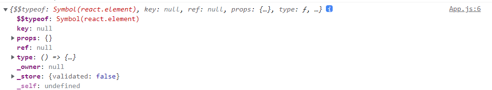
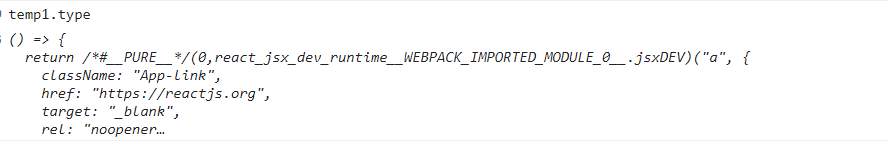
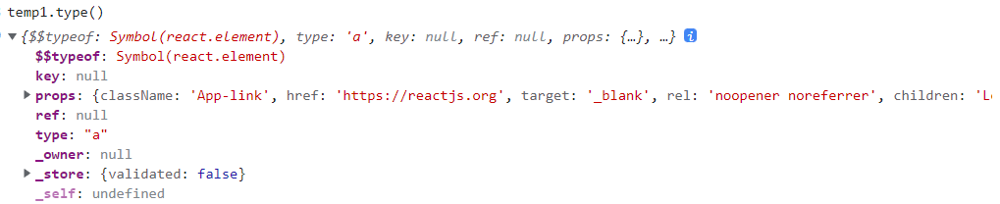

# Fiber

在 React15 及以前，`Reconciler` 采用递归的方式创建虚拟 DOM，递归过程是不能中断的。如果组件树的层级很深，递归会占用线程很多时间，造成卡顿。
为了解决这个问题，React16 将递归的无法中断的更新重构为异步的可中断更新，由于曾经用于递归的虚拟DOM数据结构已经无法满足需要。于是，全新的 `Fiber` 架构应运而生。

## Fiber 的含义

1. `Fiber` 节点用于存储 React 组件节点信息（包括 DOM节点，组件的属性 / state / effect 等）
2. react15 递归的调用方式，成为 `stack Reconfiler`， react16 的 `Reconciler` 基于 `Fiber 节点` 实现，被称为 `Fiber Reconciler
3. 作为静态的数据结构来说，每个 `Fiber 节点` 对应一个 `React element`，保存了该组件的类型 （函数式组件/类组件/原生组件/...) 、对应的 Dom节点 等信息
4. 作为动态的单元来说，每个 `Fiber 节点` 保存了本次更新中该组件改变的状态、要执行的工作

## Fiber的结构

> <https://github.com/facebook/react/blob/1fb18e22ae66fdb1dc127347e169e73948778e5a/packages/react-reconciler/src/ReactFiber.new.js#L117>

## 工作原理

### 双缓存 Fiber 树

- `currnet Fiber tree`: 当前屏幕上显示内容对应的 `Fiber 树`
  - `current fiber`

- `workInprogresss Fiber tree`: 在内存中构建的 `Fiber 树`
  - `workInProgress fiber`，两个节点通过 `alternate` 属性连接

```js
currentFiber.alternate === workInProgressFiber;
workInProgressFiber.alternate === currentFiber;
```

- `FiberRoot`: 通过 `new FiberRootNode` 生成, 是整个应用的根节点，绑定在真实DOM节点的`_reactRootContainerxxx` 属性上，React 应用的根节点通过使 current 指针在不同 `Fiber` 树的 `rootFiber` 间切换来完成 `current Fiber` 树指向的切换。即当 `workInProgress Fiber` 树构建完成交给 `Renderer` 渲染在页面上后，应用根节点的 `current` 指针指向 `workInProgress Fiber树` ，此时 `workInProgress Fiber树` 就变为 `current Fiber树`。

- `RootFiber`: 指的是根节点对应的 `FiberNode`，与 `App`、`div` 等都有对应的 `Fiber` 节点，在每次重新渲染的时候会重新构建。


## jsx 与 Fiber 节点

jsx 会被编译为 `React.createElement` 函数，关于 jsx 与 `React.createElement` 的关系可以看[这篇文章](../%E4%B8%BA%E4%BD%95%E8%A6%81%E5%9C%A8%E9%A1%B6%E9%83%A8%E5%BC%95%E5%85%A5React.md)

```jsx
const ReactLink = () => {
    return  <a className="App-link" href="https://reactjs.org">
        Learn React
    </a>
}

console.log(<ReactLink/>)
```

上面函数式组件执行后返回的 `React Component` 结构：java



其中 `$$typeof` 表示这是一个 `React Element` 对象，可以通过 `type` 属性看组件执行函数





从上面的内容我们可以发现，`JSX` 是一种描述当前组件内容的数据结构，他不包含组件 `schedule`、`reconcile`、`render` 所需的相关信息。

比如如下信息就不包括在 `JSX` 中：

- 组件在更新中的优先级
- 组件的state
- 组件被打上的用于 `Renderer` 的标记
- 这些内容都包含在 `Fiber` 节点中。

所以，在组件 `mount` 时，`Reconciler` 根据 `JSX` 描述的组件内容生成组件对应的Fiber节点。

在 `update` 时，`Reconciler` 将 JSX 与 Fiber 节点保存的数据对比，生成组件对应的 `Fiber` 节点，并根据对比结果为 `Fiber` 节点打上标记。

## 参考

- [React18 为什么要用 createRoot 取代 render](https://juejin.cn/post/7022178828684361736)
