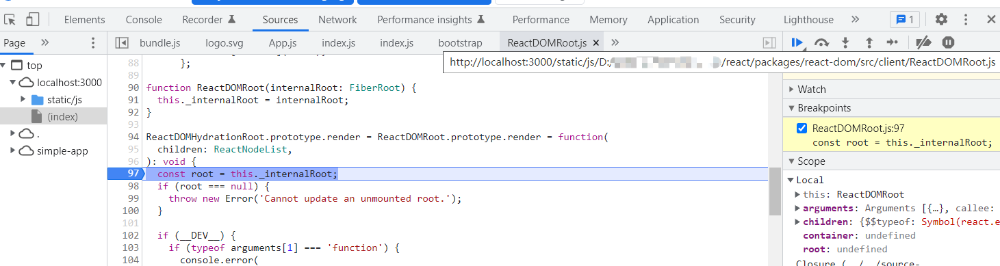

# react 理念

在日常使用的 App 时，有 2 类常见会影响 UI 的快速响应：

- 当遇到大计算量的操作或者设备性能不足导致的页面掉帧
- 发送网络请求后，由于需要等待数据返回才能进一步操作导致的不能快速响应

可以概括为：

- CPU 瓶颈
- IO 瓶颈

## CPU 瓶颈

一般浏览器的刷新频率为 60 Hz，即 16.6ms 刷新一次。而 `js线程` 和 `GUI渲染线程` 是互斥的，所以在每 16.6ms 的时间内，浏览器需要完成：

`js 脚本执行 -> 样式布局 -> 样式绘制 -> 下一个循环`

当 js 执行时间过长，超过 16.6ms 后就没有时间执行 样式布局 和 样式绘制 了，如果执行的时间越长，浏览器就一直不刷新 UI，所以就会造成卡顿。

因此需要控制 `js脚本执行` 的时长，在每 16.6ms 中预留部分时间，而 `react` 值利用这部分时间更新组件（5ms）。当预留的时间不足时，react 则将线程控制交换给浏览器，而之前为执行完的 js 任务，则等待下一帧到来时继续。

react 实现这一步的关键是，将 同步更新 变为 可中断的 异步更新。

## IO 瓶颈

网络延迟 是没法避免的，但如何在 网络延迟 客观存在的情况下，减少用户对 网络延迟 的感知？

一般情况，对于需要网络加载的情况，我们会给出一个 loading 状态的效果，让用户感知当前网络加载中。但如果请求立刻响应，就会造成 loading 一闪而过的效果，比较影响体验。

所以会设置 300ms 的延迟，如果 300ms 内响应了，则不出现 loading 状态，否则就显示 loading 的状态。

react 的解决方案是采用 Suspense 与配套的 hooks - useDeferredValue

## 名词解释

- [Scheduler](https://github.com/facebook/react/tree/v18.2.0/packages/scheduler)（调度器）—— 调度任务的优先级，高优任务优先进入Reconciler，react 16 新增
  - 在Scheduler中的每的每个任务的优先级使用过期时间表示的，如果一个任务的过期时间离现在很近，说明它马上就要过期了，优先级很高，如果过期时间很长，那它的优先级就低，没有过期的任务存放在timerQueue中，过期的任务存放在taskQueue中，timerQueue和timerQueue都是小顶堆，所以peek取出来的都是离现在时间最近也就是优先级最高的那个任务，然后优先执行它。

- [Reconciler](https://github.com/facebook/react/tree/v18.2.0/packages/react-reconciler)（协调器）—— 负责找出变化的组件进行更新, 工作的阶段被称为 `render` 阶段。因为在该阶段会调用组件的render方法。，每当有更新发生时，`Reconciler` 会做如下工作（更多可以看[官方文档](https://zh-hans.reactjs.org/docs/codebase-overview.html#reconcilers)的介绍）：
  - 调用函数组件、或class组件的render方法，将返回的JSX转化为虚拟DOM
  - 将虚拟DOM和上次更新时的虚拟DOM对比
  - 通过对比找出本次更新中变化的虚拟DOM
  - 通知Renderer将变化的虚拟DOM渲染到页面上
- Renderer（渲染器）—— 负责将变化的组件渲染到页面上,工作的阶段被称为 `commit` 阶段，react 支持跨平台，所以有不同的渲染器：
  - [ReactDOM](https://github.com/facebook/react/tree/v18.2.0/packages/react-dom) 负责浏览器环境渲染
  - [ReactNative](https://github.com/facebook/react/tree/v18.2.0/packages/react-native-renderer) 渲染器，渲染App原生组件
  - [ReactTest](https://github.com/facebook/react/tree/v18.2.0/packages/react-test-renderer) 渲染器，渲染出纯Js对象用于测试
  - [ReactArt](https://github.com/facebook/react/tree/v18.2.0/packages/react-art) 渲染器，渲染到Canvas, SVG 或 VML (IE8)
- `render` 与 `commit` 阶段统称为 `work` ，即 React 在工作中。相对应的，如果任务正在 `Scheduler` 内调度，就不属于 `work` 。

### 优先级模型

## 概念

- v16之前: Legacy Mode，同步地进行Reconcile Fiber，Reconcile任务不能被打断，会执行到底
- v16: Async Mode (异步模式)与 时间分片（Time Slicing）: 后面更名为 `Concurrent Mode` （同步模式），引入了 Fiber，采用 `requestAnimationFrame` 实现时间分片
- v17: [Concurrent Mode (并发模式)](https://17.reactjs.org/docs/concurrent-mode-intro.html)
- v18: Concurrent Render (并发更新)，[example](https://github.com/reactwg/react-18/discussions/65)

`Concurrent Mode` 模式下的更新是异步可中断的更新，除了时间片用完，还有一种中断的可能：正在更新的任务被中断，转而开始一次新的更新。我们可以说后一次的更新打断了正在执行的更新，这就是优先级的概念：后一次任务的优先级更高，打断了正在执行的更低优先级的任务。

> 如何理解 `Concurrent` 同步？

#### expirationTime 模型

即过期时间，在 Fiber 中有两层不同的含义，注意区分：

- 解决调度中经典的饥饿（Starvation）问题，假设高优先级任务一直执行，低优先级任务将无法得到执行，我们给低优先级任务设定一个过期时间，一旦过期后，就需要被当做同步任务，立即执行，这与 requestIdleCallback 中的 didTimeout 是异曲同工的。
- 代表 update 优先级，expiration time 越大，优先级越高，如果你在其它资料中阅读到 expiration time 越小优先级越高，不要感到诧异，因为这块有过变更。

在 React 内部是这样划分的优先级：

- Sync 具有最高优先级
- 异步方面，优先级分为 InteractiveExpiration 与 AsyncExpiration，同等时刻触发的 InteractiveExpiration 的优先级大于 AsyncExpiration
- InteractiveExpiration 一般指在 InteractiveEvent 中触发的更新，例如：blur, click, focus，keyDown, mouseDown 等等

#### Lane (s) 模型

Lane (s) 模型是从源码角度来定义的。官方的定义详见 [React v17.0 rc](https://zh-hans.reactjs.org/blog/2020/08/10/react-v17-rc.html) 版本发布，发布里提到的” 改进启发式更新算法 “其实就是替换了优先级模型 – Lane (s) 模型，可见 [PR](https://github.com/facebook/react/pull/18796)。

## 不常用 api 说明

> <https://zh-hans.reactjs.org/docs/react-api.html#suspense>

- useDeferredValue
- useTransition
- useId
- useImperativeHandle
- useLayoutEffect
- useDebugValue
- Suspense

### Suspense

[Suspense](https://zh-hans.reactjs.org/docs/react-api.html#suspense): `React@16.6` 新增, 用于组件的异步加载，在组件没有加载完成前，显示 `fallback` 的状态。
在 `react@18` 之前因为支持不完善，称为 `Legacy Suspense`， 而在 `react@18` 之后可以称为 `Concurrent Suspense`，[支持的场景更多了](https://juejin.cn/post/6998086416836067365)。

## react 仓库说明

react 的 packages 目录

```bash
# react 的核心逻辑，与平台无关的接口，如 组件、hooks、
├─react

# render 相关
├─react-dom
├─react-art
├─react-test-renderer
├─react-noop-renderer
├─react-native-renderer

# reconciler
├─react-reconciler

# 调度器实现
├─scheduler

├─react-devtools
├─react-devtools-core
├─react-devtools-extensions
├─react-devtools-inline
├─react-devtools-shared
├─react-devtools-shell
├─react-devtools-timeline

# 其他
├─react-fetch
├─react-fs
├─react-interactions
├─react-pg
├─react-refresh
├─react-client
├─react-server
├─react-server-dom-relay
├─react-server-dom-webpack
├─react-server-native-relay
├─react-suspense-test-utils
├─shared
├─use-subscription
```

## 调试源码

一般来说可以直接通过 `create-react-app` 创建要给 react 应用，然后直接在页面上打断点调试 `react-dom.development.js`。 不过看了[这篇文章](https://juejin.cn/post/7126501202866470949)后，发现如果能直接关联 react 仓库的代码来调试，会更容易对应到上面说的目录结构

### source-map 方法

1. 先按照 [这篇文章](https://juejin.cn/post/7126501202866470949) 将 react 的 source-map 文件编译出来，有报错的话，文中有解释，并且报错信息也会提出什么插件的原因
2. 将 `build` 命令后，`build/node_modules/` 目录下的 `react`、`react-com`、`seheduler` 分别执行下 `yarn link`
3. 来到 `create-react-app` 创建的项目，在 `yarn install` 之后执行 `yarn link react react-com seheduler`，然后运行就能映射源目录文件了

    

4. 这里不用按照文章所写的，通过 webapck 的 `external` 配置处理，在当前的 `create-react-app` 中引入了 [source-map-loader](https://webpack.docschina.org/loaders/source-map-loader/)，该 loader 会在 webpack 编译时，将第三方库的 source-map 也一起处理。
