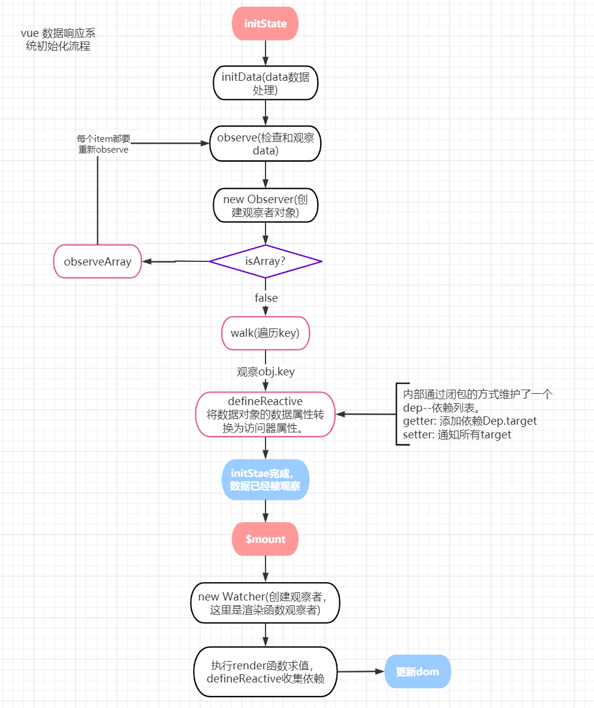

# Vue数据响应系统



## 变化监测

数据驱动视图：`UI = render(state)`ß

### 开始进行数据观测

`initState -> initData -> observe -> new Observer -> 对象或数组处理 -> defineReactive`

### initData

对数据进行初始处理

```typescript
// 创建一个_data指向data 
data = vm._data = vm.$options.data 

// 代理key，能用过this访问data中的属性， (vm._data中获取) 
proxy(vm, `_data`, key) 

// 观察data 
observe(data, true /* asRootData */) 
```

### observe

开启响应式之路

```typescript
function observe (value: any, asRootData?: boolean) { 
    // 对数据进行判断，如果不是对象或者是vnode，则不观测 
    if (!isObject(value) || value instanceof VNode) return 

    let ob: Observer | void 
    if (hasOwn(value, '__ob__') && value.__ob__ instanceof Observer) { 
        ob = value.__ob__ // 避免重复观测 
    } else if ( 
        shouldObserve && // 某些条件下可以关闭观察 
        (Array.isArray(value) || isPlainObject(value)) && // 数组和纯对象 
        Object.isExtensible(value) && // 排除 Object.freeze() 等不可观测对象 
        !value._isVue // 避免观测vue对象 
    ) { 

        ob = new Observer(value) // start 
    } 
    if (asRootData && ob) { 
        ob.vmCount++ 见下 
    } 
    return ob 
} 
```

`ob.vmCount`作用：只有组件vue.data对象的时候，`vmCount`才>0，也就是可以通过`vmCount>0`来判断是不是根data对象，当使用`$set`的时候，如`$set(vm, 'newKey', xx)`，是不会触发响应的，因为vm.data本身不是`Observer`对象。

### new Observer

```typescript
class Observer { 
    value: any; // value 属性指向 data 数据对象本身(观察数据对象)，这是一个循环引用 
    dep: Dep; 
    vmCount: number;

    constructor (value: any) {

        this.value = value 
        this.dep = new Dep() 
        this.vmCount = 0

        if (Array.isArray(value)) { 
            // 处理数组的原型方法，见下面 
            protoAugment(value, arrayMethods) 
            this.observeArray(value) 
        } else { 
            this.walk(value) 
        } 
    } 

    // 观测数组，每个item都是一个observe实例
    observeArray (value) {}

    // 遍历对象的key，调用defineReactive(obj, key) 
    walk(obj){}
} 
```

在`this.walk`中调用`defineReactive(obj, key)`不传第三个值，是为了[保证响应式数据的一致性](http://caibaojian.com/vue-design/art/7vue-reactive.html#%E4%BF%9D%E8%AF%81%E5%AE%9A%E4%B9%89%E5%93%8D%E5%BA%94%E5%BC%8F%E6%95%B0%E6%8D%AE%E8%A1%8C%E4%B8%BA%E7%9A%84%E4%B8%80%E8%87%B4%E6%80%A7)

#### 数据观测 defineReactive

**Object.defineProperty**
将数据对象的**数据属性转换为访问器属性**,设置getter/setter

```typescript
function defineReactive (obj, key, value, customSetter?, shallow?) { 
    const dep = new Dep() // 每个key都有自己的Dep实例对象，用来放置属于key的依赖对象 
    let childOb = !shallow && observe(val) // 对象深度观测 

    Object.defineProperty(obj, key, { 
        get: function reactiveGetter () { 
            if (Dep.target) { 
                dep.depend() 
                if (childOb) { 
                    childOb.dep.depend() // 提供给$set 和 Vue.set，见下面 
                    if (Array.isArray(value)) { // 同上一行 
                        dependArray(value) 
                    } 
                }    
            } 
            return value 
        }, 
        set: function reactiveSetter (newVal) { 
                // 无变化，后面的判断是针对NaN !== NaN做判断 
            if (newVal === value || (newVal !== newVal && value !== value)) { 
                return 
            } 
            value = newVal 
            childOb = !shallow && observe(newVal) // 对象深度观测 
            dep.notify() // 通知依赖 
        } 
    }) 
} 
```

`childOb.dep.depend()`的作用：当新增没有被观测的属性值时，可以通过`$set`,`Vue.set`方式，添加观测，同时在`setter`时`childOb.dep.depend()`将依赖传递给`child`，所以在设置了新属性后，就能通知到对应的上层依赖，而不会中断
例如：

```typescript
// template 
<div>{{JSON.stringfy(a)}}</div> 
var a = {} 
$set(a, 'test', 1); // 需要通知template改变 
```

也就是说，如果依赖了`a`，那也依赖了`a`的所有子对象。
数组也是一样，如果数组的item变化了，也要做同样的通知
`set`和`del`的代码

```typescript
Vue.set = function (obj, key, val) { 
    defineReactive(obj, key, val) 
    obj.__ob__.dep.notify() 
} 
Vue.del = function (obj, key, val) { 
    delete target[key] 
    obj.__ob__.dep.notify() 
} 
```

#### 数组处理

代理数组原方法（**拦截数组变异方法**）

```typescript
const arrayProto = Array.prototype 
const arrayMethods = Object.create(arrayProto) 
const methodsToPatch = ['push','pop','shift', 'unshift','splice','sort','reverse']
methodsToPatch.forEach(function (method) { 
    const original = arrayProto[method] // 保存原方法 
    def(arrayMethods, method, function mutator (...args) { 
        const result = original.apply(this, args) 
        // 省略对 push，unshift，splice等添加的方式处理 
        this.__ob__.dep.notify() // 触发依赖变更通知 
        return result 
    }) 
}) 
```

### 依赖收集 ( `Dep` 与 `Watcher`)

`Dep`：一个数据收集器，在`defineReactive`中作为一个闭包变量，存放每一个数据对应的依赖对象。
`Watcher`：**渲染函数的观察者**，`Dep`收集的对象

#### 页面渲染

`_init -> vm.$mount -> mountComponent -> new Watcher`

#### mountComponent

位于`src\core\instance\lifecycle.js`

```typescript
function mountComponent(vm, el, hydrating) { 
    vm.$el = el 
    // ... 对render不存在的处理 
    callHook(vm, 'beforeMount') 
    let updateComponent = () => { 
        let vnode = vm._render(); // 调用render生成vnode 
        vm._update(vnode, hydrating) // vnode -> DOM 
    } 
    // 创建观察者，触发数据属性get从而收集依赖 
    // 调用 updateComponent 并求值 
    new Watcher(vm, updateComponent, noop, { 
        before () { 
            if (vm._isMounted && !vm._isDestroyed) { 
                callHook(vm, 'beforeUpdate') 
            } 
        } 
    }, true /* isRenderWatcher */) 
    if (vm.$vnode == null) { 
        vm._isMounted = true 
        callHook(vm, 'mounted') 
    } 
    return vm 
} 
```

#### Watcher

`src\core\observer\watcher.js`

```typescript
class Watcher { 
constructor ( 
    vm: Component, 
    expOrFn: string | Function, // 执行过程会触发数据属性的getter，完成依赖收集 
    cb: Function, 
    options?: Object, 
    isRenderWatcher?: boolean 
) { 
        this.vm = vm 
        // 只有在 mountComponent 函数中创建渲染函数观察者，才会复制给_watcher（initLifecycle中初始化） 
        if (isRenderWatcher) {vm._watcher = this} 

        vm._watchers.push(this) // initState 中初始化 
        // ... 
        // 避免收集重复依赖，见下面 
        this.deps = [] 
        this.newDeps = [] 
        this.depIds = new Set() 
        this.newDepIds = new Set() 
        this.getter = typeof expOrFn === 'function' ? expOrFn : parsePath(expOrFn)

        this.value = this.lazy? undefined : this.get() 
    } 
    // 依赖收集 
    get () { 
        pushTarget(this) // 即将触发依赖收集的观察者对象 
        let value = this.getter.call(vm, vm) 
        if (this.deep) traverse(value) // 见 深度观测的实现 
        popTarget() 
        this.cleanupDeps() // 清空newDepIds 和 newDeps 
        return value 
    } 
    // Dep.depend调用的时候会执行调用 
    addDep (dep: Dep) { } 

    // 将newDepIds和newDeps复制给depIds属性和deps后清空， 
    // 并移除无效的观察者,如if的切换 
    cleanupDeps () {} 

    // ... 
    // 从观察者中移除依赖（当前Watcher实例），取消观测 
    teardown () { 
    // ... 
    this.active = false // 失活 
    } 
} 
```

##### `deps` 和 `depIds` 与 `newDeps` 和 `newDepIds`

1. `newDepIds` 属性用来在一次求值中避免收集重复的观察者

    ```html
    <div>{{msg}}{{msg}}</div> 
    ```

2. 在求值完成后，会清空 `newDepIds` 和 `newDeps`，并赋给了 `depIds` 属性和 `deps` 属性
3. `depIds` 属性用来避免多次求值（数据改变时，重新渲染求值）时收集重复的观察者

### 触发依赖

在setter的时候

```typescript
set: function reactiveSetter (newVal) { 
    // 省略... 
    dep.notify() 
} 
class Dep { 
    update () { 
        const subs = this.subs.slice() 
        if (process.env.NODE_ENV !== 'production' && !config.async) { 
            subs.sort((a, b) => a.id - b.id) 
        } 
        for (let i = 0, l = subs.length; i < l; i++) { 
            subs[i].update() // 通知所有的依赖更新了 
        } 
    } 
} 
```

Wather中

```typescript
class Watcher { 
    // ... 
    notify () { 
        if (this.lazy) { 
            this.dirty = true // compute的时候，lazy是true 
        } else if (this.sync) { // 渲染函数的观察者都是异步的 
            this.run() 
        } else { 
            queueWatcher(this) // 一次修改多个，但只执行一次重渲染，最终也是调用 this.run() 
        } 
    } 
    run () {
        if (this.active) { // 观察者是否处于激活状态 
            const value = this.get() // 重新求值 
            if ( 
                value !== this.value || 
                isObject(value) || // object就重新执行，因为引用地址没变化，但是内部属性值可能变化了 
                this.deep 
            ) { 
                const oldValue = this.value 
                this.value = value 
                if (this.user) { 
                // ... 与下面一样，多了异常处理，对应watch或$watch 
                } else { 
                    this.cb.call(this.vm, value, oldValue) // render 
                } 
            } 
        } 
    }
} 
```

### $nextTick

todo

### $watch 和 watch

位于：`src\core\instance\state.js -> stateMixin -> Vue.prototype.$watch`
初始化过程：`initState ->initWatch -> createWatcher`

```typescript
Vue.prototype.$watch = function ( 
expOrFn: string | Function, 
cb: any, 
options?: Object 
): Function { 
    const vm: Component = this 
    // 对象用法。传options 
    if (isPlainObject(cb)) return createWatcher(vm, expOrFn, cb, options) 
    
    options = options || {} 
    options.user = true // 多一个user 
    const watcher = new Watcher(vm, expOrFn, cb, options) 
    if (options.immediate) { 
        cb.call(vm, watcher.value) 
    } 
    return function unwatchFn () { 
        watcher.teardown() 
    } 
} 
// 处理options，然后返回$watch 
function createWatcher () {} 
```

#### 深度观测的实现

```typescript
class Watcher { 
    // ... 
    get () { 
        // ... 
        if (this.deep) traverse(value) 
        // ... 
    } 
} 
// 深度读取一次obj的所有属性值触发属性访问器添加当前的Watcher依赖 
function traverse () {} 
```

### computed

位于: `src\core\instance\state.js -> initComputed`
初始化过程：`initState -> initComputed`
创建了一个watcher对象（**计算属性的观察者**），放在vm._computedWatchers中

```typescript
function initComputed (vm: Component, computed: Object) { 
    const watchers = vm._computedWatchers = Object.create(null) 
    for (const key in computed) { 
        const userDef = computed[key] 
        const getter = typeof userDef === 'function' ? userDef : userDef.get 
        
        watchers[key] = new Watcher( 
            vm, 
            getter || noop, 
            noop, 
            computedWatcherOptions // {lazy: true} ,所以需要template进行一次求值 
        ) 

        if (!(key in vm)) {defineComputed(vm, key, userDef)} 
    }
} 
    // 为vm.xxx定义属性访问器，将get -> computedGetter 
function defineComputed () {} 
function computedGetter () { 
    const watcher = this._computedWatchers && this._computedWatchers[key] 
    if (watcher) { 
        if (watcher.dirty) {watcher.evaluate()} // 求值，当依赖变化的时候，直到取值时才重新求值 
        if (Dep.target) { // 发生在渲染函数执行时，此时指向渲染函数的观察者对象（求值过程pushTarget） 
            watcher.depend() // 收集 渲染函数的观察者对象 
        }
        return watcher.value 
    } 
} 
```
