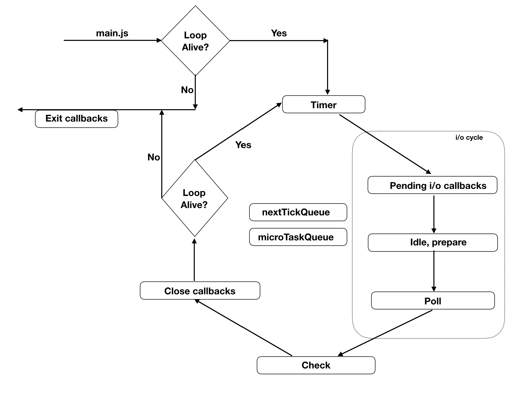

# nodejs

基于 Chrome v8引擎的服务器端 JavaScript运行环境

特点：

- 事件驱动
- 非阻塞式I/O的模型
- 高并发

## 架构组成


## 非阻塞式I/O的模型

对于一个网络IO，会涉及到两个系统对象：

- 调用这个IO的进程或线程
- 系统内核

当一个读操作发生时，会经历两个阶段：

- 等待数据准备好
- 将数据从内核中拷贝到用户进程中
记住这两点很重要，因为IO模型的区别就是在两个阶段上各有不同的情况

### I/O概念

- 阻塞I/O： 在发起I/O操作之后会一直阻塞着进程，不执行其他操作,直到得到响应或者超时为止；
- 非阻塞I/O：发起I/O操作不等得到响应或者超时就立即返回，让进程继续执行其他操作，但是要通过轮询方式不断地去check数据是否已准备好
- 多路复用I/O：又分为select、pool、epool。最大优点就是单个进程就可以同时处理多个网络连接的IO。
基本原理就是select/poll这个function会不断的轮询所负责的所有socket，当某个socket有数据到达了，就通知用户进程。
而epool通过callback回调通知机制.减少内存开销,不因并发量大而降低效率,linux下最高效率的I/O事件机制。
- 同步I/O：发起I/O操作之后会阻塞进程直到得到响应或者超时。前三者阻塞I/O，非阻塞I/O，多路复用I/O都属于同步I/O。
注意非阻塞I/O在数据从内核拷贝到用户进程时，进程仍然是阻塞的，所以还是属于同步I/O。
异步I/O：直接返回继续执行下一条语句，当I/O操作完成或数据返回时，以事件的形式通知执行IO操作的进程。

### 非I/O的操作

- 定时器（setTimeout，setInterval）
- microtask（promise）
- process.nextTick
- setImmediate
- DNS.lookup

### I/O操作

- 网络I/O
- fs

## nodejs中的事件循环

<https://juejin.cn/post/6844903999506923528>


### 6个阶段

- timers：执行setTimeout() 和 setInterval()中到期的callback。
- pending callbacks ：执行延迟到下一个循环迭代的 I/O 回调。此阶段对某些系统操作（如 TCP 错误类型）执行回调
- idle, prepare：仅内部使用
- poll：轮询，执行I/O callback，在适当的条件下会阻塞在这个阶段
- check：执行setImmediate的callback
- close callbacks：执行close事件的callback，例如socket.on("close",func)

每个阶段都有自己的callback队列，每当进入某个阶段，都会从所属的队列中取出callback来执行，当队列为空或者被执行callback的数量达到系统的最大数量时，进入下一阶段。
这六个阶段都执行完毕称为一轮循环。

#### poll阶段

这个阶段做的事情：
检查是否存在尚未完成的回调，比如由于任务太多而停止的`Timer`（下面开头的回调都指这些）

- 如果有超时回调，执行所有可用回调。
- 如果没有可用回调。处理 poll 队列的事件（I/O回调）
- 最后如果存在`immediate`回调，则推出进入`check`阶段，如果没有则堵塞在此，等到新的I/O事件（也会检查timer）。
如果不存在尚未完成的回调（或堵塞到一定时间），退出poll阶段。

### node中的事件循环顺序



> 每个阶段结束之后都会执行，nextTick、微任务，且微任务`microQueen`在`process.nextTick`队列后面，

- 外部输入数据
- 轮询阶段poll
- 检查阶段check
- 关闭事件回调阶段close callback
- 定时器检查阶段 timer，处理完队列中到期的所有定时器
- I/O事件回调阶段
- 闲置阶段
- 轮询...

### 区分


### 题目

#### setTimeout(…, 0) vs. setImmediate

```js
setImmediate(() => console.log(2)) 
setTimeout(() => console.log(1))
```

可能是1、2也可能是2、1

取决与进入`Timer`阶段的时候，`setTimeout`是否已经加入回调到定时器的队列里，如果是，则会先执行`setTimeout`。

解决方法：

```js
// 放入IO中
require('fs').readFile('my-file-path.txt', () => {
setImmediate(() => console.log(2)) s
etTimeout(() => console.log(1)) 
});
```

## 概念。接口

### Node. js的全局对象

- global
- process
- console
- Buffer
- module
- exports
- __dirname
- __filename

### EventEmitter

EventEmitter实现的原理是观察者模式，这也是实现事件驱动的基本模式

```js
const EventEmitter = require('events')

class MyEmitter extends EventEmitter {}
const myEmitter = new MyEmitter()

function callback() {
    console.log('触发了event事件！')
}
myEmitter.on('event', callback)
myEmitter.emit('event')
myEmitter.removeListener('event', callback);
```

### Buffer

> nodejs 用于在 TCP 流、文件系统操作等场景处理二进制字节

### stream

### fs文件系统

### 网络

### 子进程

child_process

### 多线程

## koa

### 洋葱模型

## 调试方法
