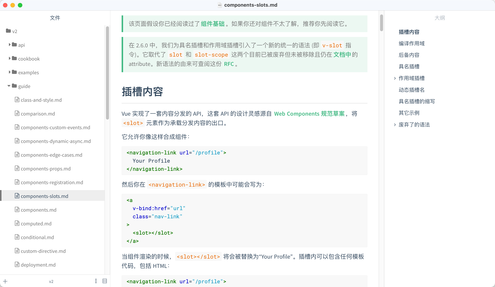
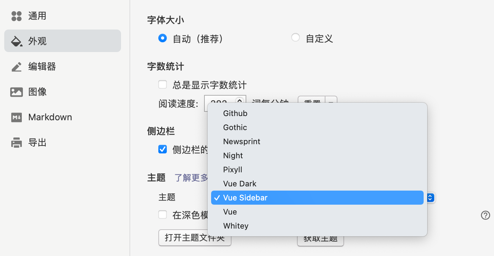

# typora右侧大纲主题

typora 的默认主题只有一个左侧侧边栏，可以切换显示 `文件树` 或者`大纲` ，写东西的时候可能会需要在二者来换切换，影响写作体验。于是写了一个主题，可以同时将2部分都给显示出来，毕竟只有小孩子才做选择。

效果：



## 使用方式

1. 打开 `偏好设置-> 外观` 面板，点击 `打开主题文件夹`，将 [vue-sidebar.css](./typora 右侧大纲主题.assets/vue-sidebar.css) 复制进去
2. 重启 typora
3. 打开 `偏好设置-> 外观` 面板，在主题中选择即可



## 使用其他主题

 这套主题是基于 [typora-vue-theme](https://github.com/blinkfox/typora-vue-theme) 修改的，如果想用使用其他主题，可以在 <https://www.typora.net/themes/> 中找到喜欢的主题，然后将一下代码添加到文件顶部

```css
/* 其他主题代码 */

:root {
    --my-sidebar-header-height: 40px;
}

/* 增加右侧侧边栏显示大纲 */
/*=============================== start ========================================*/
/* 切换 文件/大纲 按钮 隐藏 */
#typora-sidebar .sidebar-tab-btn,
#typora-sidebar:hover .sidebar-tab-btn {
   opacity: 0; 
   z-index: -10px;
}


/* 内容部分，留出右边的宽度 */
.pin-outline content {
    right: var(--sidebar-width);
    border-right: 1px solid rgba(0,0,0,.07);
}

/* 将 大纲 移动到右边 */
.pin-outline .active-tab-files #outline-content {
    display: block!important;
    position: fixed;
    top: 40px;
    right: 0;
    left: calc(100% - var(--sidebar-width));

    width: var(--sidebar-width);
    max-width: var(--sidebar-width);
    min-width: 100px;
    
    height: calc(100% - var(--my-sidebar-header-height));
    padding-left: 8px;
}

/* 显示大纲标题 */
#sidepanel-segmented-input-outline {
    display: block!important;
    position: fixed;
    top: 0;
    right: 0;
    left: calc(100% - var(--sidebar-width));

    height: var(--my-sidebar-header-height);
    width: var(--sidebar-width);
}

/*================================  end =======================================*/

/* 其他主题代码 */
```
