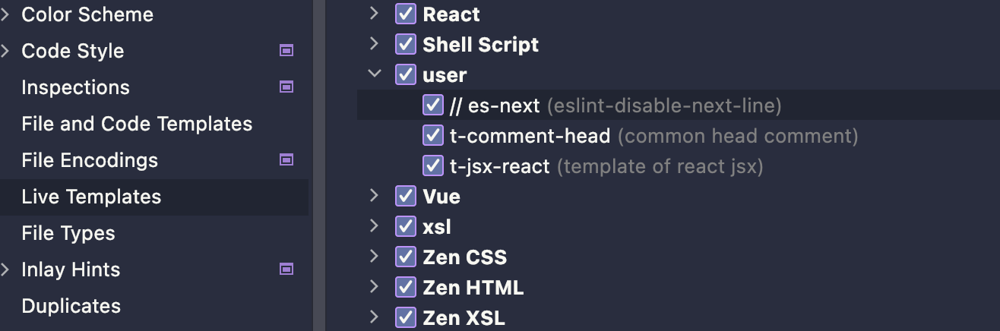

# webstrome 常用技巧

### 不常用快捷键

#### windows 快捷键

```bash
ctrl + shift + [↑/↓]                # 移动行
ctrl + alt + [←/→]                  # 回到上一次光标定位的位置
ctrl + shift + alt + j              # 选择相同内容
Shift + Ctrl + Alt + J              # 选择所有相同的单词
alt + j                             # 选中下一个相同单词
ctrl + [xcv]                        # 剪切、复制、粘贴
shift + entry                       # 在当前行下面另起一行
shift + ctrl + [+/-]                # 全部 折叠/展开

# 移动光标到行尾 / 行首，与 mac 上本身快捷键 command + [←/→] 一样
# 需要修改快捷键， 搜索 Move Caret to Line [End/Start]，修改为下面的快捷键，以保持和 mac 一致
# 注意：会和 【Select Next Tab】 的快捷键冲突，自行取决。 因为 win 默认移动到行尾行首的快捷键是 【home/end】，这里和 mac 的操作保持一致
alt + [←/→]  

# 修改 Move Caret to Line [End/Start] with Selection 的快捷键为
shift + alt + [←/→] 
```

#### mac 快捷键

> 只标注和 win 不一样的地方， 即 win 上 shift、ctrl = mac 上的 shift、Command 

```bash
Command + Option + [←/→]         # 回到上一次光标定位的位置
ctrl + G                         # 选中下一个相同单词
command + ctrl + G               # 选择所有相同的单词
command + [←/→]                  # 移动光标到行尾 / 行首
```

#### 其他配置

#### Live Template




可以创建一个模板片段，输入短语后，快速展示出来，[用法见](https://jetbrains.com.zh.xy2401.com/help/webstorm/template-variables.html)

一些变量的用法

```bash
fileNameWithoutExtension() # 文件名不带扩展名
capitalize(fileNameWithoutExtension()) # 首字母大写
```

##### lint

eslint

```js
// abbreviation
// es-next

// describe
eslint-disable-next-line

// code
// eslint-disable-next-line
```

stylelint

```js
// abbreviation
// style-next

// describe
stylelint-disable-next-line

// code
// stylelint-disable-next-line
```

##### react

```typescript
// abbreviation
t-jsx-react

// describe
template of react jsx

// code
import React from 'react';

interface $name$Props {
  attr: string;
}

export const $name$: React.FC<$name$Props> = () => {
  return <div>app</div>;
};

// 变量
$name$: capitalize(fileNameWithoutExtension())
```

##### other

```js
// abbreviation
t-comment-head

// describe
common head comment

// code
/**
 * @create $date$
 * @desc $filename$
 */

// 变量
$date$: date("Y-MM-dd")
$filename$: fileNameWithoutExtension()
```

#### file and code templates

可以在 include 中创建变量


```js
/**
 * @create ${YEAR}-${MONTH}-${DAY}
 * @desc ${NAME}
 */
```

然后在 Files 中使用：`#parse("common_header")`


##### stylelint 设置

对于新版本的webstorm本身已经内置 stylelint 命令，直接设置快捷键即可


对于 webstorm 2021.3 之前的产品，stylelint 并没有像 eslint 一样，内置修复命令，但可以通过自定义 tools 来实现

1. 自定义 stylelint 命令工具
    

    相关参数：

    ```bash
    $ProjectFileDir$\node_modules\.bin\stylelint # 如果是window 则为 stylelint.cmd
    $FileName$ --fix
    $FileDir$
    ```

2. 设置快捷键，方便调用
   

### 插件

- [Rainbow Brackets](https://plugins.jetbrains.com/plugin/10080-rainbow-brackets): 括号变色
- [coderpillr-theme](https://plugins.jetbrains.com/plugin/12878-coderpillr-theme): 主题

### 其他

```bash
!*.d.ts,*.ts,*.tsx # 全局搜索时，使用 ! 排除特定文件，例如不搜索 d.ts 中的
```

#### 规定折叠区域

```js
// region - tip
xxx
// endregion
```

### 一些问题

- 2020版本起找不到git的local changelist：<https://stackoverflow.com/questions/61251100/cant-find-git-local-changes-in-intellij-idea-2020-1>
