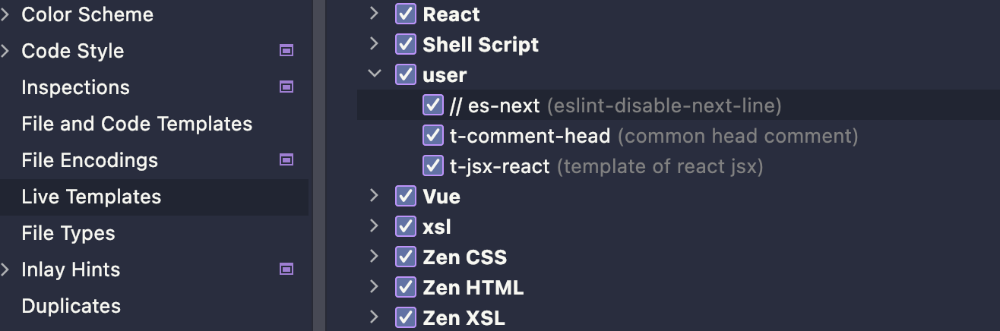
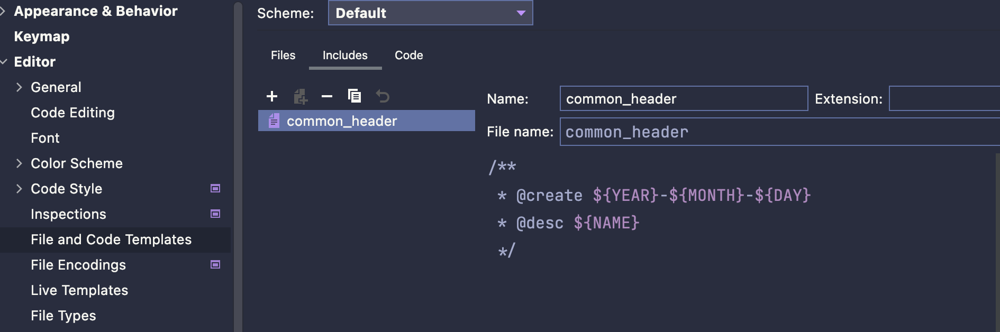
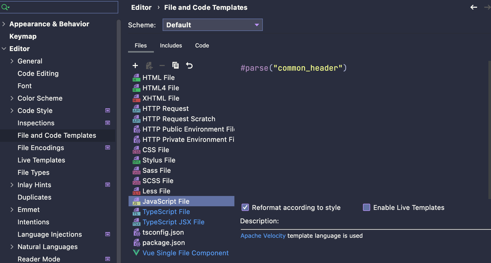
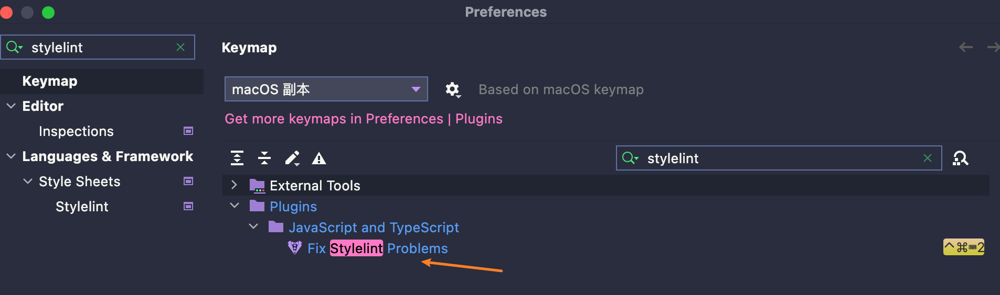
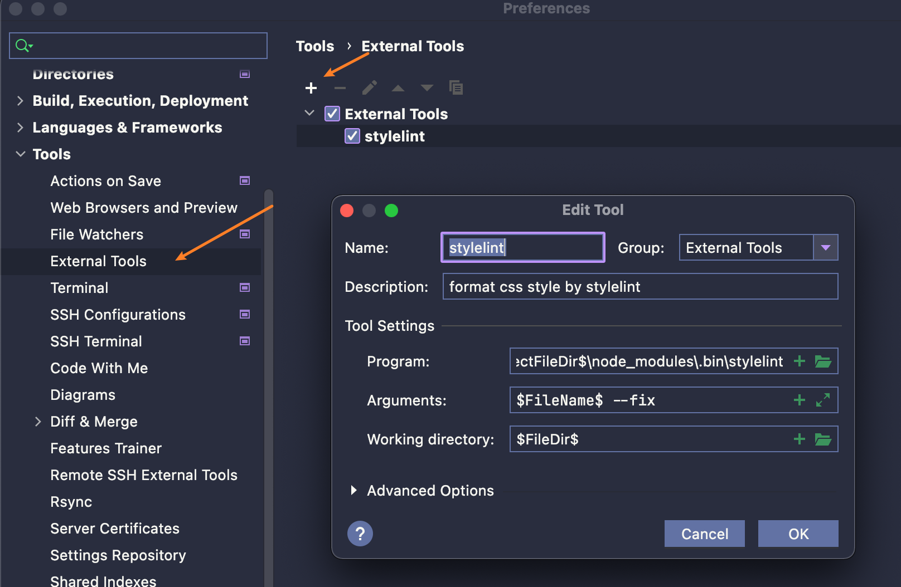
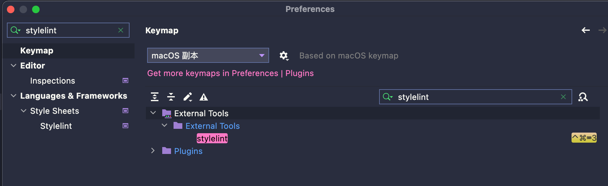

# webstrome 常用技巧

### 不常用快捷键

#### windows

```shell
ctrl + shift + ↑                # 移动行
ctrl + alt + ←                  # 移动到上次操作的地方
ctrl + shift + alt + j          # 选择相同内容
Alt+F3          # 选择所有相同的词
alt + j         # 选中相同单词
```

#### mac

```shell
⌘ == Command
⌥ == Option

⌘ + ⌥ + 方向键 # 跳到上一次光标位置
shift + ⌘ + +/- # 全部 折叠/展开
⌘ + ⌥ + +/- # 代码块 折叠/展开
```

#### 其他配置

#### Live Template



可以创建一个模板片段，输入短语后，快速展示出来，[用法见](https://jetbrains.com.zh.xy2401.com/help/webstorm/template-variables.html)

##### lint

eslint

```js
// abbreviation
// es-next

// describe
eslint-disable-next-line

// code
// eslint-disable-next-line
```

stylelint

```js
// abbreviation
// style-next

// describe
stylelint-disable-next-line

// code
// stylelint-disable-next-line
```

##### react

```typescript
// abbreviation
t-jsx-react

// describe
template of react jsx

// code
import React from 'react';

interface $name$Props {
  attr: string;
}

export const $name$: React.FC<$name$Props> = () => {
  return <div>app</div>;
};
```

##### other

```js
// abbreviation
t-comment-head

// describe
common head comment

// code
/**
 * @create $date$
 * @desc $filename$
 */
```

#### file and code templates

可以在 include 中创建变量



```js
/**
 * @create ${YEAR}-${MONTH}-${DAY}
 * @desc ${NAME}
 */
```

然后在 Files 中使用：`#parse("common_header")`



##### stylelint 设置

对于新版本的webstorm本身已经内置 stylelint 命令，直接设置快捷键即可



对于 webstorm 2021.3 之前的产品，stylelint 并没有像 eslint 一样，内置修复命令，但可以通过自定义 tools 来实现

1. 自定义 stylelint 命令工具
    

    相关参数：

    ```shell
    $ProjectFileDir$\node_modules\.bin\stylelint # 如果是window 则为 stylelint.cmd
    $FileName$ --fix
    $FileDir$
    ```

2. 设置快捷键，方便调用
   

### 插件

- [Rainbow Brackets](https://plugins.jetbrains.com/plugin/10080-rainbow-brackets): 括号变色
- [coderpillr-theme](https://plugins.jetbrains.com/plugin/12878-coderpillr-theme): 主题

### 其他

```shell
!*test.java,*.java,!Test*.java # 全局搜索时，使用 ! 排除特定文件，目录
```

#### 规定折叠区域

```js
// region - tip
xxx
// endregion
```

### 一些问题

- 2020版本起找不到git的local changelist：<https://stackoverflow.com/questions/61251100/cant-find-git-local-changes-in-intellij-idea-2020-1>
