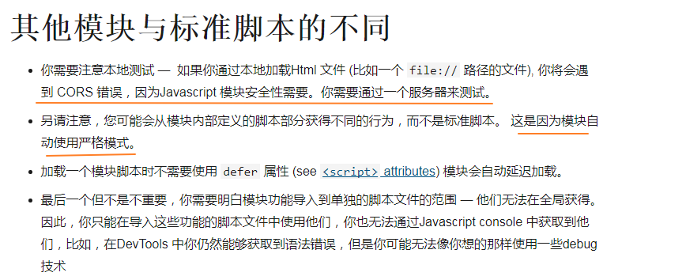
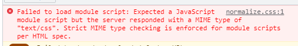
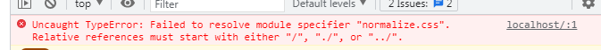
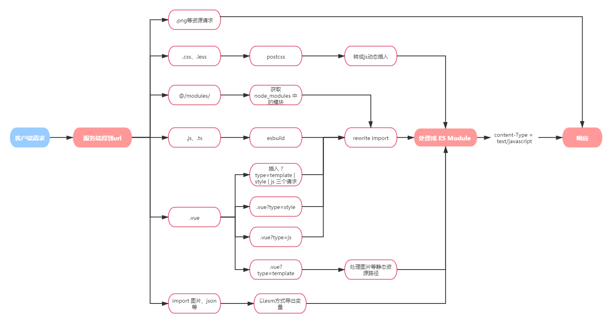
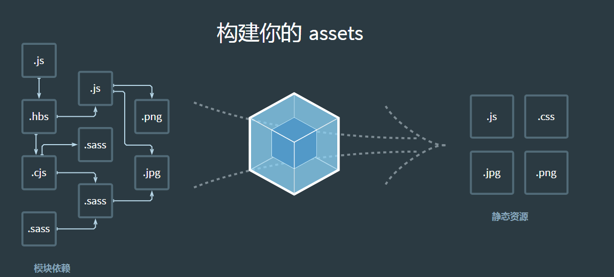
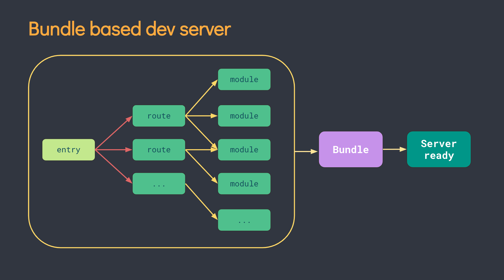
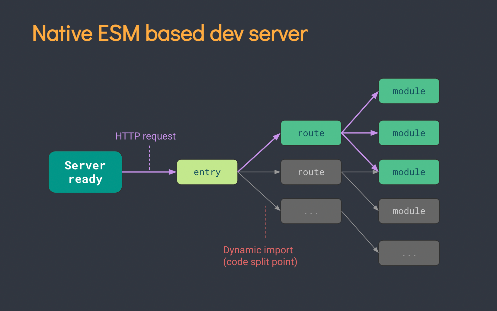

# vite浅析
如果了解前端工程化的历史，从commonjs -> AMD -> CMD -> ES Module等模块化方案在不同时期的出现，都会有不同的构建工具出现，如requireJS、SeaJS、broswerify、Webpack，再到基于ES Module的snowpack、vite等，都是为了解决模块管理的问题。

感兴趣的可以看一下这篇：[前端模块化的十年征程](https://zhuanlan.zhihu.com/p/265632724)

那么，**vite是什么呢？**
打开vite的官方网，可以看到
- 下一代前端开发与构建工具
- 速度快 使用原生 ESM 文件，无需打包!
- 对 TypeScript、JSX、CSS 等支持开箱即用。
等。

用一句解释就是： [来自此处](https://www.zhihu.com/question/475958441/answer/2032457410)
> 目前大部分浏览器已经支持了EMS(ES Modules)模块的方式了，因此我写了一个转化工具，可以让一些浏览器不支持的格式（.vue/.svelte/.ts）以及不支持的语法(最新的es语法/特性)让浏览器支持，它将会成为趋势。

看不懂上面的描述？没关系，让我们从 es module 开始！

### esm(ES Mdoule) 简介
先上[MDN](https://developer.mozilla.org/zh-CN/docs/Web/JavaScript/Guide/Modules#%E5%BA%94%E7%94%A8%E6%A8%A1%E5%9D%97%E5%88%B0%E4%BD%A0%E7%9A%84html)

和平时用webpack打包时的写法比较
```
// esm支持的引入的方式
// 1. 支持除 绝对路径，相对路径 的使用外，还支持url的方式引入
// 2. 需要完整后缀
import module from 'http://XXX/module.js' ; 
import module from '/XXX/module.js' ;
import module from './XXX/module.js' ;
import module from '../XXX/module.js';

// export与平时使用的一样
export const a = 1;
export {a};
export default a;
export { a as b }
```
注意
1. 关于要加后缀的讨论，[见这篇讨论](https://www.zhihu.com/question/453620623/answer/1829159627)
2. 一些特点



#### esm 使用
[例子代码](https://gitee.com/zaiMoe/simple-vite/tree/master/esm)
```
// index.html
<body>
    <div id="app"></div>
    <script type="module" src="./index.js"></script>
</body>

// index.js
import Vue from 'https://cdn.jsdelivr.net/npm/vue@2.6.14/dist/vue.esm.browser.js'
new Vue({
    el: '#app',
    template: `<div>
        <h1>{{ message }}</h1>
        <input v-model="message">
    </div>`,
    data: {
      message: 'Hello Vue.js!'
    }
})
```

#### 特点
###### 1. 优点
- 浏览器会自动解析并加载模块依赖，而不用工具进行处理
- 动态绑定解决了循环调用的问题( [[译] 深入理解 ES Modules](https://mp.weixin.qq.com/s?__biz=Mzg4MTYwMzY1Mw==&mid=2247495724&idx=1&sn=7456d174eb724932c99f4bd82ece522b&source=41#wechat_redirect))

###### 2. 局限
- 兼容性问题，IE都不支持
- nodejs当前的还没有特别好的解决方案
- 会有大量的请求，即使上`http`缓存也不是特别好，所以不建议生产环境直接使用，而是用其他工具打包，vite提供的解决方案是用 `rollup` 打包
- 只能加载js代码，不支持其他资源，如css、图片等
```
import 'https://necolas.github.io/normalize.css/latest/normalize.css'
```



### 改造上面 esm 使用的例子
##### 1. 支持css、img
用过 `webpack` 的都知道，我们会用 [`loader`](https://webpack.docschina.org/concepts/loaders/) 来处理非 `.js` 的文件，同样，对于 `esm` 请求的文件，我们也可以做同样的处理，比如加载 `.css` 文件：
```
// css-loader/style-loader 
function styleLoader(code) {
  return `
        const css = ${JSON.stringify(code)}
        const style = document.createElement('style')
        style.innerHTML = css
        document.head.appendChild(style)
      `
}
```

##### 2. 支持ts
与上面一样，对于 `.ts` 文件，我们可以用类似 `babel-loader`、`ts-loader`的方式，进行处理，这里我们用 `esbuild`转换 `ts` 文件，速度会更快
```
const esBuild = require('esbuild')
function transformTS (code) {
    const result = esBuild.transformSync(code, { loader: 'ts' })
    retrun result.code
}
```

##### 3. 支持 裸模块
> 裸模块指不带 `/`，`./`，`../` 等开头的模块，也就是如请求 node_modules 的模块
```
import 'normalize.css' // 如果直接请求一个裸模块，浏览器会报错
```


对于裸模块，我们可以在响应一个模块前，处理其中依赖的裸模块，添加如 `/@modules/` 的表示，这样在下次请求的时候，可以根据这个标识，从 `node_modules` 中返回对应的代码
```
// 修改代码中的 裸模块 请求
function rewriteImports(code) {
  return code.replace(/ from ['"](.*)['"]/g, function (fragment, moduleName) {
	
	// 以相对路径开头的，不处理
    if (['./', '../', '/'].some(item => moduleName.startsWith(item))) {
      return fragment;
    } else {
      return ` from '/@modules/${moduleName}'`;
    }
  });
}

// 处理 裸模块 的响应代码
function resolvePkgFile(filePath) {

  // 获取 模块 的目录
  const pkgPath = path.join(process.cwd(), 'node_modules', filePath.replace('/@modules/', ''))

  // 找到入口文件
  const pkgJson = require(path.join(pkgPath, 'package.json'))
  const entryPoint = pkgJson.module || pkgJson.main || 'index.js'
	
  // 返回代码
  return fs.readFileSync(path.join(pkgPath, entryPoint), 'utf-8')
}
```

##### 更加完整的例子


[代码在这里](https://gitee.com/zaiMoe/simple-vite/tree/master)
- 支持 js、css等静态资源加载
- 解析 vue文件
- 解析 ts文件
- 热更新

### 再看 vite
通过上面的例子，回头开头那句对vite的解释：
> 目前大部分浏览器已经支持了EMS(ES Modules)模块的方式了，因此我写了一个转化工具，可以让一些浏览器不支持的格式（.vue/.svelte/.ts）以及不支持的语法(最新的es语法/特性)让浏览器支持，它将会成为趋势。

是不是已经好理解多了，当然实际 vite 的实现没有这么简单，vite 之所以比 snowpack 等其他 esm 工具更多，是因为提供了更加完整的解决方案，包括打包、基于esm的热更新等

#### vite 为什么那么快
##### 加载优化
###### bundle打包方式
来看一张熟悉的图



这就是过去构建工具所采用的方式，将大量文件及其依赖构建成少了 bundle，这也是 webpack 项目越大越卡顿的原因，当冷启动开发服务器时，基于打包器的方式启动必须优先抓取并构建你的整个应用，然后才能提供服务。随着项目的增长，打包构建速度越来越慢。



###### bundleless
前面说过，vite 是使用ESM的规范来执行代码，在开发阶段可以不需要处理（如编译成es5），直接在浏览器运行即可。只需要起一个服务器，对于从入口开始 `import` 的依赖，返回给浏览器就行了，对于还没有`import` 的则不需要处理。即 先启动，再按需编译



##### 其他优化
除了上面的方式，vite还做了其他不同于 webpack 的优化，比如
- 预打包，在启动时会将依赖打包成一个文件（缓存在node_modules/.vite下）
- 用 `Es-module-lexer` 进行js语法解析来，其底层是用 C 来处的，比如babel 和 webpack 用的 acorn, 速度快了将近20倍
- 用 `esbuild` 来编译 js、css，底层用go来处理，比起 babel 等，快了 10 ~ 100倍


### 公司项目中的落地
##### 1. 分析方案
回滚整个流程


1. vite2是与框架无关的，对于不同的资源处理，都是采用插件的机制
2. 公司的项目以vue2为主，社区也提供了vue2的[插件](https://github.com/underfin/vite-plugin-vue2)，所以基于vue2的项目，都是能用vite运行的，当然打包还是用原来的cli工具
3. vite基于 `http-proxy` 提供了代理调试的功能，而原本的脚手架的代理功能也是一样的，所以远程代理是直接兼容的
4. 对原项目的mock方案的支持，见下面

##### 2. 插件介绍
基于vite-plugin的 `configureServer` 钩子，从原cli工具的配置文件中读取 `dev.proxyTable`代理配置，插件内部进行转化处理，然后拦截请求，按照以前的mock文件响应，支持原来的大部分功能。

实际就是给在vite的服务器中加了一个中间，用于处理某些请求

##### 3. 一些会遇到的问题
1.  xxx does not provode an export named 'default'
不支持commonjs语法
- 将 require 改成 import
- 可以用 `@originjs/vite-plugin-commonjs`
2.  请求 404
vue文件需要写完整路径和后缀，如/a,/a/,/a/index都是不合法的，需要补充后缀
[参考 vite.resolve.extensions](https://cn.vitejs.dev/config/#resolve-extensions)

3. less中的语法`~@src/xx`无法识别
`~`是 webpack 的语法，不是标准的 esm 导入方式。
在处理别名的时候，可以这么写
```
{
    alias: [
    { find: /^~@src/, replacement:  './src'} 
    { find: /^~/, replacement: '' } // 其他以 ~ 开头的直接去掉
    ]
}
```

4. 比较多的问题（与vite无关）
- import 了一个未导出的变量，会报错
- .vue、.ts、.less的后缀缺少，vite当前普通静态资源识别，返回404
- 代码语法不对，比如 import、require混用，ts类型定义错误等（todo，补充例子）
- ext3.x 版本报错，使用了不能在严格模式运行的代码
- 原项目中使用了require，且有特定的加载顺序

更多参考 issue

### 参考
- [Webpack 打包太慢？来试试 Bundleless](https://zhuanlan.zhihu.com/p/158499877)
- [Es-Module-Lexer，ES Module 语法的词法分析利器](https://juejin.cn/post/6950448092596404261)
- [从vue-loader源码分析CSS Scoped的实现](https://juejin.cn/post/6844903949900742670)
- [vue-loader 原理分析](https://juejin.cn/post/6937125495439900685)
- [简单实现 Vite 热更新](https://zhuanlan.zhihu.com/p/359839728)
- [Vite 原理分析](https://juejin.cn/post/6902225969604460558)
- [Vite2插件开发指南](https://zhuanlan.zhihu.com/p/364275970)
